<!doctype html>
<html lang="en">
<head>
<meta charset="utf-8">
<meta name="viewport" content="width=device-width, initial-scale=1">
<title>Baltic investment plan</title>

</head>
<body><main markdown="1">
# Baltic investment plan

Private Nasdaq Baltic portfolio analysis. Tables, figures and individual-share information are collapsed; select a title to expand it.

---

# Nasdaq Baltic universe: maximum-netSD portfolio

Study period: 2023-01-01 to 2026-08-29 | Portfolio ceiling: EUR 15,000 | Existing positions may be sold

## Optimisation result

The best numerical solution found has netSD 0.931034 (OUT=108, IN=0, denominator=116). It is evaluated in the same dominance network as all 56 eligible shares, the current portfolio, and the ten earlier training/full-data portfolios.

Current-portfolio netSD is 0.439655; the optimised-portfolio value is 0.974138. Historical gross dividends for the final whole-share quantities are EUR 1929.36. These historical dividends are a counterfactual, before tax and without reinvestment, rather than a forecast.

<strong>Table 1. Optimisation objective and constraint checks</strong>

| Component | Restriction or objective | Obtained value | Result |
| --- | --- | --- | --- |
| Objective: netSD | maximum value found numerically | 0.93103448 | Reported |
| Budget | invested <= 15000 | 14928.09199759 | Satisfied |
| Residual cash | >= 0 | 71.90800241 | Satisfied |
| Full-investment weights | sum(w) = 1 | 1.00000000 | Satisfied |
| Long only | min(w) >= 0 | 0.00000000 | Satisfied |
| Sales | existing positions may be reduced to zero | -330.00000000 | Allowed |
| Minimum mean | >= 0.00037514 | 0.00058958 | Satisfied |
| Dividend tie-break | largest historical dividend among tied netSD candidates | 2250.77667840 | EUR historical gross cash |

<strong>Table 2. Eligible Nasdaq Baltic shares and the optimised allocation</strong>

| asset | name | market | last_price | optimal_weight_percent | current_shares | target_shares | trade_shares | action | invested_EUR | historical_dividend_cash |
| --- | --- | --- | --- | --- | --- | --- | --- | --- | --- | --- |
| AIR | Airobot Technologies | TLN | 1.8100 | 0.0000 | 0 | 0 | 0 | HOLD | 0.0000 | 0.0000 |
| AKO1L | Akola Group | VLN | 1.7700 | 0.4277 | 0 | 36 | 36 | BUY | 63.7200 | 0.0000 |
| AMG1L | Amber Grid | VLN | 1.2000 | 0.0000 | 0 | 0 | 0 | HOLD | 0.0000 | 0.0000 |
| APG1L | Apranga | VLN | 3.9800 | 8.7016 | 200 | 327 | 127 | BUY | 1301.4600 | 336.8100 |
| ARC1T | Arco Vara | TLN | 1.2400 | 0.0000 | 0 | 0 | 0 | HOLD | 0.0000 | 0.0000 |
| AUG1L | AUGA group | VLN | 0.0976 | 0.0000 | 0 | 0 | 0 | HOLD | 0.0000 | 0.0000 |
| BAL1R | Amber Latvijas balzams | RIG | 1.3000 | 0.0000 | 0 | 0 | 0 | HOLD | 0.0000 | 0.0000 |
| BERCM | Bercman Technologies | TLN | 1.0850 | 0.0000 | 0 | 0 | 0 | HOLD | 0.0000 | 0.0000 |
| CPA1T | Coop Pank | TLN | 2.3300 | 2.2424 | 0 | 144 | 144 | BUY | 335.5200 | 38.4480 |
| CTS1L | City Service | VLN | 0.1560 | 0.0000 | 0 | 0 | 0 | HOLD | 0.0000 | 0.0000 |
| DGR1R | DelfinGroup | RIG | 1.5300 | 0.0000 | 0 | 0 | 0 | HOLD | 0.0000 | 0.0000 |
| EFT1T | EfTEN Real Estate Fund | TLN | 19.4000 | 4.9803 | 0 | 38 | 38 | BUY | 737.2000 | 169.5788 |
| EWA1L | East West Agro | VLN | 15.6000 | 0.0000 | 0 | 0 | 0 | HOLD | 0.0000 | 0.0000 |
| GRG1L | Grigeo Group | VLN | 1.0100 | 6.6137 | 0 | 982 | 982 | BUY | 991.8200 | 166.9400 |
| HAE1T | Harju Elekter Group | TLN | 5.1400 | 2.3823 | 100 | 69 | -31 | SELL | 354.6600 | 40.0200 |
| HPR1T | Hepsor | TLN | 5.1400 | 0.0000 | 0 | 0 | 0 | HOLD | 0.0000 | 0.0000 |
| IDX1R | INDEXO | RIG | 9.3000 | 0.0000 | 0 | 0 | 0 | HOLD | 0.0000 | 0.0000 |
| IGN1L | Ignitis grupė | VLN | 22.1000 | 2.6752 | 0 | 18 | 18 | BUY | 397.8000 | 70.5420 |
| INC1L | INVL Technology | VLN | 4.9200 | 0.0000 | 0 | 0 | 0 | HOLD | 0.0000 | 0.0000 |
| INL1L | INVL Baltic Farmland | VLN | 6.9500 | 0.0000 | 0 | 0 | 0 | HOLD | 0.0000 | 0.0000 |
| INR1L | INVL Baltic Real Estate | VLN | 3.0400 | 0.0000 | 0 | 0 | 0 | HOLD | 0.0000 | 0.0000 |
| IVL1L | Invalda INVL | VLN | 27.8000 | 0.0000 | 0 | 0 | 0 | HOLD | 0.0000 | 0.0000 |
| KNE1L | KN Energies | VLN | 0.4920 | 7.1877 | 0 | 2191 | 2191 | BUY | 1077.9720 | 141.1004 |
| KNR1L | Kauno energija | VLN | 2.0800 | 0.0000 | 0 | 0 | 0 | HOLD | 0.0000 | 0.0000 |
| LGD1L | LITGRID | VLN | 1.1200 | 0.0000 | 0 | 0 | 0 | HOLD | 0.0000 | 0.0000 |
| LHV1T | LHV Group | TLN | 3.3350 | 2.5891 | 0 | 116 | 116 | BUY | 386.8600 | 49.8800 |
| LINDA | Linda Nektar | TLN | 4.5000 | 0.0000 | 0 | 0 | 0 | HOLD | 0.0000 | 0.0000 |
| MAGIC | TextMagic | TLN | 1.7100 | 0.0000 | 0 | 0 | 0 | HOLD | 0.0000 | 0.0000 |
| MDARA | MADARA Cosmetics | RIG | 9.8800 | 0.0000 | 0 | 0 | 0 | HOLD | 0.0000 | 0.0000 |
| MODE | Modera | TLN | 5.9000 | 2.0978 | 0 | 53 | 53 | BUY | 312.7000 | 0.0000 |
| MOLNR | J. Molner | TLN | 18.9000 | 6.2192 | 0 | 49 | 49 | BUY | 926.1000 | 0.0000 |
| MRK1T | Merko Ehitus | TLN | 26.9000 | 10.7129 | 20 | 59 | 39 | BUY | 1587.1000 | 321.5500 |
| NCN1T | Nordecon | TLN | 0.5980 | 0.0000 | 0 | 0 | 0 | HOLD | 0.0000 | 0.0000 |
| NEOFI | NEO Finance | VLN | 2.2000 | 0.0000 | 0 | 0 | 0 | HOLD | 0.0000 | 0.0000 |
| PKG1T | Pro Kapital Grupp | TLN | 0.6500 | 0.0000 | 0 | 0 | 0 | HOLD | 0.0000 | 0.0000 |
| PRF1T | PRFoods | TLN | 0.0550 | 0.0000 | 0 | 0 | 0 | HOLD | 0.0000 | 0.0000 |
| PZV1L | Pieno žvaigždės | VLN | 1.7300 | 2.2221 | 0 | 192 | 192 | BUY | 332.1600 | 80.6400 |
| RKB1R | Rīgas kuģu būvētava | RIG | 0.3580 | 0.0000 | 0 | 0 | 0 | HOLD | 0.0000 | 0.0000 |
| ROE1L | Artea Bankas | VLN | 0.8950 | 1.3978 | 416 | 234 | -182 | SELL | 209.4300 | 31.8240 |
| RSU1L | Rokiškio sūris | VLN | 4.5600 | 7.8548 | 0 | 258 | 258 | BUY | 1176.4800 | 180.6000 |
| SAF1R | SAF Tehnika | RIG | 17.1500 | 0.0000 | 100 | 0 | -100 | SELL | 0.0000 | 0.0000 |
| SAUNA | Saunum Group | TLN | 2.6500 | 0.0000 | 0 | 0 | 0 | HOLD | 0.0000 | 0.0000 |
| SCM1R | Siguldas ciltslietu un mākslīgās apsēklošanas stacija | RIG | 6.7000 | 0.0000 | 0 | 0 | 0 | HOLD | 0.0000 | 0.0000 |
| SFG1T | Silvano Fashion Group | TLN | 1.0700 | 0.0000 | 0 | 0 | 0 | HOLD | 0.0000 | 0.0000 |
| SKN1T | Nordic Fibreboard | TLN | 0.6200 | 0.0000 | 0 | 0 | 0 | HOLD | 0.0000 | 0.0000 |
| TAL1T | Tallink Grupp | TLN | 0.6200 | 8.2049 | 700 | 1985 | 1285 | BUY | 1230.7000 | 297.7500 |
| TEL1L | Telia Lietuva | VLN | 2.2200 | 0.3415 | 0 | 23 | 23 | BUY | 51.0600 | 7.1300 |
| TKM1T | TKM Grupp | TLN | 9.1000 | 2.9917 | 288 | 49 | -239 | SELL | 445.9000 | 129.8500 |
| TPD1T | Trigon Property Development | TLN | 0.5700 | 0.0000 | 0 | 0 | 0 | HOLD | 0.0000 | 0.0000 |
| TSM1T | Tallinna Sadam | TLN | 1.2220 | 0.0000 | 330 | 0 | -330 | SELL | 0.0000 | 0.0000 |
| TVE1T | Tallinna Vesi | TLN | 10.8500 | 5.7834 | 0 | 79 | 79 | BUY | 857.1500 | 153.2600 |
| UTR1L | Utenos trikotažas | VLN | 0.3840 | 0.0000 | 0 | 0 | 0 | HOLD | 0.0000 | 0.0000 |
| VBL1L | Vilniaus baldai | VLN | 9.7000 | 0.0000 | 0 | 0 | 0 | HOLD | 0.0000 | 0.0000 |
| VIRSI | VIRŠI-A | RIG | 4.1000 | 3.5169 | 0 | 128 | 128 | BUY | 524.8000 | 34.8535 |
| VLP1L | Vilkyškių pieninė | VLN | 15.5000 | 10.8571 | 42 | 105 | 63 | BUY | 1627.5000 | 0.0000 |
| ZMP1L | Žemaitijos pienas | VLN | 2.5600 | 0.0000 | 0 | 0 | 0 | HOLD | 0.0000 | 0.0000 |

<strong>Table 3. Buy, sell and hold decisions for nonzero current or target positions</strong>

| asset | name | last_price | target_weight_percent | current_shares | target_shares | trade_shares | action | invested_EUR | total_dividend_per_share | historical_dividend_cash |
| --- | --- | --- | --- | --- | --- | --- | --- | --- | --- | --- |
| VLP1L | Vilkyškių pieninė | 15.5000 | 10.8571 | 42 | 105 | 63 | BUY | 1627.5000 | 0.0000 | 0.0000 |
| MRK1T | Merko Ehitus | 26.9000 | 10.7129 | 20 | 59 | 39 | BUY | 1587.1000 | 5.4500 | 321.5500 |
| APG1L | Apranga | 3.9800 | 8.7016 | 200 | 327 | 127 | BUY | 1301.4600 | 1.0300 | 336.8100 |
| TAL1T | Tallink Grupp | 0.6200 | 8.2049 | 700 | 1985 | 1285 | BUY | 1230.7000 | 0.1500 | 297.7500 |
| RSU1L | Rokiškio sūris | 4.5600 | 7.8548 | 0 | 258 | 258 | BUY | 1176.4800 | 0.7000 | 180.6000 |
| KNE1L | KN Energies | 0.4920 | 7.1877 | 0 | 2191 | 2191 | BUY | 1077.9720 | 0.0644 | 141.1004 |
| GRG1L | Grigeo Group | 1.0100 | 6.6137 | 0 | 982 | 982 | BUY | 991.8200 | 0.1700 | 166.9400 |
| MOLNR | J. Molner | 18.9000 | 6.2192 | 0 | 49 | 49 | BUY | 926.1000 | 0.0000 | 0.0000 |
| TVE1T | Tallinna Vesi | 10.8500 | 5.7834 | 0 | 79 | 79 | BUY | 857.1500 | 1.9400 | 153.2600 |
| EFT1T | EfTEN Real Estate Fund | 19.4000 | 4.9803 | 0 | 38 | 38 | BUY | 737.2000 | 4.4626 | 169.5788 |
| VIRSI | VIRŠI-A | 4.1000 | 3.5169 | 0 | 128 | 128 | BUY | 524.8000 | 0.2723 | 34.8535 |
| TKM1T | TKM Grupp | 9.1000 | 2.9917 | 288 | 49 | -239 | SELL | 445.9000 | 2.6500 | 129.8500 |
| IGN1L | Ignitis grupė | 22.1000 | 2.6752 | 0 | 18 | 18 | BUY | 397.8000 | 3.9190 | 70.5420 |
| LHV1T | LHV Group | 3.3350 | 2.5891 | 0 | 116 | 116 | BUY | 386.8600 | 0.4300 | 49.8800 |
| HAE1T | Harju Elekter Group | 5.1400 | 2.3823 | 100 | 69 | -31 | SELL | 354.6600 | 0.5800 | 40.0200 |
| CPA1T | Coop Pank | 2.3300 | 2.2424 | 0 | 144 | 144 | BUY | 335.5200 | 0.2670 | 38.4480 |
| PZV1L | Pieno žvaigždės | 1.7300 | 2.2221 | 0 | 192 | 192 | BUY | 332.1600 | 0.4200 | 80.6400 |
| MODE | Modera | 5.9000 | 2.0978 | 0 | 53 | 53 | BUY | 312.7000 | 0.0000 | 0.0000 |
| ROE1L | Artea Bankas | 0.8950 | 1.3978 | 416 | 234 | -182 | SELL | 209.4300 | 0.1360 | 31.8240 |
| AKO1L | Akola Group | 1.7700 | 0.4277 | 0 | 36 | 36 | BUY | 63.7200 | 0.0000 | 0.0000 |
| TEL1L | Telia Lietuva | 2.2200 | 0.3415 | 0 | 23 | 23 | BUY | 51.0600 | 0.3100 | 7.1300 |
| SAF1R | SAF Tehnika | 17.1500 | 0.0000 | 100 | 0 | -100 | SELL | 0.0000 | 0.0000 | 0.0000 |
| TSM1T | Tallinna Sadam | 1.2220 | 0.0000 | 330 | 0 | -330 | SELL | 0.0000 | 0.2920 | 0.0000 |

A positive trade_shares value means buy, a negative value means sell, and zero means hold. Target shares are obtained by flooring the continuous optimal allocation at the last observed price; unused cash therefore remains nonnegative.

## Table 3A: interactive share profiles

Select a share to display its allocation, technical indicators, all PerformanceAnalytics measures, stochastic-dominance curves and leave-one-out effect.

<strong>IGN1L — Ignitis grupė</strong> | HOLD | target 8 shares | priority 1

| Measure | Value |
| --- | --- |
| Current shares | 0 |
| Target shares | 8 |
| Change | +8 |
| Weight | 1.27% |
| Last price | EUR 22.1000 |
| Individual netSD | 0.3947 |
| OUT / IN | 56 / 11 |
| RSI(14) | 46.17 |
| MACD state | Bearish |
| Bollinger state | Inside bands |
| Technical decision | HOLD |
| Observation date | 2026-08-28 |

Bollinger Bands — enlarge last year

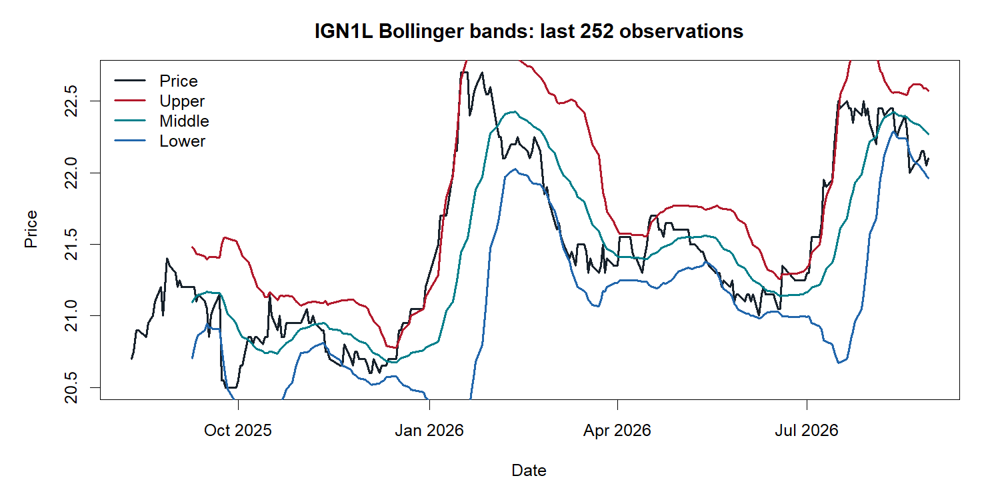

RSI(14) — enlarge last year

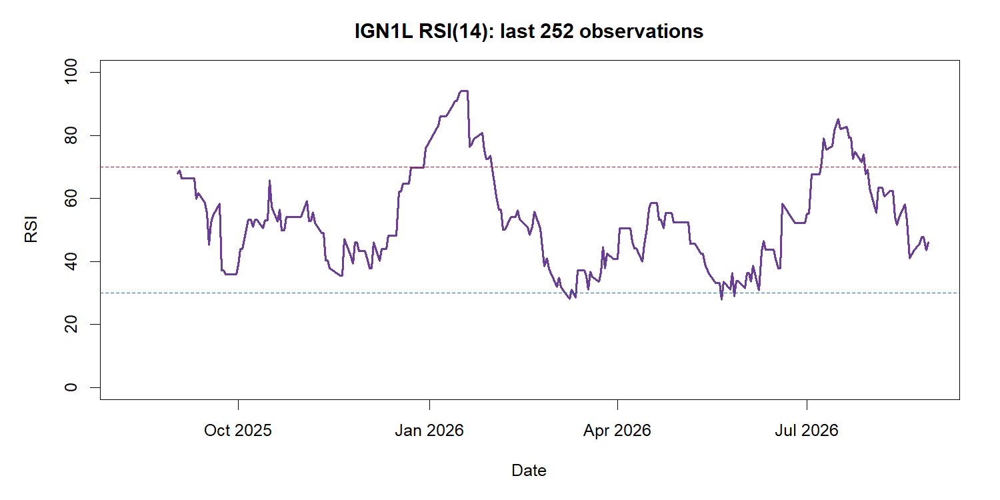

MACD — enlarge last year

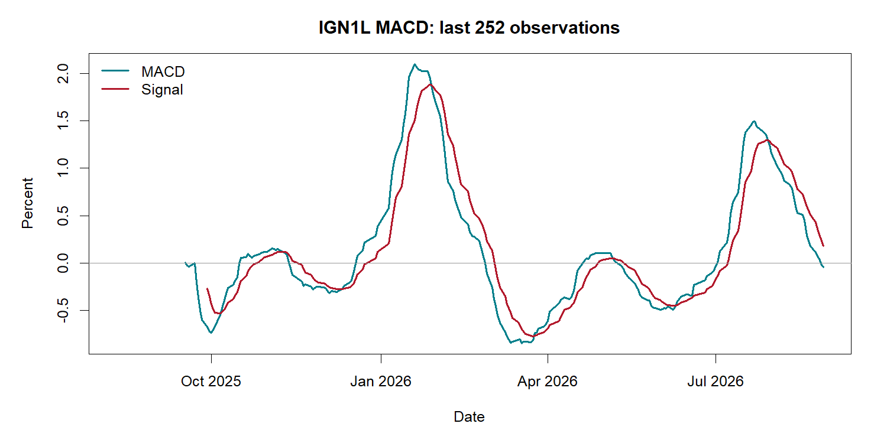

FSD, SSD and TSD components versus Baltic portfolios

The lower integrated CDF component is preferred at a given return threshold. Dominance requires the relevant curve to remain no higher over the complete domain, not merely over one interval.

All 72 PerformanceAnalytics measures

| Measure | Value |
| --- | --- |
| ArithmeticReturn | 0.000108 |
| GeometricReturn | 0.000087 |
| AnnualizedReturn_Arithmetic | 0.027126 |
| AnnualizedReturn_Geometric | 0.022275 |
| CumulativeReturn | 0.068138 |
| Volatility | 0.006362 |
| Volatility_Annualized | 0.101001 |
| MaximumDrawdown | 0.165620 |
| AverageDrawdown | 0.044485 |
| AverageDrawdownLength | 74.400000 |
| AverageRecoveryTime | 38.900000 |
| Sharpe_Daily | 0.016919 |
| Sharpe_Annualized | 0.268574 |
| Sharpe_VaR | 0.011676 |
| Sharpe_ES | 0.006979 |
| Sortino | 0.024262 |
| Calmar | 0.134494 |
| Omega | 1.054449 |
| Sterling | 0.083860 |
| Burke | 0.127683 |
| Martin | 0.259626 |
| UlcerIndex | 0.085796 |
| PainIndex | 0.070307 |
| PainRatio | 0.316822 |
| VaR_Loss | 0.009219 |
| ES_Loss | 0.015423 |
| DownsideDeviation | 0.004437 |
| DrawdownDeviation | 0.007873 |
| Rachev | 1.039140 |
| AdjustedSharpe | 0.263485 |
| Skewness | -0.033254 |
| Kurtosis | 8.810035 |
| UpsidePotential | 0.469849 |
| UpsideRisk | 0.004556 |
| BernardoLedoit | 1.054449 |
| DRatio | 0.968757 |
| Hurst | 0.358896 |
| Kappa | 0.015679 |
| Kelly | 2.659124 |
| Prospect | -0.532723 |
| Information_Daily | -0.058371 |
| Information_Annualized | -1.039489 |
| CAPMAlpha | 0.000085 |
| JensenAlpha | 0.016326 |
| Treynor_Daily | 0.003361 |
| Treynor_Annualized | 0.856261 |
| Modigliani | 0.000187 |
| TrackingError_Daily | 0.012509 |
| TrackingError_Annualized | 0.198573 |
| M2Sortino | 0.023483 |
| Appraisal | 0.161912 |
| CAPMBeta | 0.026014 |
| ActiveReturn | -0.206414 |
| OmegaExcessReturn | -0.003127 |
| BetaCoSkewness | -3.787258 |
| BetaCoKurtosis | -0.082161 |
| CDD | 0.109179 |
| CoSkewness | -0.000001 |
| CoKurtosis | -0.000000 |
| FamaBeta | 0.575188 |
| MSquaredExcess | -0.154606 |
| NetSelectivity | -0.109264 |
| Selectivity | 0.016326 |
| SpecificRisk | 0.100831 |
| SystematicRisk | 0.004568 |
| TotalRisk | 0.100934 |
| UpCapture | 0.040918 |
| UpNumber | 0.383028 |
| UpPercent | 0.162844 |
| DownCapture | 0.019678 |
| DownNumber | 0.399371 |
| DownPercent | 0.874214 |

Effect of removing this share from curent_update_baltic

| Measure | Portfolio without share | Change from baseline |
| --- | --- | --- |
| netSD | 0.788136 | -0.008475 |
| Rachev ratio | 1.201534 | -0.000949 |
| Sortino ratio | 0.176875 | 0.000292 |

The removed weight is distributed proportionally across all remaining holdings, so their weights still sum to 1.

<strong>GRG1L — Grigeo Group</strong> | HOLD | target 723 shares | priority 2

| Measure | Value |
| --- | --- |
| Current shares | 0 |
| Target shares | 723 |
| Change | +723 |
| Weight | 4.87% |
| Last price | EUR 1.0100 |
| Individual netSD | 0.3772 |
| OUT / IN | 49 / 6 |
| RSI(14) | 35.53 |
| MACD state | Bearish |
| Bollinger state | Inside bands |
| Technical decision | HOLD |
| Observation date | 2026-08-28 |

Bollinger Bands — enlarge last year

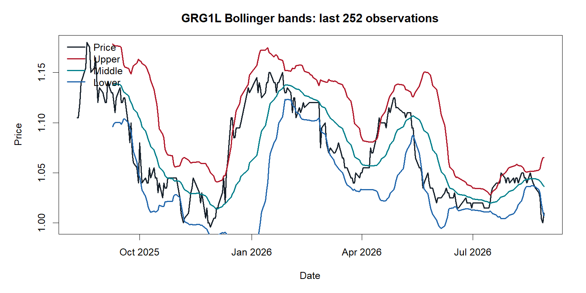

RSI(14) — enlarge last year

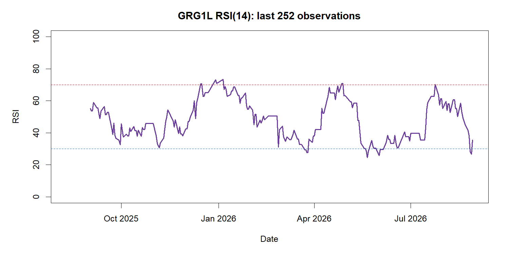

MACD — enlarge last year

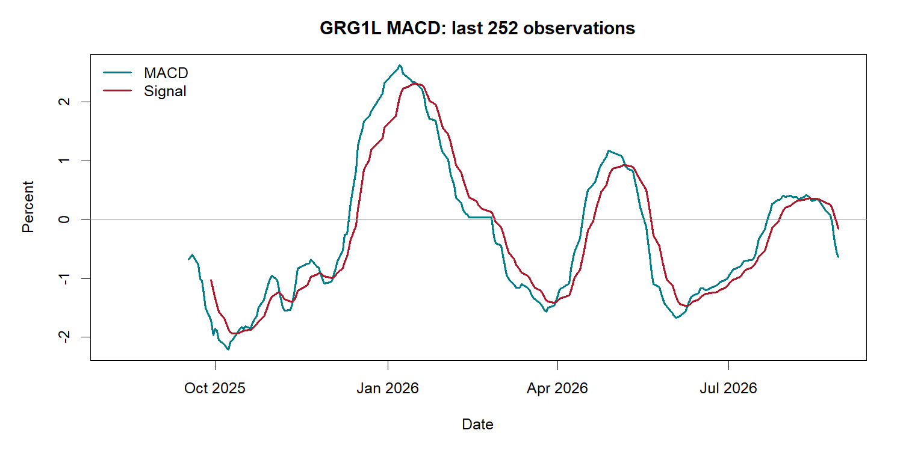

FSD, SSD and TSD components versus Baltic portfolios

The lower integrated CDF component is preferred at a given return threshold. Dominance requires the relevant curve to remain no higher over the complete domain, not merely over one interval.

All 72 PerformanceAnalytics measures

| Measure | Value |
| --- | --- |
| ArithmeticReturn | 0.000507 |
| GeometricReturn | 0.000459 |
| AnnualizedReturn_Arithmetic | 0.127810 |
| AnnualizedReturn_Geometric | 0.122677 |
| CumulativeReturn | 0.413726 |
| Volatility | 0.009829 |
| Volatility_Annualized | 0.156023 |
| MaximumDrawdown | 0.163104 |
| AverageDrawdown | 0.025521 |
| AverageDrawdownLength | 19.694444 |
| AverageRecoveryTime | 12.250000 |
| Sharpe_Daily | 0.051603 |
| Sharpe_Annualized | 0.819174 |
| Sharpe_VaR | 0.035105 |
| Sharpe_ES | 0.023893 |
| Sortino | 0.081544 |
| Calmar | 0.752135 |
| Omega | 1.173751 |
| Sterling | 0.466265 |
| Burke | 0.565621 |
| Martin | 2.053835 |
| UlcerIndex | 0.059730 |
| PainIndex | 0.043336 |
| PainRatio | 2.830823 |
| VaR_Loss | 0.014447 |
| ES_Loss | 0.021228 |
| DownsideDeviation | 0.006220 |
| DrawdownDeviation | 0.008942 |
| Rachev | 1.114414 |
| AdjustedSharpe | 0.718078 |
| Skewness | 1.110901 |
| Kurtosis | 12.838329 |
| UpsidePotential | 0.550860 |
| UpsideRisk | 0.007619 |
| BernardoLedoit | 1.173751 |
| DRatio | 0.806165 |
| Hurst | 0.382523 |
| Kappa | 0.056030 |
| Kelly | 5.250336 |
| Prospect | -0.505101 |
| Information_Daily | -0.024444 |
| Information_Annualized | -0.455607 |
| CAPMAlpha | 0.000492 |
| JensenAlpha | 0.118837 |
| Treynor_Daily | 0.027355 |
| Treynor_Annualized | 7.306573 |
| Modigliani | 0.000571 |
| TrackingError_Daily | 0.014658 |
| TrackingError_Annualized | 0.232684 |
| M2Sortino | 0.124429 |
| Appraisal | 0.762303 |
| CAPMBeta | 0.016790 |
| ActiveReturn | -0.106013 |
| OmegaExcessReturn | 0.087066 |
| BetaCoSkewness | -1.870061 |
| BetaCoKurtosis | 0.013070 |
| CDD | 0.057321 |
| CoSkewness | -0.000000 |
| CoKurtosis | 0.000000 |
| FamaBeta | 0.888531 |
| MSquaredExcess | -0.073755 |
| NetSelectivity | -0.080521 |
| Selectivity | 0.118837 |
| SpecificRisk | 0.155892 |
| SystematicRisk | 0.002948 |
| TotalRisk | 0.155920 |
| UpCapture | 0.025515 |
| UpNumber | 0.348624 |
| UpPercent | 0.206422 |
| DownCapture | -0.118101 |
| DownNumber | 0.355346 |
| DownPercent | 0.823899 |

Effect of removing this share from curent_update_baltic

| Measure | Portfolio without share | Change from baseline |
| --- | --- | --- |
| netSD | 0.762712 | -0.033898 |
| Rachev ratio | 1.208206 | 0.005723 |
| Sortino ratio | 0.171220 | -0.005364 |

The removed weight is distributed proportionally across all remaining holdings, so their weights still sum to 1.

<strong>VLP1L — Vilkyškių pieninė</strong> | HOLD | target 75 shares | priority 2

| Measure | Value |
| --- | --- |
| Current shares | 42 |
| Target shares | 75 |
| Change | +33 |
| Weight | 7.83% |
| Last price | EUR 15.5000 |
| Individual netSD | 0.3772 |
| OUT / IN | 43 / 0 |
| RSI(14) | 57.67 |
| MACD state | Bearish |
| Bollinger state | Inside bands |
| Technical decision | HOLD |
| Observation date | 2026-08-28 |

Bollinger Bands — enlarge last year

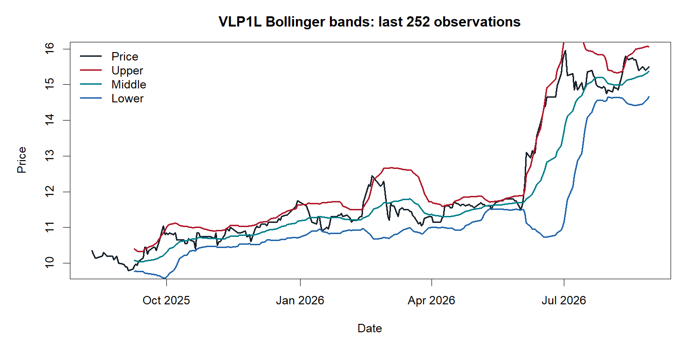

RSI(14) — enlarge last year

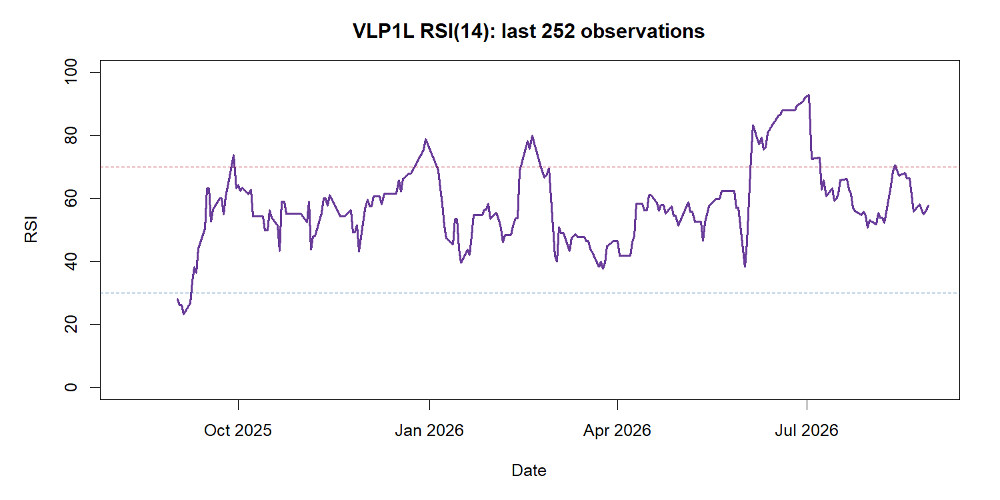

MACD — enlarge last year

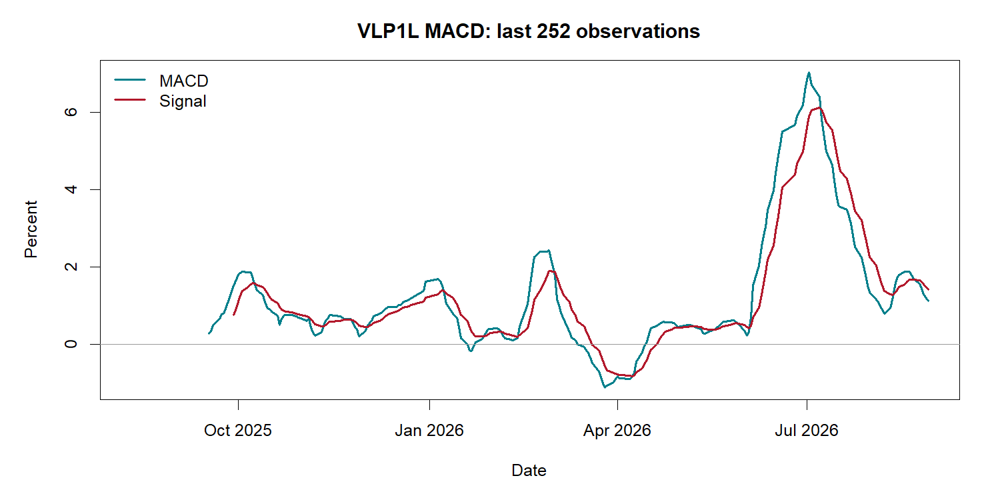

FSD, SSD and TSD components versus Baltic portfolios

The lower integrated CDF component is preferred at a given return threshold. Dominance requires the relevant curve to remain no higher over the complete domain, not merely over one interval.

All 72 PerformanceAnalytics measures

| Measure | Value |
| --- | --- |
| ArithmeticReturn | 0.001223 |
| GeometricReturn | 0.001140 |
| AnnualizedReturn_Arithmetic | 0.308070 |
| AnnualizedReturn_Geometric | 0.332487 |
| CumulativeReturn | 1.360478 |
| Volatility | 0.012975 |
| Volatility_Annualized | 0.205977 |
| MaximumDrawdown | 0.157158 |
| AverageDrawdown | 0.039828 |
| AverageDrawdownLength | 25.392857 |
| AverageRecoveryTime | 14.107143 |
| Sharpe_Daily | 0.094217 |
| Sharpe_Annualized | 1.495653 |
| Sharpe_VaR | 0.084766 |
| Sharpe_ES | 0.050656 |
| Sortino | 0.164747 |
| Calmar | 2.115625 |
| Omega | 1.369319 |
| Sterling | 1.292930 |
| Burke | 1.256071 |
| Martin | 5.265313 |
| UlcerIndex | 0.063147 |
| PainIndex | 0.047953 |
| PainRatio | 6.933606 |
| VaR_Loss | 0.014422 |
| ES_Loss | 0.024133 |
| DownsideDeviation | 0.007420 |
| DrawdownDeviation | 0.010767 |
| Rachev | 1.428309 |
| AdjustedSharpe | -0.792235 |
| Skewness | 1.859172 |
| Kurtosis | 24.383907 |
| UpsidePotential | 0.610832 |
| UpsideRisk | 0.010704 |
| BernardoLedoit | 1.369319 |
| DRatio | 0.658191 |
| Hurst | 0.426761 |
| Kappa | 0.100544 |
| Kelly | 7.261257 |
| Prospect | -0.392858 |
| Information_Daily | 0.019363 |
| Information_Annualized | 0.393018 |
| CAPMAlpha | 0.001173 |
| JensenAlpha | 0.319473 |
| Treynor_Daily | 0.020028 |
| Treynor_Annualized | 5.842701 |
| Modigliani | 0.001042 |
| TrackingError_Daily | 0.016637 |
| TrackingError_Annualized | 0.264105 |
| M2Sortino | 0.332887 |
| Appraisal | 1.553874 |
| CAPMBeta | 0.056906 |
| ActiveReturn | 0.103798 |
| OmegaExcessReturn | 0.290002 |
| BetaCoSkewness | -0.725375 |
| BetaCoKurtosis | -0.007644 |
| CDD | 0.095077 |
| CoSkewness | -0.000000 |
| CoKurtosis | -0.000000 |
| FamaBeta | 1.173012 |
| MSquaredExcess | 0.044566 |
| NetSelectivity | 0.064232 |
| Selectivity | 0.319473 |
| SpecificRisk | 0.205598 |
| SystematicRisk | 0.009993 |
| TotalRisk | 0.205841 |
| UpCapture | 0.183974 |
| UpNumber | 0.426606 |
| UpPercent | 0.275229 |
| DownCapture | -0.130313 |
| DownNumber | 0.361635 |
| DownPercent | 0.798742 |

Effect of removing this share from curent_update_baltic

| Measure | Portfolio without share | Change from baseline |
| --- | --- | --- |
| netSD | 0.720339 | -0.076271 |
| Rachev ratio | 1.202236 | -0.000247 |
| Sortino ratio | 0.149701 | -0.026882 |

The removed weight is distributed proportionally across all remaining holdings, so their weights still sum to 1.

<strong>KNE1L — KN Energies</strong> | HOLD | target 1226 shares | priority 4

| Measure | Value |
| --- | --- |
| Current shares | 0 |
| Target shares | 1226 |
| Change | +1226 |
| Weight | 4.02% |
| Last price | EUR 0.4920 |
| Individual netSD | 0.3684 |
| OUT / IN | 42 / 0 |
| RSI(14) | 55.64 |
| MACD state | Bullish |
| Bollinger state | Inside bands |
| Technical decision | HOLD |
| Observation date | 2026-08-28 |

Bollinger Bands — enlarge last year

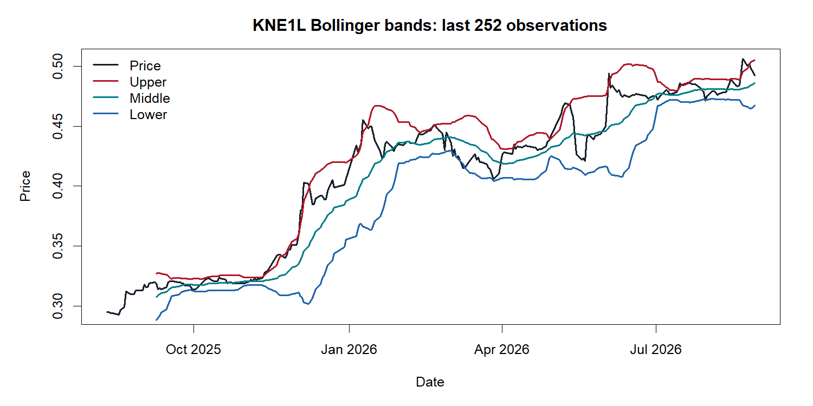

RSI(14) — enlarge last year

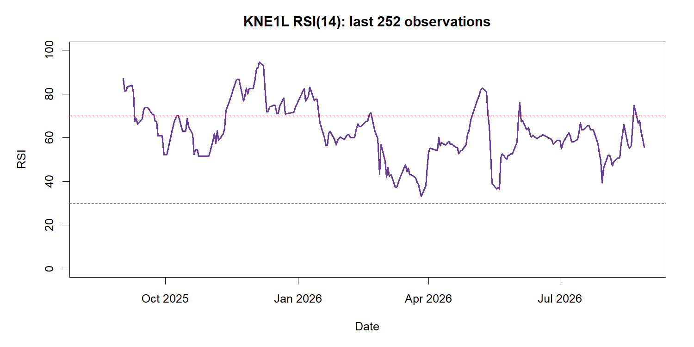

MACD — enlarge last year

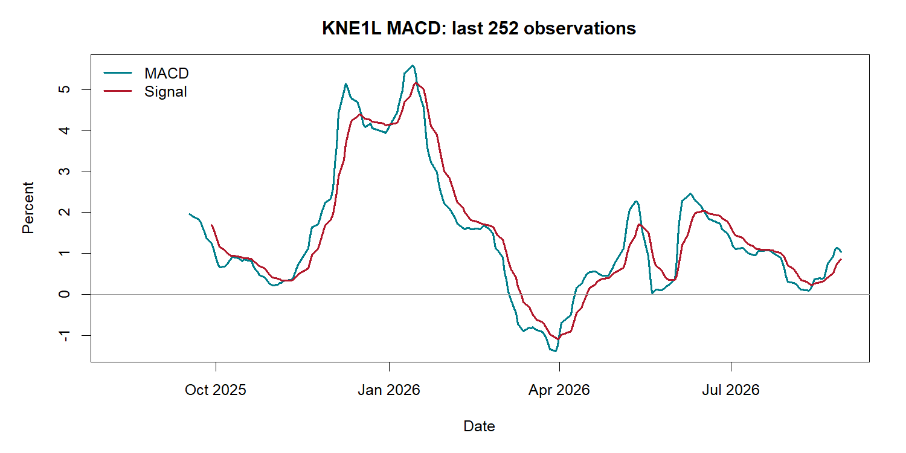

FSD, SSD and TSD components versus Baltic portfolios

The lower integrated CDF component is preferred at a given return threshold. Dominance requires the relevant curve to remain no higher over the complete domain, not merely over one interval.

All 72 PerformanceAnalytics measures

| Measure | Value |
| --- | --- |
| ArithmeticReturn | 0.000970 |
| GeometricReturn | 0.000892 |
| AnnualizedReturn_Arithmetic | 0.244434 |
| AnnualizedReturn_Geometric | 0.251806 |
| CumulativeReturn | 0.958110 |
| Volatility | 0.012585 |
| Volatility_Annualized | 0.199782 |
| MaximumDrawdown | 0.262350 |
| AverageDrawdown | 0.040766 |
| AverageDrawdownLength | 33.000000 |
| AverageRecoveryTime | 18.954545 |
| Sharpe_Daily | 0.077074 |
| Sharpe_Annualized | 1.223506 |
| Sharpe_VaR | 0.062324 |
| Sharpe_ES | 0.039062 |
| Sortino | 0.130612 |
| Calmar | 0.959809 |
| Omega | 1.290164 |
| Sterling | 0.694925 |
| Burke | 1.001545 |
| Martin | 2.047422 |
| UlcerIndex | 0.122987 |
| PainIndex | 0.091665 |
| PainRatio | 2.747028 |
| VaR_Loss | 0.015563 |
| ES_Loss | 0.024832 |
| DownsideDeviation | 0.007426 |
| DrawdownDeviation | 0.011794 |
| Rachev | 1.379867 |
| AdjustedSharpe | 0.864712 |
| Skewness | 1.082079 |
| Kurtosis | 11.239148 |
| UpsidePotential | 0.580744 |
| UpsideRisk | 0.010196 |
| BernardoLedoit | 1.290164 |
| DRatio | 0.740349 |
| Hurst | 0.383627 |
| Kappa | 0.083316 |
| Kelly | 6.124211 |
| Prospect | -0.432052 |
| Information_Daily | 0.004520 |
| Information_Annualized | 0.088911 |
| CAPMAlpha | 0.000925 |
| JensenAlpha | 0.240138 |
| Treynor_Daily | 0.017476 |
| Treynor_Annualized | 4.935416 |
| Modigliani | 0.000853 |
| TrackingError_Daily | 0.016379 |
| TrackingError_Annualized | 0.260001 |
| M2Sortino | 0.252111 |
| Appraisal | 1.204012 |
| CAPMBeta | 0.051020 |
| ActiveReturn | 0.023117 |
| OmegaExcessReturn | 0.209287 |
| BetaCoSkewness | -1.303857 |
| BetaCoKurtosis | -0.058605 |
| CDD | 0.090512 |
| CoSkewness | -0.000000 |
| CoKurtosis | -0.000000 |
| FamaBeta | 1.137731 |
| MSquaredExcess | -0.005995 |
| NetSelectivity | -0.008381 |
| Selectivity | 0.240138 |
| SpecificRisk | 0.199448 |
| SystematicRisk | 0.008959 |
| TotalRisk | 0.199650 |
| UpCapture | 0.160227 |
| UpNumber | 0.364679 |
| UpPercent | 0.227064 |
| DownCapture | -0.085429 |
| DownNumber | 0.355346 |
| DownPercent | 0.801887 |

Effect of removing this share from curent_update_baltic

| Measure | Portfolio without share | Change from baseline |
| --- | --- | --- |
| netSD | 0.754237 | -0.042373 |
| Rachev ratio | 1.209135 | 0.006652 |
| Sortino ratio | 0.168507 | -0.008076 |

The removed weight is distributed proportionally across all remaining holdings, so their weights still sum to 1.

<strong>MRK1T — Merko Ehitus</strong> | HOLD | target 38 shares | priority 4

| Measure | Value |
| --- | --- |
| Current shares | 20 |
| Target shares | 38 |
| Change | +18 |
| Weight | 6.97% |
| Last price | EUR 26.9000 |
| Individual netSD | 0.3684 |
| OUT / IN | 42 / 0 |
| RSI(14) | 40.54 |
| MACD state | Bearish |
| Bollinger state | Inside bands |
| Technical decision | HOLD |
| Observation date | 2026-08-28 |

Bollinger Bands — enlarge last year

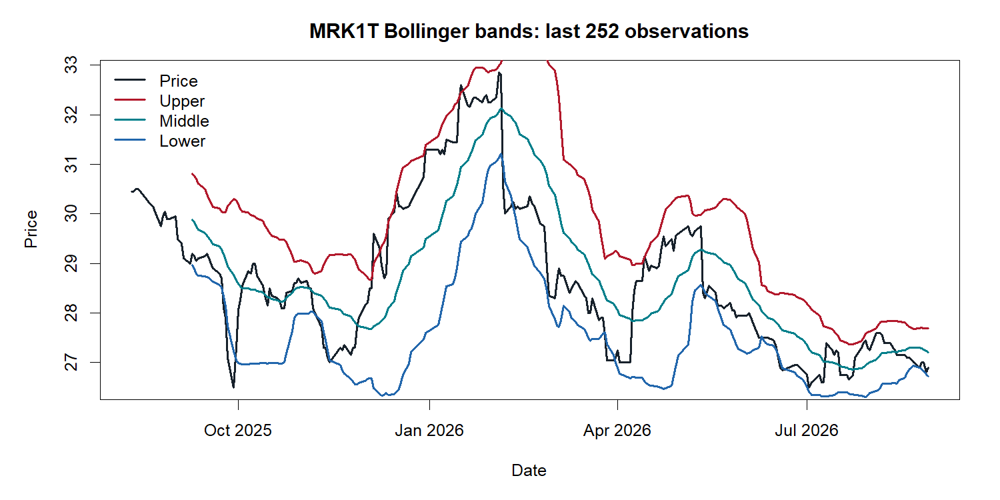

RSI(14) — enlarge last year

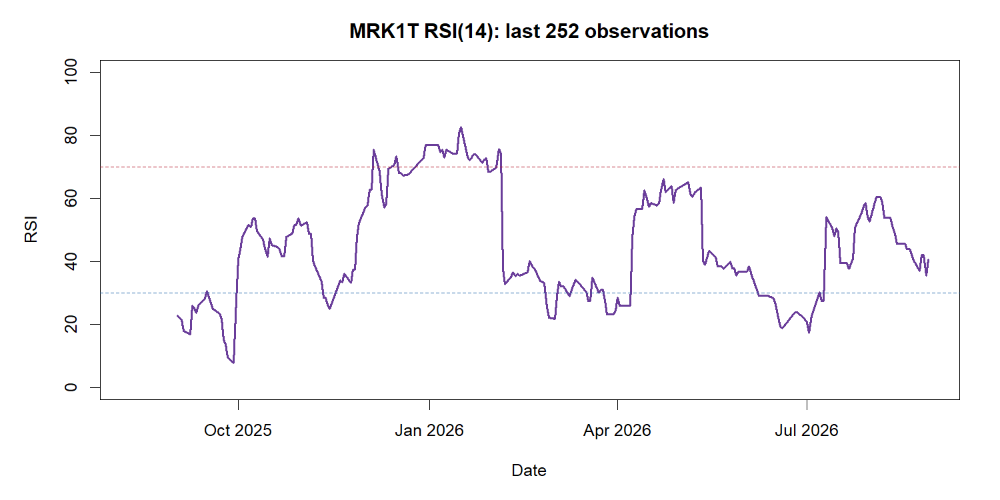

MACD — enlarge last year

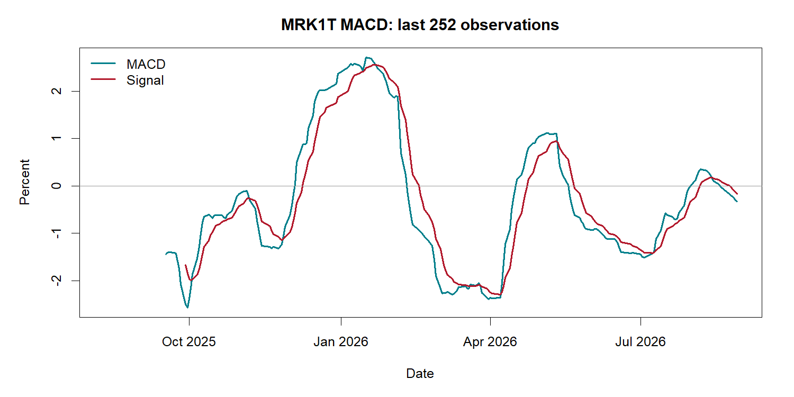

FSD, SSD and TSD components versus Baltic portfolios

The lower integrated CDF component is preferred at a given return threshold. Dominance requires the relevant curve to remain no higher over the complete domain, not merely over one interval.

All 72 PerformanceAnalytics measures

| Measure | Value |
| --- | --- |
| ArithmeticReturn | 0.000873 |
| GeometricReturn | 0.000817 |
| AnnualizedReturn_Arithmetic | 0.219897 |
| AnnualizedReturn_Geometric | 0.228513 |
| CumulativeReturn | 0.851101 |
| Volatility | 0.010598 |
| Volatility_Annualized | 0.168242 |
| MaximumDrawdown | 0.213246 |
| AverageDrawdown | 0.030621 |
| AverageDrawdownLength | 22.258065 |
| AverageRecoveryTime | 11.064516 |
| Sharpe_Daily | 0.082335 |
| Sharpe_Annualized | 1.307029 |
| Sharpe_VaR | 0.072461 |
| Sharpe_ES | 0.040486 |
| Sortino | 0.138032 |
| Calmar | 1.071592 |
| Omega | 1.329059 |
| Sterling | 0.729500 |
| Burke | 0.901691 |
| Martin | 2.953061 |
| UlcerIndex | 0.077382 |
| PainIndex | 0.049366 |
| PainRatio | 4.628938 |
| VaR_Loss | 0.012042 |
| ES_Loss | 0.021553 |
| DownsideDeviation | 0.006322 |
| DrawdownDeviation | 0.010945 |
| Rachev | 1.344492 |
| AdjustedSharpe | 0.276910 |
| Skewness | 1.268852 |
| Kurtosis | 17.955590 |
| UpsidePotential | 0.557509 |
| UpsideRisk | 0.008542 |
| BernardoLedoit | 1.329059 |
| DRatio | 0.694712 |
| Hurst | 0.405900 |
| Kappa | 0.082490 |
| Kelly | 7.768742 |
| Prospect | -0.386314 |
| Information_Daily | -0.000039 |
| Information_Annualized | -0.000761 |
| CAPMAlpha | 0.000792 |
| JensenAlpha | 0.207631 |
| Treynor_Daily | 0.008948 |
| Treynor_Annualized | 2.502555 |
| Modigliani | 0.000911 |
| TrackingError_Daily | 0.014572 |
| TrackingError_Annualized | 0.231319 |
| M2Sortino | 0.231256 |
| Appraisal | 1.240587 |
| CAPMBeta | 0.091312 |
| ActiveReturn | -0.000176 |
| OmegaExcessReturn | 0.192319 |
| BetaCoSkewness | -0.108044 |
| BetaCoKurtosis | -0.013832 |
| CDD | 0.054320 |
| CoSkewness | -0.000000 |
| CoKurtosis | -0.000000 |
| FamaBeta | 0.958116 |
| MSquaredExcess | 0.007987 |
| NetSelectivity | 0.009402 |
| Selectivity | 0.207631 |
| SpecificRisk | 0.167365 |
| SystematicRisk | 0.016034 |
| TotalRisk | 0.168131 |
| UpCapture | 0.232974 |
| UpNumber | 0.470183 |
| UpPercent | 0.243119 |
| DownCapture | 0.035101 |
| DownNumber | 0.430818 |
| DownPercent | 0.808176 |

Effect of removing this share from curent_update_baltic

| Measure | Portfolio without share | Change from baseline |
| --- | --- | --- |
| netSD | 0.728814 | -0.067797 |
| Rachev ratio | 1.188254 | -0.014229 |
| Sortino ratio | 0.160993 | -0.015590 |

The removed weight is distributed proportionally across all remaining holdings, so their weights still sum to 1.

<strong>APG1L — Apranga</strong> | HOLD | target 329 shares | priority 6

| Measure | Value |
| --- | --- |
| Current shares | 200 |
| Target shares | 329 |
| Change | +129 |
| Weight | 8.74% |
| Last price | EUR 3.9800 |
| Individual netSD | 0.3333 |
| OUT / IN | 38 / 0 |
| RSI(14) | 55.56 |
| MACD state | Bearish |
| Bollinger state | Inside bands |
| Technical decision | HOLD |
| Observation date | 2026-08-28 |

Bollinger Bands — enlarge last year

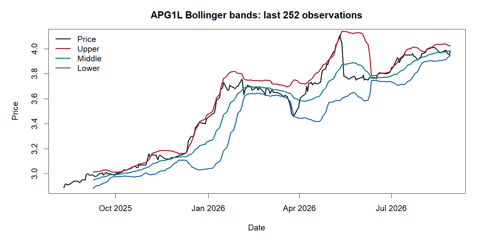

RSI(14) — enlarge last year

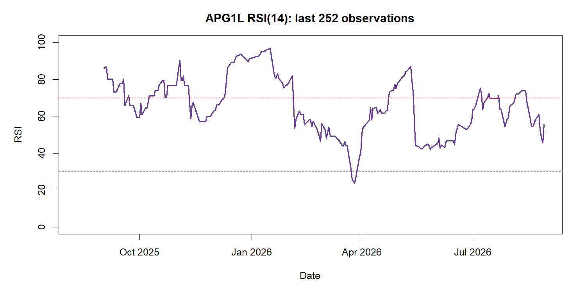

MACD — enlarge last year

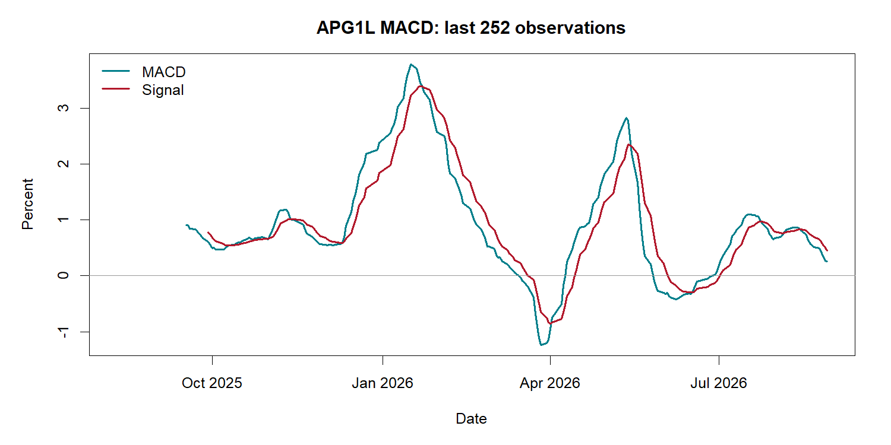

FSD, SSD and TSD components versus Baltic portfolios

The lower integrated CDF component is preferred at a given return threshold. Dominance requires the relevant curve to remain no higher over the complete domain, not merely over one interval.

All 72 PerformanceAnalytics measures

| Measure | Value |
| --- | --- |
| ArithmeticReturn | 0.000854 |
| GeometricReturn | 0.000815 |
| AnnualizedReturn_Arithmetic | 0.215236 |
| AnnualizedReturn_Geometric | 0.227925 |
| CumulativeReturn | 0.848452 |
| Volatility | 0.008762 |
| Volatility_Annualized | 0.139094 |
| MaximumDrawdown | 0.122520 |
| AverageDrawdown | 0.022993 |
| AverageDrawdownLength | 31.090909 |
| AverageRecoveryTime | 22.136364 |
| Sharpe_Daily | 0.097478 |
| Sharpe_Annualized | 1.547413 |
| Sharpe_VaR | 0.105986 |
| Sharpe_ES | 0.045711 |
| Sortino | 0.132530 |
| Calmar | 1.860315 |
| Omega | 1.452921 |
| Sterling | 1.024293 |
| Burke | 1.133884 |
| Martin | 4.059646 |
| UlcerIndex | 0.056144 |
| PainIndex | 0.042201 |
| PainRatio | 5.400998 |
| VaR_Loss | 0.008059 |
| ES_Loss | 0.018685 |
| DownsideDeviation | 0.006445 |
| DrawdownDeviation | 0.007213 |
| Rachev | 1.219309 |
| AdjustedSharpe | -5.572545 |
| Skewness | -2.803633 |
| Kurtosis | 41.870691 |
| UpsidePotential | 0.425141 |
| UpsideRisk | 0.005989 |
| BernardoLedoit | 1.452921 |
| DRatio | 0.504583 |
| Hurst | 0.441221 |
| Kappa | 0.062549 |
| Kelly | 11.124919 |
| Prospect | -0.233234 |
| Information_Daily | -0.000181 |
| Information_Annualized | -0.003533 |
| CAPMAlpha | 0.000805 |
| JensenAlpha | 0.215245 |
| Treynor_Daily | 0.014701 |
| Treynor_Annualized | 4.110665 |
| Modigliani | 0.001078 |
| TrackingError_Daily | 0.013622 |
| TrackingError_Annualized | 0.216245 |
| M2Sortino | 0.230300 |
| Appraisal | 1.552311 |
| CAPMBeta | 0.055447 |
| ActiveReturn | -0.000764 |
| OmegaExcessReturn | 0.191027 |
| BetaCoSkewness | -1.508227 |
| BetaCoKurtosis | 0.019251 |
| CDD | 0.072705 |
| CoSkewness | -0.000000 |
| CoKurtosis | 0.000000 |
| FamaBeta | 0.792124 |
| MSquaredExcess | 0.048060 |
| NetSelectivity | 0.046775 |
| Selectivity | 0.215245 |
| SpecificRisk | 0.138661 |
| SystematicRisk | 0.009736 |
| TotalRisk | 0.139002 |
| UpCapture | 0.127047 |
| UpNumber | 0.424312 |
| UpPercent | 0.181193 |
| DownCapture | -0.092921 |
| DownNumber | 0.330189 |
| DownPercent | 0.877358 |

Effect of removing this share from curent_update_baltic

| Measure | Portfolio without share | Change from baseline |
| --- | --- | --- |
| netSD | 0.711864 | -0.084746 |
| Rachev ratio | 1.236434 | 0.033951 |
| Sortino ratio | 0.161783 | -0.014800 |

The removed weight is distributed proportionally across all remaining holdings, so their weights still sum to 1.

<strong>VIRSI — VIRŠI-A</strong> | HOLD | target 10 shares | priority 7

| Measure | Value |
| --- | --- |
| Current shares | 0 |
| Target shares | 10 |
| Change | +10 |
| Weight | 0.27% |
| Last price | EUR 4.1000 |
| Individual netSD | 0.2982 |
| OUT / IN | 34 / 0 |
| RSI(14) | 39.50 |
| MACD state | Bullish |
| Bollinger state | Inside bands |
| Technical decision | HOLD |
| Observation date | 2026-08-28 |

Bollinger Bands — enlarge last year

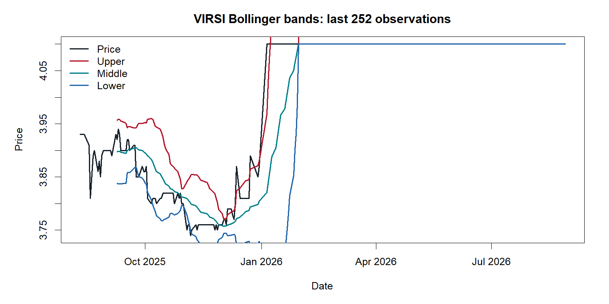

RSI(14) — enlarge last year

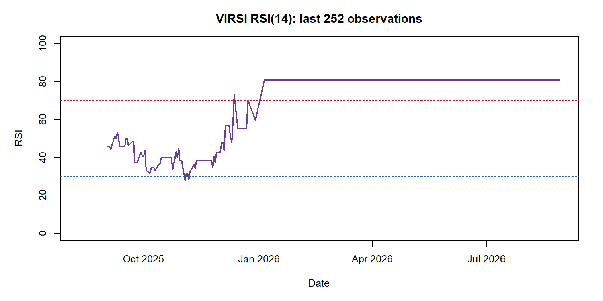

MACD — enlarge last year

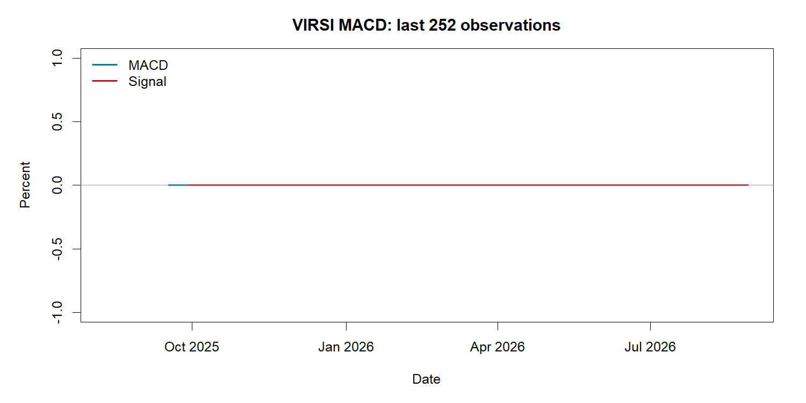

FSD, SSD and TSD components versus Baltic portfolios

The lower integrated CDF component is preferred at a given return threshold. Dominance requires the relevant curve to remain no higher over the complete domain, not merely over one interval.

All 72 PerformanceAnalytics measures

| Measure | Value |
| --- | --- |
| ArithmeticReturn | -0.000133 |
| GeometricReturn | -0.000137 |
| AnnualizedReturn_Arithmetic | -0.033418 |
| AnnualizedReturn_Geometric | -0.033996 |
| CumulativeReturn | -0.098313 |
| Volatility | 0.003040 |
| Volatility_Annualized | 0.048259 |
| MaximumDrawdown | 0.124120 |
| AverageDrawdown | 0.027761 |
| AverageDrawdownLength | 124.833333 |
| AverageRecoveryTime | 74.500000 |
| Sharpe_Daily | -0.043621 |
| Sharpe_Annualized | -0.692463 |
| Sharpe_VaR | -0.027517 |
| Sharpe_ES | -0.016389 |
| Sortino | -0.055034 |
| Calmar | -0.273898 |
| Omega | 0.840536 |
| Sterling | -0.151688 |
| Burke | -0.454512 |
| Martin | -0.363783 |
| UlcerIndex | 0.093452 |
| PainIndex | 0.081684 |
| PainRatio | -0.416191 |
| VaR_Loss | 0.004819 |
| ES_Loss | 0.008091 |
| DownsideDeviation | 0.002410 |
| DrawdownDeviation | 0.004590 |
| Rachev | 0.830411 |
| AdjustedSharpe | -0.579847 |
| Skewness | -1.885460 |
| Kurtosis | 22.031264 |
| UpsidePotential | 0.290085 |
| UpsideRisk | 0.001855 |
| BernardoLedoit | 0.840536 |
| DRatio | 1.278744 |
| Hurst | 0.409033 |
| Kappa | -0.030795 |
| Kelly | -14.348873 |
| Prospect | -0.486434 |
| Information_Daily | -0.082876 |
| Information_Annualized | -1.436276 |
| CAPMAlpha | -0.000129 |
| JensenAlpha | -0.032932 |
| Treynor_Daily | 0.029502 |
| Treynor_Annualized | 7.308020 |
| Modigliani | -0.000483 |
| TrackingError_Daily | 0.011521 |
| TrackingError_Annualized | 0.182893 |
| M2Sortino | -0.038508 |
| Appraisal | -0.682961 |
| CAPMBeta | -0.004652 |
| ActiveReturn | -0.262686 |
| OmegaExcessReturn | -0.047792 |
| BetaCoSkewness | -1.229618 |
| BetaCoKurtosis | 0.019891 |
| CDD | 0.070421 |
| CoSkewness | -0.000000 |
| CoKurtosis | 0.000000 |
| FamaBeta | 0.274829 |
| MSquaredExcess | -0.286801 |
| NetSelectivity | -0.096847 |
| Selectivity | -0.032932 |
| SpecificRisk | 0.048220 |
| SystematicRisk | -0.000817 |
| TotalRisk | 0.048227 |
| UpCapture | -0.032328 |
| UpNumber | 0.185780 |
| UpPercent | 0.052752 |
| DownCapture | -0.001457 |
| DownNumber | 0.191824 |
| DownPercent | 0.927673 |

Effect of removing this share from curent_update_baltic

| Measure | Portfolio without share | Change from baseline |
| --- | --- | --- |
| netSD | 0.796610 | 0.000000 |
| Rachev ratio | 1.202553 | 0.000070 |
| Sortino ratio | 0.176762 | 0.000179 |

The removed weight is distributed proportionally across all remaining holdings, so their weights still sum to 1.

<strong>RSU1L — Rokiškio sūris</strong> | HOLD | target 155 shares | priority 8

| Measure | Value |
| --- | --- |
| Current shares | 0 |
| Target shares | 155 |
| Change | +155 |
| Weight | 4.74% |
| Last price | EUR 4.5600 |
| Individual netSD | 0.2544 |
| OUT / IN | 35 / 6 |
| RSI(14) | 58.03 |
| MACD state | Bullish |
| Bollinger state | Inside bands |
| Technical decision | HOLD |
| Observation date | 2026-08-28 |

Bollinger Bands — enlarge last year

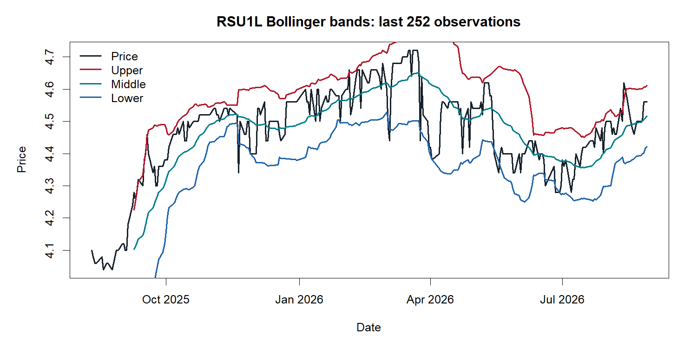

RSI(14) — enlarge last year

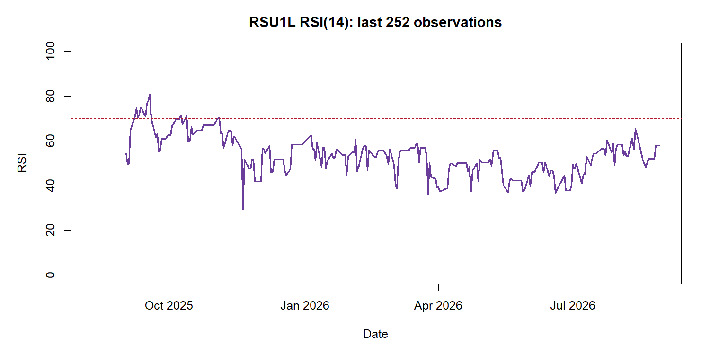

MACD — enlarge last year

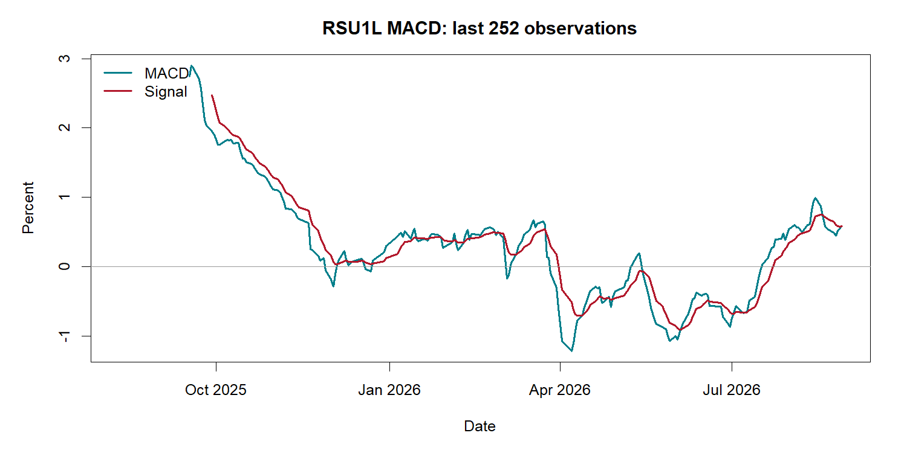

FSD, SSD and TSD components versus Baltic portfolios

The lower integrated CDF component is preferred at a given return threshold. Dominance requires the relevant curve to remain no higher over the complete domain, not merely over one interval.

All 72 PerformanceAnalytics measures

| Measure | Value |
| --- | --- |
| ArithmeticReturn | 0.000234 |
| GeometricReturn | 0.000116 |
| AnnualizedReturn_Arithmetic | 0.058990 |
| AnnualizedReturn_Geometric | 0.029780 |
| CumulativeReturn | 0.091774 |
| Volatility | 0.015378 |
| Volatility_Annualized | 0.244115 |
| MaximumDrawdown | 0.159089 |
| AverageDrawdown | 0.073389 |
| AverageDrawdownLength | 67.454545 |
| AverageRecoveryTime | 35.272727 |
| Sharpe_Daily | 0.015222 |
| Sharpe_Annualized | 0.241649 |
| Sharpe_VaR | 0.009229 |
| Sharpe_ES | 0.006528 |
| Sortino | 0.022589 |
| Calmar | 0.187193 |
| Omega | 1.052456 |
| Sterling | 0.114943 |
| Burke | 0.095021 |
| Martin | 0.461094 |
| UlcerIndex | 0.064586 |
| PainIndex | 0.053798 |
| PainRatio | 0.553557 |
| VaR_Loss | 0.025365 |
| ES_Loss | 0.035860 |
| DownsideDeviation | 0.010363 |
| DrawdownDeviation | 0.010488 |
| Rachev | 1.071028 |
| AdjustedSharpe | 0.242870 |
| Skewness | 0.436525 |
| Kurtosis | 8.148953 |
| UpsidePotential | 0.453221 |
| UpsideRisk | 0.011350 |
| BernardoLedoit | 1.052456 |
| DRatio | 0.967126 |
| Hurst | 0.351713 |
| Kappa | 0.015195 |
| Kelly | 0.989899 |
| Prospect | -0.515701 |
| Information_Daily | -0.038401 |
| Information_Annualized | -0.686268 |
| CAPMAlpha | 0.000143 |
| JensenAlpha | 0.005979 |
| Treynor_Daily | 0.001119 |
| Treynor_Annualized | 0.286143 |
| Modigliani | 0.000168 |
| TrackingError_Daily | 0.018258 |
| TrackingError_Annualized | 0.289842 |
| M2Sortino | 0.028780 |
| Appraisal | 0.024580 |
| CAPMBeta | 0.104075 |
| ActiveReturn | -0.198909 |
| OmegaExcessReturn | -0.029551 |
| BetaCoSkewness | -3.452885 |
| BetaCoKurtosis | 0.121557 |
| CDD | 0.125774 |
| CoSkewness | -0.000000 |
| CoKurtosis | 0.000000 |
| FamaBeta | 1.390202 |
| MSquaredExcess | -0.168690 |
| NetSelectivity | -0.288144 |
| Selectivity | 0.005979 |
| SpecificRisk | 0.243268 |
| SystematicRisk | 0.018275 |
| TotalRisk | 0.243954 |
| UpCapture | 0.143059 |
| UpNumber | 0.309633 |
| UpPercent | 0.236239 |
| DownCapture | 0.110948 |
| DownNumber | 0.339623 |
| DownPercent | 0.761006 |

Effect of removing this share from curent_update_baltic

| Measure | Portfolio without share | Change from baseline |
| --- | --- | --- |
| netSD | 0.771186 | -0.025424 |
| Rachev ratio | 1.238953 | 0.036470 |
| Sortino ratio | 0.179974 | 0.003391 |

The removed weight is distributed proportionally across all remaining holdings, so their weights still sum to 1.

<strong>PZV1L — Pieno žvaigždės</strong> | HOLD | target 251 shares | priority 9

| Measure | Value |
| --- | --- |
| Current shares | 0 |
| Target shares | 251 |
| Change | +251 |
| Weight | 2.90% |
| Last price | EUR 1.7300 |
| Individual netSD | 0.1842 |
| OUT / IN | 35 / 14 |
| RSI(14) | 46.60 |
| MACD state | Bearish |
| Bollinger state | Inside bands |
| Technical decision | HOLD |
| Observation date | 2026-08-28 |

Bollinger Bands — enlarge last year

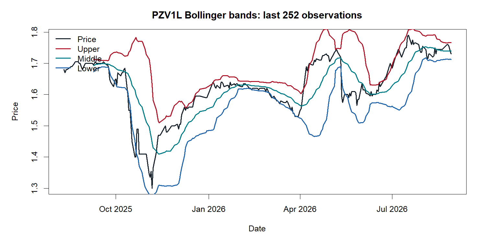

RSI(14) — enlarge last year

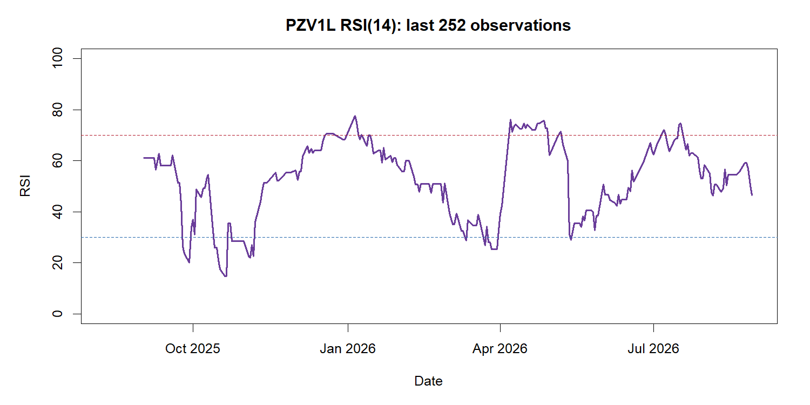

MACD — enlarge last year

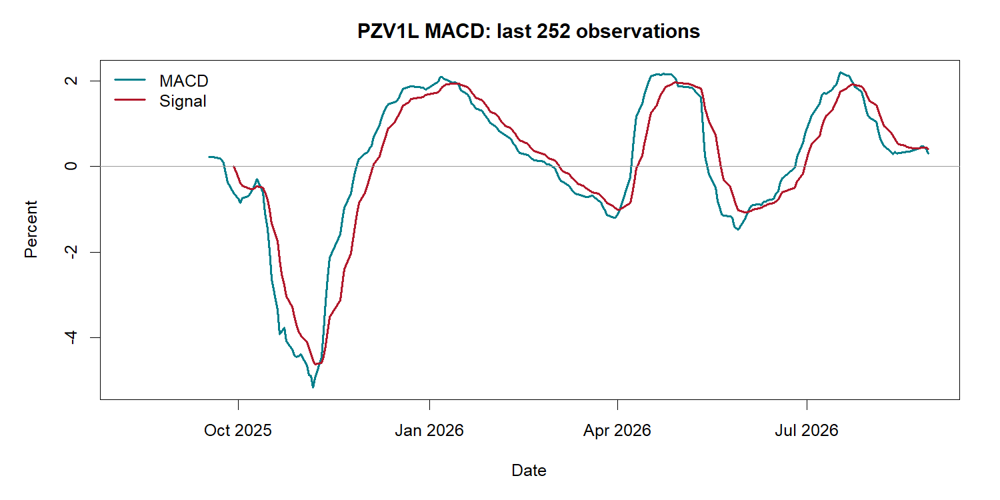

FSD, SSD and TSD components versus Baltic portfolios

The lower integrated CDF component is preferred at a given return threshold. Dominance requires the relevant curve to remain no higher over the complete domain, not merely over one interval.

All 72 PerformanceAnalytics measures

| Measure | Value |
| --- | --- |
| ArithmeticReturn | 0.000850 |
| GeometricReturn | 0.000752 |
| AnnualizedReturn_Arithmetic | 0.214083 |
| AnnualizedReturn_Geometric | 0.208457 |
| CumulativeReturn | 0.762141 |
| Volatility | 0.014032 |
| Volatility_Annualized | 0.222748 |
| MaximumDrawdown | 0.212625 |
| AverageDrawdown | 0.037616 |
| AverageDrawdownLength | 18.810811 |
| AverageRecoveryTime | 9.054054 |
| Sharpe_Daily | 0.060544 |
| Sharpe_Annualized | 0.961100 |
| Sharpe_VaR | 0.050639 |
| Sharpe_ES | 0.027378 |
| Sortino | 0.093674 |
| Calmar | 0.980395 |
| Omega | 1.241052 |
| Sterling | 0.666794 |
| Burke | 0.701161 |
| Martin | 2.575798 |
| UlcerIndex | 0.080929 |
| PainIndex | 0.055102 |
| PainRatio | 3.783116 |
| VaR_Loss | 0.016776 |
| ES_Loss | 0.031030 |
| DownsideDeviation | 0.009069 |
| DrawdownDeviation | 0.014074 |
| Rachev | 1.173382 |
| AdjustedSharpe | 0.494959 |
| Skewness | 0.556555 |
| Kurtosis | 17.917831 |
| UpsidePotential | 0.482278 |
| UpsideRisk | 0.010729 |
| BernardoLedoit | 1.241052 |
| DRatio | 0.722207 |
| Hurst | 0.406966 |
| Kappa | 0.054267 |
| Kelly | 4.314746 |
| Prospect | -0.392082 |
| Information_Daily | -0.003752 |
| Information_Annualized | -0.072514 |
| CAPMAlpha | 0.000812 |
| JensenAlpha | 0.198809 |
| Treynor_Daily | 0.017818 |
| Treynor_Annualized | 4.941486 |
| Modigliani | 0.000670 |
| TrackingError_Daily | 0.017576 |
| TrackingError_Annualized | 0.279015 |
| M2Sortino | 0.206232 |
| Appraisal | 0.893618 |
| CAPMBeta | 0.042185 |
| ActiveReturn | -0.020233 |
| OmegaExcessReturn | 0.156533 |
| BetaCoSkewness | -0.465367 |
| BetaCoKurtosis | 0.055288 |
| CDD | 0.096713 |
| CoSkewness | -0.000000 |
| CoKurtosis | 0.000000 |
| FamaBeta | 1.268520 |
| MSquaredExcess | -0.052380 |
| NetSelectivity | -0.081640 |
| Selectivity | 0.198809 |
| SpecificRisk | 0.222477 |
| SystematicRisk | 0.007408 |
| TotalRisk | 0.222600 |
| UpCapture | 0.131042 |
| UpNumber | 0.362385 |
| UpPercent | 0.233945 |
| DownCapture | -0.086529 |
| DownNumber | 0.314465 |
| DownPercent | 0.817610 |

Effect of removing this share from curent_update_baltic

| Measure | Portfolio without share | Change from baseline |
| --- | --- | --- |
| netSD | 0.762712 | -0.033898 |
| Rachev ratio | 1.213216 | 0.010733 |
| Sortino ratio | 0.171000 | -0.005583 |

The removed weight is distributed proportionally across all remaining holdings, so their weights still sum to 1.

<strong>ROE1L — Artea Bankas</strong> | HOLD | target 667 shares | priority 9

| Measure | Value |
| --- | --- |
| Current shares | 416 |
| Target shares | 667 |
| Change | +251 |
| Weight | 3.98% |
| Last price | EUR 0.8950 |
| Individual netSD | 0.1842 |
| OUT / IN | 38 / 17 |
| RSI(14) | 51.65 |
| MACD state | Bearish |
| Bollinger state | Inside bands |
| Technical decision | HOLD |
| Observation date | 2026-08-28 |

Bollinger Bands — enlarge last year

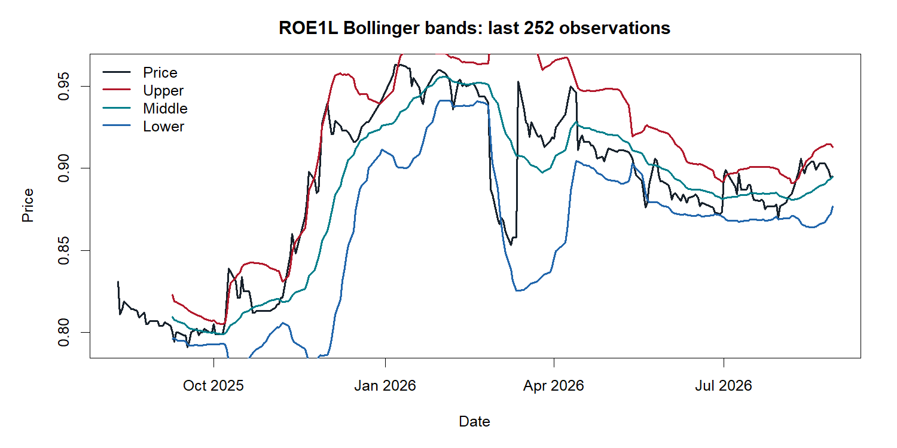

RSI(14) — enlarge last year

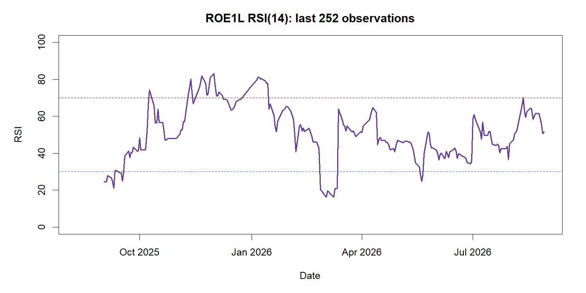

MACD — enlarge last year

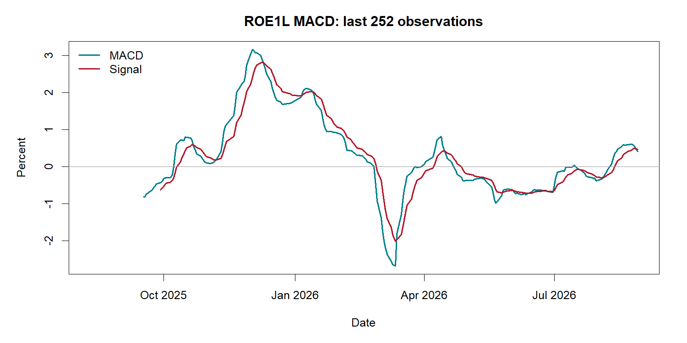

FSD, SSD and TSD components versus Baltic portfolios

The lower integrated CDF component is preferred at a given return threshold. Dominance requires the relevant curve to remain no higher over the complete domain, not merely over one interval.

All 72 PerformanceAnalytics measures

| Measure | Value |
| --- | --- |
| ArithmeticReturn | 0.000483 |
| GeometricReturn | 0.000425 |
| AnnualizedReturn_Arithmetic | 0.121675 |
| AnnualizedReturn_Geometric | 0.112967 |
| CumulativeReturn | 0.377457 |
| Volatility | 0.010850 |
| Volatility_Annualized | 0.172242 |
| MaximumDrawdown | 0.195697 |
| AverageDrawdown | 0.026332 |
| AverageDrawdownLength | 30.000000 |
| AverageRecoveryTime | 16.541667 |
| Sharpe_Daily | 0.044500 |
| Sharpe_Annualized | 0.706419 |
| Sharpe_VaR | 0.041965 |
| Sharpe_ES | 0.022170 |
| Sortino | 0.074968 |
| Calmar | 0.577255 |
| Omega | 1.170781 |
| Sterling | 0.382037 |
| Burke | 0.446368 |
| Martin | 1.405464 |
| UlcerIndex | 0.080377 |
| PainIndex | 0.060631 |
| PainRatio | 1.863187 |
| VaR_Loss | 0.011506 |
| ES_Loss | 0.021779 |
| DownsideDeviation | 0.006441 |
| DrawdownDeviation | 0.009503 |
| Rachev | 1.372678 |
| AdjustedSharpe | 0.560868 |
| Skewness | 1.895772 |
| Kurtosis | 23.643745 |
| UpsidePotential | 0.513939 |
| UpsideRisk | 0.008736 |
| BernardoLedoit | 1.170781 |
| DRatio | 0.967636 |
| Hurst | 0.412721 |
| Kappa | 0.045908 |
| Kelly | 4.101313 |
| Prospect | -0.473745 |
| Information_Daily | -0.026193 |
| Information_Annualized | -0.486139 |
| CAPMAlpha | 0.000428 |
| JensenAlpha | 0.098738 |
| Treynor_Daily | 0.006828 |
| Treynor_Annualized | 1.815646 |
| Modigliani | 0.000492 |
| TrackingError_Daily | 0.014995 |
| TrackingError_Annualized | 0.238043 |
| M2Sortino | 0.114315 |
| Appraisal | 0.574790 |
| CAPMBeta | 0.062219 |
| ActiveReturn | -0.115722 |
| OmegaExcessReturn | 0.076092 |
| BetaCoSkewness | -3.665609 |
| BetaCoKurtosis | -0.115281 |
| CDD | 0.088512 |
| CoSkewness | -0.000000 |
| CoKurtosis | -0.000000 |
| FamaBeta | 0.980897 |
| MSquaredExcess | -0.092393 |
| NetSelectivity | -0.111354 |
| Selectivity | 0.098738 |
| SpecificRisk | 0.171781 |
| SystematicRisk | 0.010925 |
| TotalRisk | 0.172128 |
| UpCapture | 0.129274 |
| UpNumber | 0.428899 |
| UpPercent | 0.208716 |
| DownCapture | 0.019880 |
| DownNumber | 0.487421 |
| DownPercent | 0.779874 |

Effect of removing this share from curent_update_baltic

| Measure | Portfolio without share | Change from baseline |
| --- | --- | --- |
| netSD | 0.788136 | -0.008475 |
| Rachev ratio | 1.209444 | 0.006961 |
| Sortino ratio | 0.175665 | -0.000918 |

The removed weight is distributed proportionally across all remaining holdings, so their weights still sum to 1.

<strong>TEL1L — Telia Lietuva</strong> | HOLD | target 21 shares | priority 11

| Measure | Value |
| --- | --- |
| Current shares | 0 |
| Target shares | 21 |
| Change | +21 |
| Weight | 0.32% |
| Last price | EUR 2.2200 |
| Individual netSD | 0.1667 |
| OUT / IN | 43 / 24 |
| RSI(14) | 45.64 |
| MACD state | Bearish |
| Bollinger state | Inside bands |
| Technical decision | HOLD |
| Observation date | 2026-08-28 |

Bollinger Bands — enlarge last year

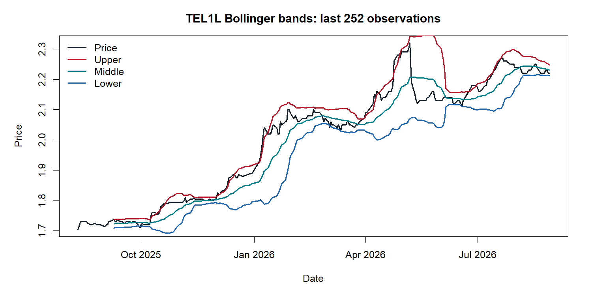

RSI(14) — enlarge last year

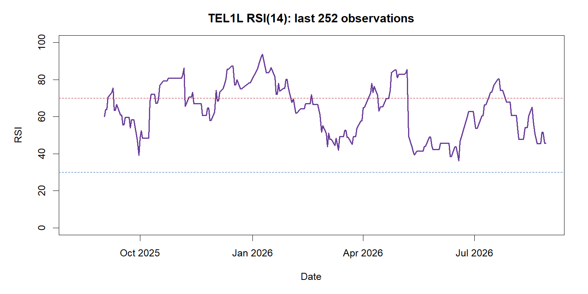

MACD — enlarge last year

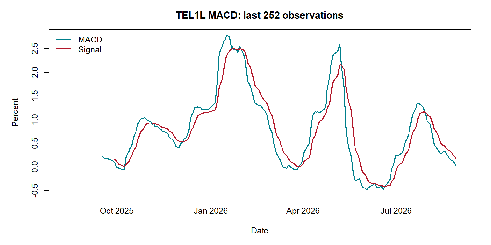

FSD, SSD and TSD components versus Baltic portfolios

The lower integrated CDF component is preferred at a given return threshold. Dominance requires the relevant curve to remain no higher over the complete domain, not merely over one interval.

All 72 PerformanceAnalytics measures

| Measure | Value |
| --- | --- |
| ArithmeticReturn | 0.000149 |
| GeometricReturn | 0.000127 |
| AnnualizedReturn_Arithmetic | 0.037591 |
| AnnualizedReturn_Geometric | 0.032623 |
| CumulativeReturn | 0.100817 |
| Volatility | 0.006598 |
| Volatility_Annualized | 0.104745 |
| MaximumDrawdown | 0.225761 |
| AverageDrawdown | 0.036650 |
| AverageDrawdownLength | 66.545455 |
| AverageRecoveryTime | 34.727273 |
| Sharpe_Daily | 0.022608 |
| Sharpe_Annualized | 0.358884 |
| Sharpe_VaR | 0.015944 |
| Sharpe_ES | 0.009737 |
| Sortino | 0.032399 |
| Calmar | 0.144503 |
| Omega | 1.080062 |
| Sterling | 0.100144 |
| Burke | 0.204657 |
| Martin | 0.221097 |
| UlcerIndex | 0.147551 |
| PainIndex | 0.125364 |
| PainRatio | 0.260227 |
| VaR_Loss | 0.009356 |
| ES_Loss | 0.015321 |
| DownsideDeviation | 0.004604 |
| DrawdownDeviation | 0.008616 |
| Rachev | 1.075976 |
| AdjustedSharpe | 0.333757 |
| Skewness | -0.329646 |
| Kurtosis | 12.372385 |
| UpsidePotential | 0.437074 |
| UpsideRisk | 0.004723 |
| BernardoLedoit | 1.080062 |
| DRatio | 0.934140 |
| Hurst | 0.379338 |
| Kappa | 0.019352 |
| Kelly | 3.426255 |
| Prospect | -0.473444 |
| Information_Daily | -0.054410 |
| Information_Annualized | -0.973675 |
| CAPMAlpha | 0.000131 |
| JensenAlpha | 0.027961 |
| Treynor_Daily | 0.006249 |
| Treynor_Annualized | 1.600315 |
| Modigliani | 0.000250 |
| TrackingError_Daily | 0.012685 |
| TrackingError_Annualized | 0.201367 |
| M2Sortino | 0.034150 |
| Appraisal | 0.267278 |
| CAPMBeta | 0.020385 |
| ActiveReturn | -0.196066 |
| OmegaExcessReturn | 0.006262 |
| BetaCoSkewness | -2.565127 |
| BetaCoKurtosis | -0.028307 |
| CDD | 0.049102 |
| CoSkewness | -0.000000 |
| CoKurtosis | -0.000000 |
| FamaBeta | 0.596511 |
| MSquaredExcess | -0.141614 |
| NetSelectivity | -0.103792 |
| Selectivity | 0.027961 |
| SpecificRisk | 0.104615 |
| SystematicRisk | 0.003580 |
| TotalRisk | 0.104676 |
| UpCapture | 0.051596 |
| UpNumber | 0.302752 |
| UpPercent | 0.178899 |
| DownCapture | 0.020832 |
| DownNumber | 0.301887 |
| DownPercent | 0.861635 |

Effect of removing this share from curent_update_baltic

| Measure | Portfolio without share | Change from baseline |
| --- | --- | --- |
| netSD | 0.796610 | 0.000000 |
| Rachev ratio | 1.202558 | 0.000075 |
| Sortino ratio | 0.176610 | 0.000027 |

The removed weight is distributed proportionally across all remaining holdings, so their weights still sum to 1.

<strong>AKO1L — Akola Group</strong> | HOLD | target 112 shares | priority 12

| Measure | Value |
| --- | --- |
| Current shares | 0 |
| Target shares | 112 |
| Change | +112 |
| Weight | 1.32% |
| Last price | EUR 1.7700 |
| Individual netSD | 0.1228 |
| OUT / IN | 25 / 11 |
| RSI(14) | 45.60 |
| MACD state | Bearish |
| Bollinger state | Inside bands |
| Technical decision | HOLD |
| Observation date | 2026-08-28 |

Bollinger Bands — enlarge last year

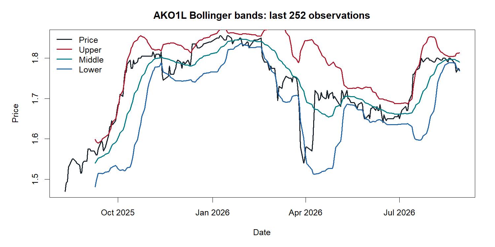

RSI(14) — enlarge last year

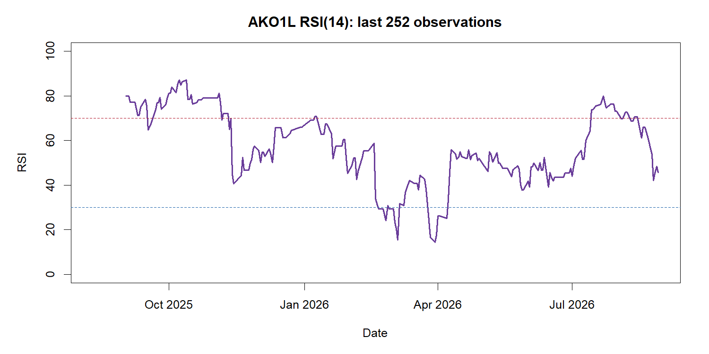

MACD — enlarge last year

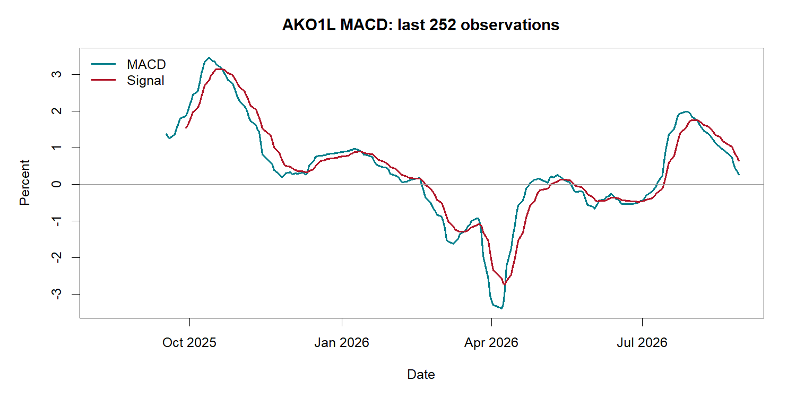

FSD, SSD and TSD components versus Baltic portfolios

The lower integrated CDF component is preferred at a given return threshold. Dominance requires the relevant curve to remain no higher over the complete domain, not merely over one interval.

All 72 PerformanceAnalytics measures

| Measure | Value |
| --- | --- |
| ArithmeticReturn | 0.000215 |
| GeometricReturn | 0.000148 |
| AnnualizedReturn_Arithmetic | 0.054158 |
| AnnualizedReturn_Geometric | 0.038019 |
| CumulativeReturn | 0.118116 |
| Volatility | 0.011582 |
| Volatility_Annualized | 0.183857 |
| MaximumDrawdown | 0.406184 |
| AverageDrawdown | 0.070383 |
| AverageDrawdownLength | 81.888889 |
| AverageRecoveryTime | 48.222222 |
| Sharpe_Daily | 0.018556 |
| Sharpe_Annualized | 0.294564 |
| Sharpe_VaR | 0.012857 |
| Sharpe_ES | 0.008461 |
| Sortino | 0.027662 |
| Calmar | 0.093600 |
| Omega | 1.061023 |
| Sterling | 0.075109 |
| Burke | 0.127391 |
| Martin | 0.149407 |
| UlcerIndex | 0.254464 |
| PainIndex | 0.211197 |
| PainRatio | 0.180016 |
| VaR_Loss | 0.016716 |
| ES_Loss | 0.025400 |
| DownsideDeviation | 0.007769 |
| DrawdownDeviation | 0.016029 |
| Rachev | 1.112303 |
| AdjustedSharpe | 0.288067 |
| Skewness | 0.385739 |
| Kurtosis | 14.339191 |
| UpsidePotential | 0.480974 |
| UpsideRisk | 0.008582 |
| BernardoLedoit | 1.061023 |
| DRatio | 0.959257 |
| Hurst | 0.408968 |
| Kappa | 0.017077 |
| Kelly | 1.602141 |
| Prospect | -0.538978 |
| Information_Daily | -0.043019 |
| Information_Annualized | -0.771779 |
| CAPMAlpha | 0.000164 |
| JensenAlpha | 0.024661 |
| Treynor_Daily | 0.002535 |
| Treynor_Annualized | 0.650874 |
| Modigliani | 0.000205 |
| TrackingError_Daily | 0.015563 |
| TrackingError_Annualized | 0.247053 |
| M2Sortino | 0.037933 |
| Appraisal | 0.134428 |
| CAPMBeta | 0.058412 |
| ActiveReturn | -0.190670 |
| OmegaExcessReturn | -0.006462 |
| BetaCoSkewness | -4.591177 |
| BetaCoKurtosis | -0.085834 |
| CDD | 0.203360 |
| CoSkewness | -0.000001 |
| CoKurtosis | -0.000000 |
| FamaBeta | 1.047039 |
| MSquaredExcess | -0.156572 |
| NetSelectivity | -0.201428 |
| Selectivity | 0.024661 |
| SpecificRisk | 0.183449 |
| SystematicRisk | 0.010257 |
| TotalRisk | 0.183735 |
| UpCapture | 0.097979 |
| UpNumber | 0.389908 |
| UpPercent | 0.238532 |
| DownCapture | 0.059814 |
| DownNumber | 0.415094 |
| DownPercent | 0.789308 |

Effect of removing this share from curent_update_baltic

| Measure | Portfolio without share | Change from baseline |
| --- | --- | --- |
| netSD | 0.788136 | -0.008475 |
| Rachev ratio | 1.205217 | 0.002734 |
| Sortino ratio | 0.177027 | 0.000444 |

The removed weight is distributed proportionally across all remaining holdings, so their weights still sum to 1.

<strong>EFT1T — EfTEN Real Estate Fund</strong> | HOLD | target 20 shares | priority 13

| Measure | Value |
| --- | --- |
| Current shares | 0 |
| Target shares | 20 |
| Change | +20 |
| Weight | 2.62% |
| Last price | EUR 19.4000 |
| Individual netSD | 0.1140 |
| OUT / IN | 36 / 23 |
| RSI(14) | 43.20 |
| MACD state | Bearish |
| Bollinger state | Inside bands |
| Technical decision | HOLD |
| Observation date | 2026-08-28 |

Bollinger Bands — enlarge last year

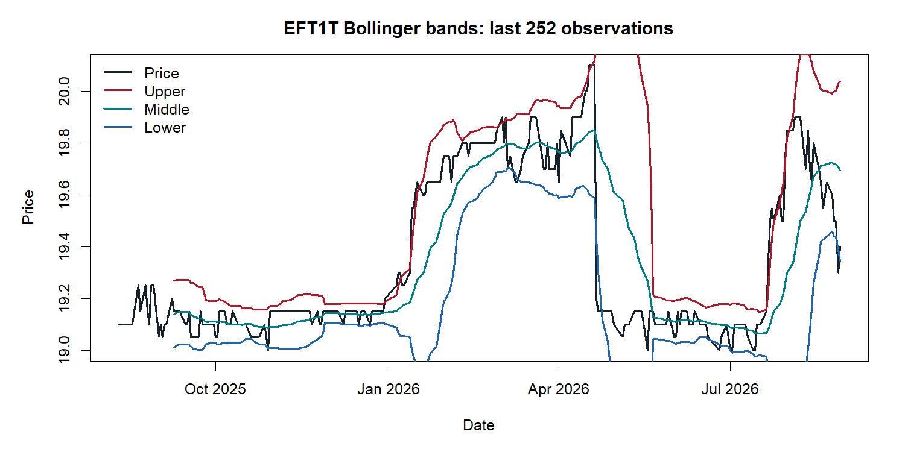

RSI(14) — enlarge last year

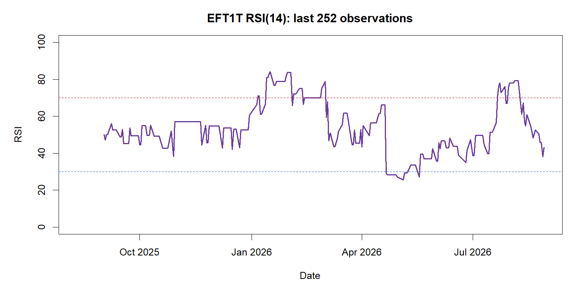

MACD — enlarge last year

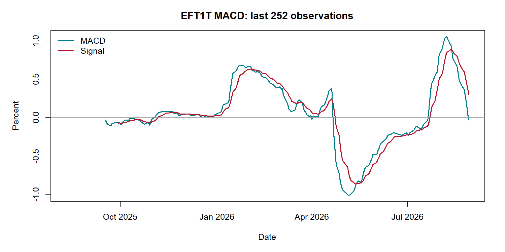

FSD, SSD and TSD components versus Baltic portfolios

The lower integrated CDF component is preferred at a given return threshold. Dominance requires the relevant curve to remain no higher over the complete domain, not merely over one interval.

All 72 PerformanceAnalytics measures

| Measure | Value |
| --- | --- |
| ArithmeticReturn | -0.000063 |
| GeometricReturn | -0.000082 |
| AnnualizedReturn_Arithmetic | -0.015907 |
| AnnualizedReturn_Geometric | -0.020430 |
| CumulativeReturn | -0.059894 |
| Volatility | 0.006116 |
| Volatility_Annualized | 0.097082 |
| MaximumDrawdown | 0.201964 |
| AverageDrawdown | 0.045633 |
| AverageDrawdownLength | 147.000000 |
| AverageRecoveryTime | 80.800000 |
| Sharpe_Daily | -0.010321 |
| Sharpe_Annualized | -0.163847 |
| Sharpe_VaR | -0.006635 |
| Sharpe_ES | -0.004086 |
| Sortino | -0.013496 |
| Calmar | -0.101159 |
| Omega | 0.965259 |
| Sterling | -0.067658 |
| Burke | -0.129214 |
| Martin | -0.126159 |
| UlcerIndex | 0.161942 |
| PainIndex | 0.153465 |
| PainRatio | -0.133128 |
| VaR_Loss | 0.009514 |
| ES_Loss | 0.015448 |
| DownsideDeviation | 0.004677 |
| DrawdownDeviation | 0.007374 |
| Rachev | 0.875056 |
| AdjustedSharpe | -0.167524 |
| Skewness | -1.382197 |
| Kurtosis | 16.679067 |
| UpsidePotential | 0.374987 |
| UpsideRisk | 0.003935 |
| BernardoLedoit | 0.965259 |
| DRatio | 0.996650 |
| Hurst | 0.388273 |
| Kappa | -0.007768 |
| Kelly | -1.687710 |
| Prospect | -0.499101 |
| Information_Daily | -0.071517 |
| Information_Annualized | -1.247719 |
| CAPMAlpha | -0.000069 |
| JensenAlpha | -0.021895 |
| Treynor_Daily | -0.012786 |
| Treynor_Annualized | -3.189276 |
| Modigliani | -0.000114 |
| TrackingError_Daily | 0.012577 |
| TrackingError_Annualized | 0.199660 |
| M2Sortino | -0.021051 |
| Appraisal | -0.225699 |
| CAPMBeta | 0.006406 |
| ActiveReturn | -0.249120 |
| OmegaExcessReturn | -0.047208 |
| BetaCoSkewness | -1.120956 |
| BetaCoKurtosis | -0.031388 |
| CDD | 0.115536 |
| CoSkewness | -0.000000 |
| CoKurtosis | -0.000000 |
| FamaBeta | 0.552871 |
| MSquaredExcess | -0.216200 |
| NetSelectivity | -0.146866 |
| Selectivity | -0.021895 |
| SpecificRisk | 0.097011 |
| SystematicRisk | 0.001125 |
| TotalRisk | 0.097018 |
| UpCapture | -0.005516 |
| UpNumber | 0.332569 |
| UpPercent | 0.137615 |
| DownCapture | 0.011748 |
| DownNumber | 0.301887 |
| DownPercent | 0.874214 |

Effect of removing this share from curent_update_baltic

| Measure | Portfolio without share | Change from baseline |
| --- | --- | --- |
| netSD | 0.762712 | -0.033898 |
| Rachev ratio | 1.206108 | 0.003624 |
| Sortino ratio | 0.178117 | 0.001534 |

The removed weight is distributed proportionally across all remaining holdings, so their weights still sum to 1.

<strong>HAE1T — Harju Elekter Group</strong> | BUY | target 122 shares | priority 13

| Measure | Value |
| --- | --- |
| Current shares | 100 |
| Target shares | 122 |
| Change | +22 |
| Weight | 4.18% |
| Last price | EUR 5.1400 |
| Individual netSD | 0.1140 |
| OUT / IN | 37 / 24 |
| RSI(14) | 42.59 |
| MACD state | Bullish |
| Bollinger state | Inside bands |
| Technical decision | BUY |
| Observation date | 2026-08-28 |

Bollinger Bands — enlarge last year

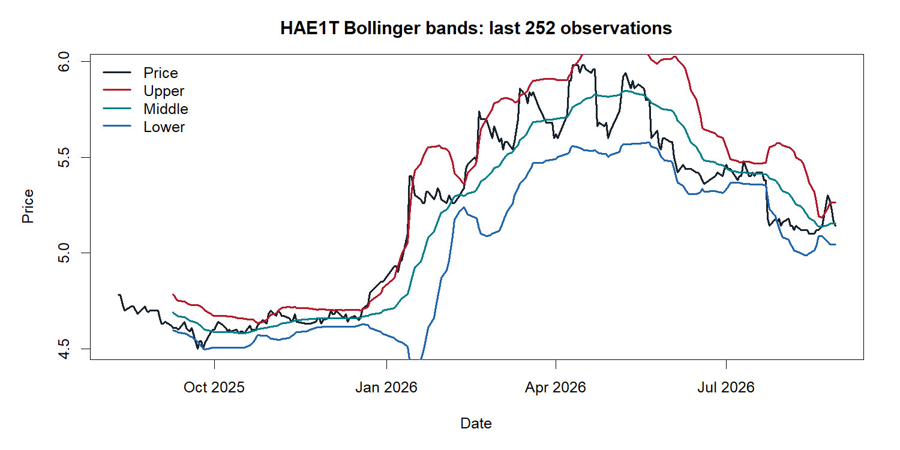

RSI(14) — enlarge last year

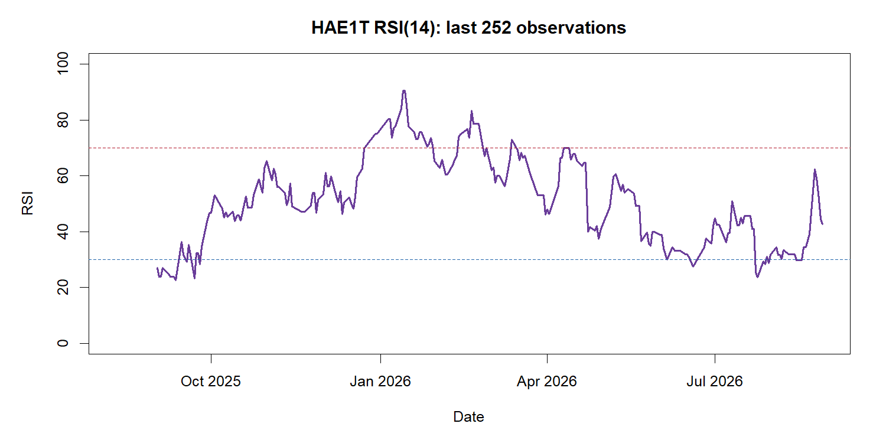

MACD — enlarge last year

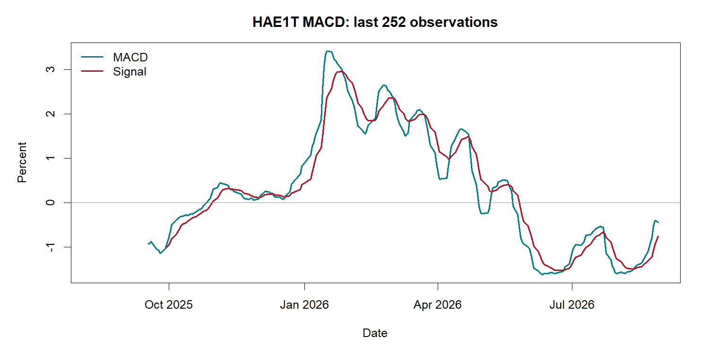

FSD, SSD and TSD components versus Baltic portfolios

The lower integrated CDF component is preferred at a given return threshold. Dominance requires the relevant curve to remain no higher over the complete domain, not merely over one interval.

All 72 PerformanceAnalytics measures

| Measure | Value |
| --- | --- |
| ArithmeticReturn | -0.000032 |
| GeometricReturn | -0.000071 |
| AnnualizedReturn_Arithmetic | -0.008146 |
| AnnualizedReturn_Geometric | -0.017725 |
| CumulativeReturn | -0.052102 |
| Volatility | 0.008807 |
| Volatility_Annualized | 0.139804 |
| MaximumDrawdown | 0.209400 |
| AverageDrawdown | 0.058845 |
| AverageDrawdownLength | 93.375000 |
| AverageRecoveryTime | 15.375000 |
| Sharpe_Daily | -0.003671 |
| Sharpe_Annualized | -0.058271 |
| Sharpe_VaR | -0.002878 |
| Sharpe_ES | -0.001603 |
| Sortino | -0.005398 |
| Calmar | -0.084644 |
| Omega | 0.988111 |
| Sterling | -0.057287 |
| Burke | -0.088405 |
| Martin | -0.156945 |
| UlcerIndex | 0.112935 |
| PainIndex | 0.098550 |
| PainRatio | -0.179853 |
| VaR_Loss | 0.011233 |
| ES_Loss | 0.020168 |
| DownsideDeviation | 0.005988 |
| DrawdownDeviation | 0.009361 |
| Rachev | 1.080200 |
| AdjustedSharpe | -0.057893 |
| Skewness | 0.500438 |
| Kurtosis | 14.435639 |
| UpsidePotential | 0.448649 |
| UpsideRisk | 0.006450 |
| BernardoLedoit | 0.988111 |
| DRatio | 1.154072 |
| Hurst | 0.386445 |
| Kappa | -0.003342 |
| Kelly | -0.416803 |
| Prospect | -0.572958 |
| Information_Daily | -0.063852 |
| Information_Annualized | -1.115467 |
| CAPMAlpha | -0.000055 |
| JensenAlpha | -0.023582 |
| Treynor_Daily | -0.002770 |
| Treynor_Annualized | -0.691964 |
| Modigliani | -0.000041 |
| TrackingError_Daily | 0.013916 |
| TrackingError_Annualized | 0.220906 |
| M2Sortino | -0.017860 |
| Appraisal | -0.168881 |
| CAPMBeta | 0.025615 |
| ActiveReturn | -0.246414 |
| OmegaExcessReturn | -0.052011 |
| BetaCoSkewness | 0.134984 |
| BetaCoKurtosis | 0.053440 |
| CDD | 0.153779 |
| CoSkewness | 0.000000 |
| CoKurtosis | 0.000000 |
| FamaBeta | 0.796163 |
| MSquaredExcess | -0.204243 |
| NetSelectivity | -0.199798 |
| Selectivity | -0.023582 |
| SpecificRisk | 0.139638 |
| SystematicRisk | 0.004498 |
| TotalRisk | 0.139711 |
| UpCapture | -0.001326 |
| UpNumber | 0.373853 |
| UpPercent | 0.176606 |
| DownCapture | 0.007906 |
| DownNumber | 0.430818 |
| DownPercent | 0.823899 |

Effect of removing this share from curent_update_baltic

| Measure | Portfolio without share | Change from baseline |
| --- | --- | --- |
| netSD | 0.762712 | -0.033898 |
| Rachev ratio | 1.196361 | -0.006122 |
| Sortino ratio | 0.180183 | 0.003600 |

The removed weight is distributed proportionally across all remaining holdings, so their weights still sum to 1.

<strong>LHV1T — LHV Group</strong> | HOLD | target 1 shares | priority 15

| Measure | Value |
| --- | --- |
| Current shares | 0 |
| Target shares | 1 |
| Change | +1 |
| Weight | 0.03% |
| Last price | EUR 3.3350 |
| Individual netSD | 0.1053 |
| OUT / IN | 34 / 22 |
| RSI(14) | 43.80 |
| MACD state | Bearish |
| Bollinger state | Inside bands |
| Technical decision | HOLD |
| Observation date | 2026-08-28 |

Bollinger Bands — enlarge last year

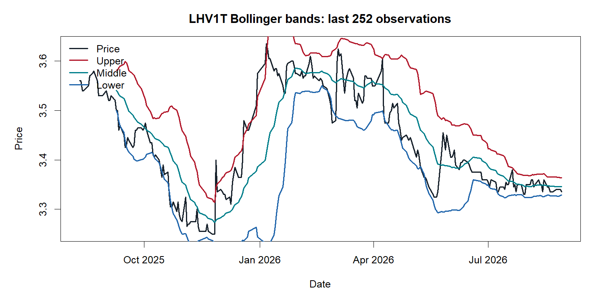

RSI(14) — enlarge last year

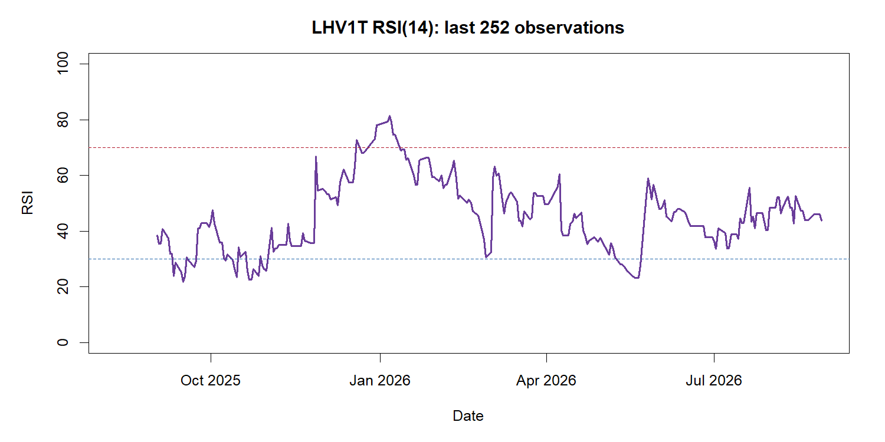

MACD — enlarge last year

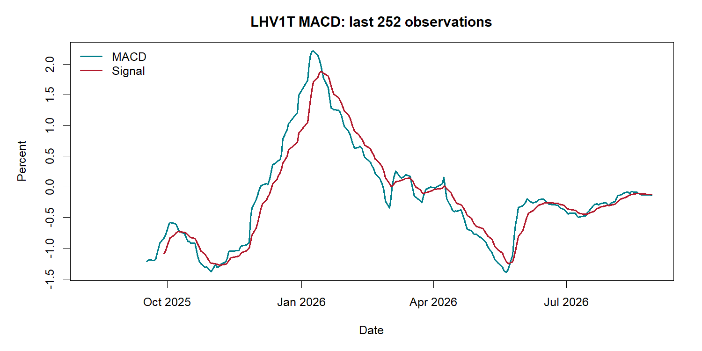

FSD, SSD and TSD components versus Baltic portfolios

The lower integrated CDF component is preferred at a given return threshold. Dominance requires the relevant curve to remain no higher over the complete domain, not merely over one interval.

All 72 PerformanceAnalytics measures

| Measure | Value |
| --- | --- |
| ArithmeticReturn | -0.000299 |
| GeometricReturn | -0.000338 |
| AnnualizedReturn_Arithmetic | -0.075467 |
| AnnualizedReturn_Geometric | -0.081572 |
| CumulativeReturn | -0.224773 |
| Volatility | 0.008756 |
| Volatility_Annualized | 0.138993 |
| MaximumDrawdown | 0.317810 |
| AverageDrawdown | 0.069906 |
| AverageDrawdownLength | 149.600000 |
| AverageRecoveryTime | 2.600000 |
| Sharpe_Daily | -0.034203 |
| Sharpe_Annualized | -0.542953 |
| Sharpe_VaR | -0.023678 |
| Sharpe_ES | -0.016078 |
| Sortino | -0.051795 |
| Calmar | -0.256669 |
| Omega | 0.901766 |
| Sterling | -0.195237 |
| Burke | -0.373845 |
| Martin | -0.370437 |
| UlcerIndex | 0.220205 |
| PainIndex | 0.206536 |
| PainRatio | -0.394952 |
| VaR_Loss | 0.012648 |
| ES_Loss | 0.018626 |
| DownsideDeviation | 0.005782 |
| DrawdownDeviation | 0.011592 |
| Rachev | 1.213892 |
| AdjustedSharpe | -0.479708 |
| Skewness | 0.734623 |
| Kurtosis | 7.071013 |
| UpsidePotential | 0.475464 |
| UpsideRisk | 0.006574 |
| BernardoLedoit | 0.901766 |
| DRatio | 1.524267 |
| Hurst | 0.340010 |
| Kappa | -0.036120 |
| Kelly | -3.906329 |
| Prospect | -0.710868 |
| Information_Daily | -0.081465 |
| Information_Annualized | -1.378293 |
| CAPMAlpha | -0.000292 |
| JensenAlpha | -0.079647 |
| Treynor_Daily | 0.040102 |
| Treynor_Annualized | 9.689265 |
| Modigliani | -0.000378 |
| TrackingError_Daily | 0.014180 |
| TrackingError_Annualized | 0.225105 |
| M2Sortino | -0.083045 |
| Appraisal | -0.573439 |
| CAPMBeta | -0.008419 |
| ActiveReturn | -0.310261 |
| OmegaExcessReturn | -0.114675 |
| BetaCoSkewness | -3.835436 |
| BetaCoKurtosis | -0.113239 |
| CDD | 0.180859 |
| CoSkewness | -0.000001 |
| CoKurtosis | -0.000000 |
| FamaBeta | 0.791547 |
| MSquaredExcess | -0.269998 |
| NetSelectivity | -0.262590 |
| Selectivity | -0.079647 |
| SpecificRisk | 0.138893 |
| SystematicRisk | -0.001478 |
| TotalRisk | 0.138901 |
| UpCapture | -0.077199 |
| UpNumber | 0.339450 |
| UpPercent | 0.149083 |
| DownCapture | -0.008574 |
| DownNumber | 0.471698 |
| DownPercent | 0.789308 |

Effect of removing this share from curent_update_baltic

| Measure | Portfolio without share | Change from baseline |
| --- | --- | --- |
| netSD | 0.796610 | 0.000000 |
| Rachev ratio | 1.202508 | 0.000025 |
| Sortino ratio | 0.176637 | 0.000054 |

The removed weight is distributed proportionally across all remaining holdings, so their weights still sum to 1.

<strong>TKM1T — TKM Grupp</strong> | HOLD | target 305 shares | priority 16

| Measure | Value |
| --- | --- |
| Current shares | 288 |
| Target shares | 305 |
| Change | +17 |
| Weight | 18.52% |
| Last price | EUR 9.1000 |
| Individual netSD | 0.0789 |
| OUT / IN | 29 / 20 |
| RSI(14) | 42.63 |
| MACD state | Bearish |
| Bollinger state | Inside bands |
| Technical decision | HOLD |
| Observation date | 2026-08-28 |

Bollinger Bands — enlarge last year

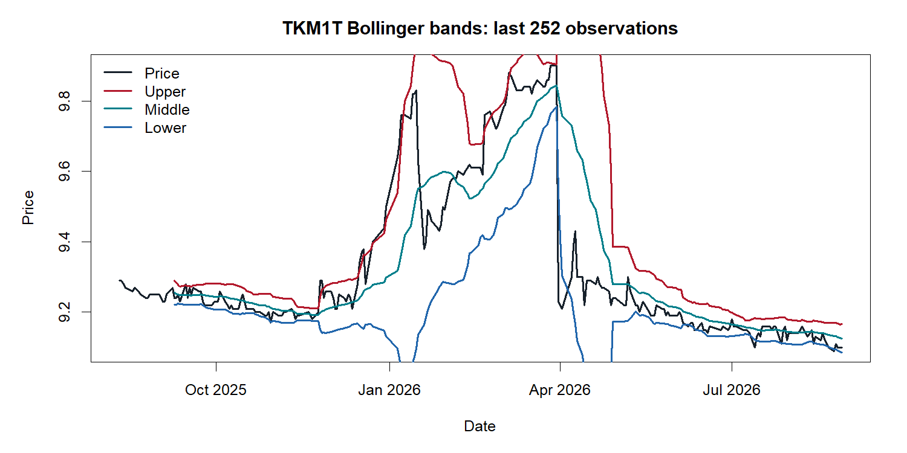

RSI(14) — enlarge last year

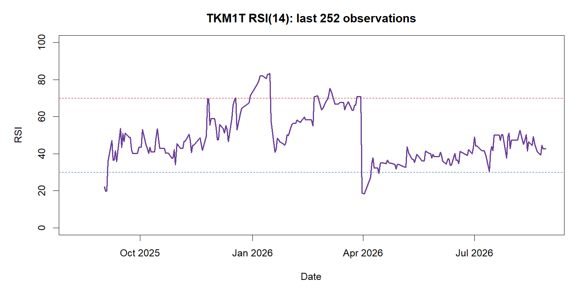

MACD — enlarge last year

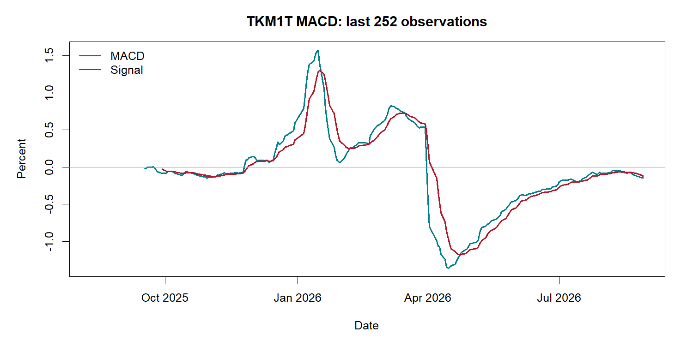

FSD, SSD and TSD components versus Baltic portfolios

The lower integrated CDF component is preferred at a given return threshold. Dominance requires the relevant curve to remain no higher over the complete domain, not merely over one interval.

All 72 PerformanceAnalytics measures

| Measure | Value |
| --- | --- |
| ArithmeticReturn | -0.000048 |
| GeometricReturn | -0.000068 |
| AnnualizedReturn_Arithmetic | -0.012162 |
| AnnualizedReturn_Geometric | -0.016943 |
| CumulativeReturn | -0.049845 |
| Volatility | 0.006201 |
| Volatility_Annualized | 0.098432 |
| MaximumDrawdown | 0.170070 |
| AverageDrawdown | 0.021201 |
| AverageDrawdownLength | 74.300000 |
| AverageRecoveryTime | 40.000000 |
| Sharpe_Daily | -0.007783 |
| Sharpe_Annualized | -0.123558 |
| Sharpe_VaR | -0.006871 |
| Sharpe_ES | -0.003093 |
| Sortino | -0.009456 |
| Calmar | -0.099626 |
| Omega | 0.970092 |
| Sterling | -0.062737 |
| Burke | -0.104562 |
| Martin | -0.147483 |
| UlcerIndex | 0.114883 |
| PainIndex | 0.105668 |
| PainRatio | -0.160345 |
| VaR_Loss | 0.007024 |
| ES_Loss | 0.015606 |
| DownsideDeviation | 0.005104 |
| DrawdownDeviation | 0.006232 |
| Rachev | 0.888236 |
| AdjustedSharpe | -0.130610 |
| Skewness | -4.151940 |
| Kurtosis | 47.689790 |
| UpsidePotential | 0.306695 |
| UpsideRisk | 0.003514 |
| BernardoLedoit | 0.970092 |
| DRatio | 1.003342 |
| Hurst | 0.417088 |
| Kappa | -0.004604 |
| Kelly | -1.255266 |
| Prospect | -0.404644 |
| Information_Daily | -0.071791 |
| Information_Annualized | -1.254642 |
| CAPMAlpha | -0.000080 |
| JensenAlpha | -0.025078 |
| Treynor_Daily | -0.001906 |
| Treynor_Annualized | -0.476317 |
| Modigliani | -0.000086 |
| TrackingError_Daily | 0.012333 |
| TrackingError_Annualized | 0.195779 |
| M2Sortino | -0.017314 |
| Appraisal | -0.255460 |
| CAPMBeta | 0.035572 |
| ActiveReturn | -0.245633 |
| OmegaExcessReturn | -0.046166 |
| BetaCoSkewness | -1.671872 |
| BetaCoKurtosis | 0.036864 |
| CDD | 0.021416 |
| CoSkewness | -0.000000 |
| CoKurtosis | 0.000000 |
| FamaBeta | 0.560557 |
| MSquaredExcess | -0.210725 |
| NetSelectivity | -0.145137 |
| Selectivity | -0.025078 |
| SpecificRisk | 0.098168 |
| SystematicRisk | 0.006246 |
| TotalRisk | 0.098367 |
| UpCapture | 0.023213 |
| UpNumber | 0.396789 |
| UpPercent | 0.139908 |
| DownCapture | 0.043554 |
| DownNumber | 0.411950 |
| DownPercent | 0.874214 |

Effect of removing this share from curent_update_baltic

| Measure | Portfolio without share | Change from baseline |
| --- | --- | --- |
| netSD | 0.754237 | -0.042373 |
| Rachev ratio | 1.253781 | 0.051298 |
| Sortino ratio | 0.193754 | 0.017171 |

The removed weight is distributed proportionally across all remaining holdings, so their weights still sum to 1.

<strong>CPA1T — Coop Pank</strong> | HOLD | target 109 shares | priority 17

| Measure | Value |
| --- | --- |
| Current shares | 0 |
| Target shares | 109 |
| Change | +109 |
| Weight | 1.71% |
| Last price | EUR 2.3300 |
| Individual netSD | 0.0702 |
| OUT / IN | 30 / 22 |
| RSI(14) | 56.23 |
| MACD state | Bearish |
| Bollinger state | Inside bands |
| Technical decision | HOLD |
| Observation date | 2026-08-28 |

Bollinger Bands — enlarge last year

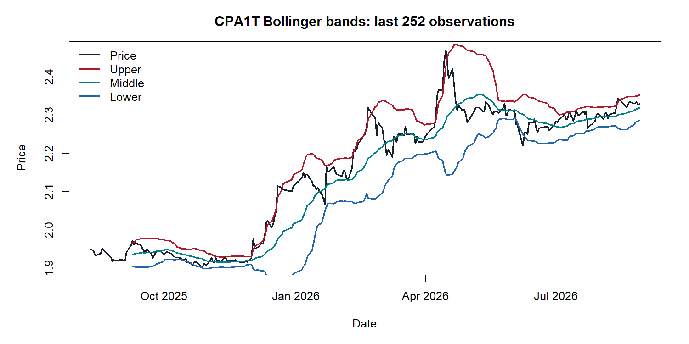

RSI(14) — enlarge last year

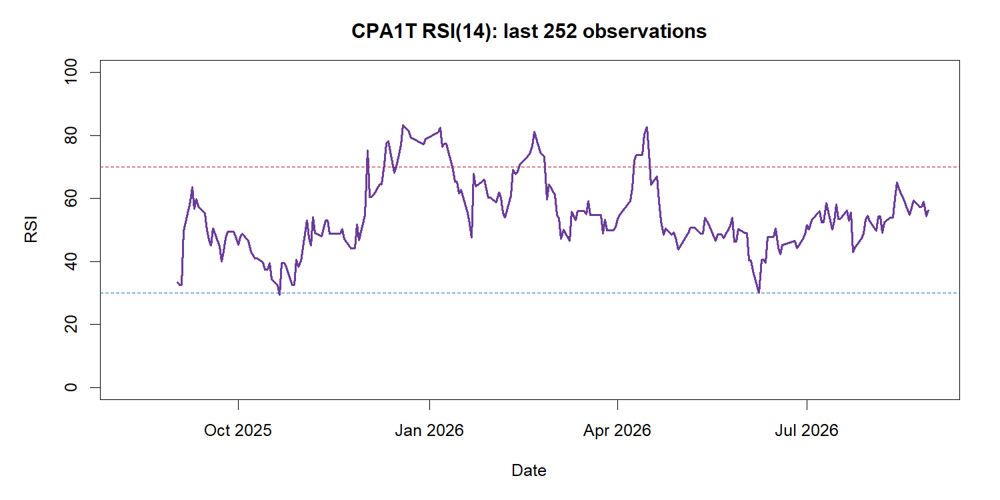

MACD — enlarge last year


FSD, SSD and TSD components versus Baltic portfolios

The lower integrated CDF component is preferred at a given return threshold. Dominance requires the relevant curve to remain no higher over the complete domain, not merely over one interval.

All 72 PerformanceAnalytics measures

| Measure | Value |
| --- | --- |
| ArithmeticReturn | -0.000131 |
| GeometricReturn | -0.000180 |
| AnnualizedReturn_Arithmetic | -0.032938 |
| AnnualizedReturn_Geometric | -0.044259 |
| CumulativeReturn | -0.126674 |
| Volatility | 0.009913 |
| Volatility_Annualized | 0.157369 |
| MaximumDrawdown | 0.385217 |
| AverageDrawdown | 0.106368 |
| AverageDrawdownLength | 187.000000 |
| AverageRecoveryTime | 45.000000 |
| Sharpe_Daily | -0.013185 |
| Sharpe_Annualized | -0.209303 |
| Sharpe_VaR | -0.008197 |
| Sharpe_ES | -0.006038 |
| Sortino | -0.019819 |
| Calmar | -0.114894 |
| Omega | 0.961795 |
| Sterling | -0.091215 |
| Burke | -0.164865 |
| Martin | -0.144765 |
| UlcerIndex | 0.305731 |
| PainIndex | 0.281857 |
| PainRatio | -0.157027 |
| VaR_Loss | 0.015946 |
| ES_Loss | 0.021647 |
| DownsideDeviation | 0.006595 |
| DrawdownDeviation | 0.014058 |
| Rachev | 1.161109 |
| AdjustedSharpe | -0.204274 |
| Skewness | 0.543429 |
| Kurtosis | 5.777861 |
| UpsidePotential | 0.498935 |
| UpsideRisk | 0.007394 |
| BernardoLedoit | 0.961795 |
| DRatio | 1.342664 |
| Hurst | 0.327174 |
| Kappa | -0.014072 |
| Kelly | -1.330014 |
| Prospect | -0.668262 |
| Information_Daily | -0.069339 |
| Information_Annualized | -1.195555 |
| CAPMAlpha | -0.000180 |
| JensenAlpha | -0.057154 |
| Treynor_Daily | -0.003186 |
| Treynor_Annualized | -0.784953 |
| Modigliani | -0.000146 |
| TrackingError_Daily | 0.014382 |
| TrackingError_Annualized | 0.228303 |
| M2Sortino | -0.044567 |
| Appraisal | -0.364144 |
| CAPMBeta | 0.056384 |
| ActiveReturn | -0.272948 |
| OmegaExcessReturn | -0.082018 |
| BetaCoSkewness | -2.462721 |
| BetaCoKurtosis | 0.012465 |
| CDD | 0.275115 |
| CoSkewness | -0.000000 |
| CoKurtosis | 0.000000 |
| FamaBeta | 0.896196 |
| MSquaredExcess | -0.226318 |
| NetSelectivity | -0.249209 |
| Selectivity | -0.057154 |
| SpecificRisk | 0.156953 |
| SystematicRisk | 0.009901 |
| TotalRisk | 0.157265 |
| UpCapture | 0.032163 |
| UpNumber | 0.373853 |
| UpPercent | 0.213303 |
| DownCapture | 0.079258 |
| DownNumber | 0.474843 |
| DownPercent | 0.764151 |

Effect of removing this share from curent_update_baltic

| Measure | Portfolio without share | Change from baseline |
| --- | --- | --- |
| netSD | 0.805085 | 0.008475 |
| Rachev ratio | 1.208621 | 0.006138 |
| Sortino ratio | 0.180081 | 0.003498 |

The removed weight is distributed proportionally across all remaining holdings, so their weights still sum to 1.

<strong>MOLNR — J. Molner</strong> | BUY | target 38 shares | priority 17

| Measure | Value |
| --- | --- |
| Current shares | 0 |
| Target shares | 38 |
| Change | +38 |
| Weight | 4.83% |
| Last price | EUR 18.9000 |
| Individual netSD | 0.0702 |
| OUT / IN | 8 / 0 |
| RSI(14) | 44.96 |
| MACD state | Bullish |
| Bollinger state | Inside bands |
| Technical decision | BUY |
| Observation date | 2026-08-28 |

Bollinger Bands — enlarge last year


RSI(14) — enlarge last year


MACD — enlarge last year


FSD, SSD and TSD components versus Baltic portfolios

The lower integrated CDF component is preferred at a given return threshold. Dominance requires the relevant curve to remain no higher over the complete domain, not merely over one interval.

All 72 PerformanceAnalytics measures

| Measure | Value |
| --- | --- |
| ArithmeticReturn | 0.001511 |
| GeometricReturn | 0.000922 |
| AnnualizedReturn_Arithmetic | 0.380894 |
| AnnualizedReturn_Geometric | 0.261260 |
| CumulativeReturn | 1.002693 |
| Volatility | 0.036225 |
| Volatility_Annualized | 0.575057 |
| MaximumDrawdown | 0.334865 |
| AverageDrawdown | 0.142918 |
| AverageDrawdownLength | 56.923077 |
| AverageRecoveryTime | 27.461538 |
| Sharpe_Daily | 0.041725 |
| Sharpe_Annualized | 0.662359 |
| Sharpe_VaR | 0.034107 |
| Sharpe_ES | 0.023600 |
| Sortino | 0.084093 |
| Calmar | 0.780197 |
| Omega | 1.208374 |
| Sterling | 0.600785 |
| Burke | 0.411736 |
| Martin | 1.784282 |
| UlcerIndex | 0.146423 |
| PainIndex | 0.124032 |
| PainRatio | 2.106394 |
| VaR_Loss | 0.044317 |
| ES_Loss | 0.064046 |
| DownsideDeviation | 0.017974 |
| DrawdownDeviation | 0.023045 |
| Rachev | 1.395142 |
| AdjustedSharpe | 0.173690 |
| Skewness | 5.561928 |
| Kurtosis | 76.948058 |
| UpsidePotential | 0.487661 |
| UpsideRisk | 0.031460 |
| BernardoLedoit | 1.208374 |
| DRatio | 1.006490 |
| Hurst | 0.442163 |
| Kappa | 0.055208 |
| Kelly | 1.151816 |
| Prospect | -0.420367 |
| Information_Daily | 0.002743 |
| Information_Annualized | 0.054153 |
| CAPMAlpha | 0.001515 |
| JensenAlpha | 0.262135 |
| Treynor_Daily | -0.241030 |
| Treynor_Annualized | -68.335799 |
| Modigliani | 0.000462 |
| TrackingError_Daily | 0.037889 |
| TrackingError_Annualized | 0.601465 |
| M2Sortino | 0.247376 |
| Appraisal | 0.456144 |
| CAPMBeta | -0.003823 |
| ActiveReturn | 0.032571 |
| OmegaExcessReturn | 0.158352 |
| BetaCoSkewness | -4.654220 |
| BetaCoKurtosis | 0.066452 |
| CDD | 0.282678 |
| CoSkewness | -0.000001 |
| CoKurtosis | 0.000000 |
| FamaBeta | 3.274872 |
| MSquaredExcess | -0.121196 |
| NetSelectivity | -0.487668 |
| Selectivity | 0.262135 |
| SpecificRisk | 0.574675 |
| SystematicRisk | -0.000671 |
| TotalRisk | 0.574675 |
| UpCapture | 0.139307 |
| UpNumber | 0.243119 |
| UpPercent | 0.204128 |
| DownCapture | -0.272221 |
| DownNumber | 0.308176 |
| DownPercent | 0.754717 |

Effect of removing this share from curent_update_baltic

| Measure | Portfolio without share | Change from baseline |
| --- | --- | --- |
| netSD | 0.728814 | -0.067797 |
| Rachev ratio | 1.101756 | -0.100727 |
| Sortino ratio | 0.154919 | -0.021664 |

The removed weight is distributed proportionally across all remaining holdings, so their weights still sum to 1.

<strong>MODE — Modera</strong> | HOLD | target 51 shares | priority 19

| Measure | Value |
| --- | --- |
| Current shares | 0 |
| Target shares | 51 |
| Change | +51 |
| Weight | 2.03% |
| Last price | EUR 5.9000 |
| Individual netSD | 0.0263 |
| OUT / IN | 27 / 24 |
| RSI(14) | 48.74 |
| MACD state | Bearish |
| Bollinger state | Inside bands |
| Technical decision | HOLD |
| Observation date | 2026-08-28 |

Bollinger Bands — enlarge last year


RSI(14) — enlarge last year


MACD — enlarge last year


FSD, SSD and TSD components versus Baltic portfolios

The lower integrated CDF component is preferred at a given return threshold. Dominance requires the relevant curve to remain no higher over the complete domain, not merely over one interval.

All 72 PerformanceAnalytics measures

| Measure | Value |
| --- | --- |
| ArithmeticReturn | 0.000581 |
| GeometricReturn | 0.000335 |
| AnnualizedReturn_Arithmetic | 0.146305 |
| AnnualizedReturn_Geometric | 0.088023 |
| CumulativeReturn | 0.287131 |
| Volatility | 0.022818 |
| Volatility_Annualized | 0.362217 |
| MaximumDrawdown | 0.350099 |
| AverageDrawdown | 0.078297 |
| AverageDrawdownLength | 57.538462 |
| AverageRecoveryTime | 20.076923 |
| Sharpe_Daily | 0.025444 |
| Sharpe_Annualized | 0.403915 |
| Sharpe_VaR | 0.021584 |
| Sharpe_ES | 0.013710 |
| Sortino | 0.047600 |
| Calmar | 0.251422 |
| Omega | 1.113330 |
| Sterling | 0.195563 |
| Burke | 0.227710 |
| Martin | 0.598998 |
| UlcerIndex | 0.146950 |
| PainIndex | 0.119170 |
| PainRatio | 0.738629 |
| VaR_Loss | 0.026899 |
| ES_Loss | 0.042348 |
| DownsideDeviation | 0.012197 |
| DrawdownDeviation | 0.017111 |
| Rachev | 1.327719 |
| AdjustedSharpe | 0.381751 |
| Skewness | 4.318793 |
| Kurtosis | 53.841391 |
| UpsidePotential | 0.467614 |
| UpsideRisk | 0.019275 |
| BernardoLedoit | 1.113330 |
| DRatio | 1.084627 |
| Hurst | 0.438359 |
| Kappa | 0.030570 |
| Kelly | 1.115118 |
| Prospect | -0.477417 |
| Information_Daily | -0.018531 |
| Information_Annualized | -0.340133 |
| CAPMAlpha | 0.000709 |
| JensenAlpha | 0.121395 |
| Treynor_Daily | -0.002294 |
| Treynor_Annualized | -0.603190 |
| Modigliani | 0.000281 |
| TrackingError_Daily | 0.026052 |
| TrackingError_Annualized | 0.413563 |
| M2Sortino | 0.084529 |
| Appraisal | 0.336208 |
| CAPMBeta | -0.145928 |
| ActiveReturn | -0.140667 |
| OmegaExcessReturn | 0.018190 |
| BetaCoSkewness | -2.100357 |
| BetaCoKurtosis | 0.041600 |
| CDD | 0.225221 |
| CoSkewness | -0.000000 |
| CoKurtosis | 0.000000 |
| FamaBeta | 2.062778 |
| MSquaredExcess | -0.151395 |
| NetSelectivity | -0.383713 |
| Selectivity | 0.121395 |
| SpecificRisk | 0.361070 |
| SystematicRisk | -0.025625 |
| TotalRisk | 0.361978 |
| UpCapture | -0.136502 |
| UpNumber | 0.254587 |
| UpPercent | 0.190367 |
| DownCapture | -0.344034 |
| DownNumber | 0.342767 |
| DownPercent | 0.764151 |

Effect of removing this share from curent_update_baltic

| Measure | Portfolio without share | Change from baseline |
| --- | --- | --- |
| netSD | 0.779661 | -0.016949 |
| Rachev ratio | 1.184296 | -0.018188 |
| Sortino ratio | 0.173776 | -0.002807 |

The removed weight is distributed proportionally across all remaining holdings, so their weights still sum to 1.

<strong>TAL1T — Tallink Grupp</strong> | HOLD | target 919 shares | priority 20

| Measure | Value |
| --- | --- |
| Current shares | 700 |
| Target shares | 919 |
| Change | +219 |
| Weight | 3.80% |
| Last price | EUR 0.6200 |
| Individual netSD | 0.0175 |
| OUT / IN | 26 / 24 |
| RSI(14) | 51.82 |
| MACD state | Bullish |
| Bollinger state | Inside bands |
| Technical decision | HOLD |
| Observation date | 2026-08-28 |

Bollinger Bands — enlarge last year


RSI(14) — enlarge last year


MACD — enlarge last year


FSD, SSD and TSD components versus Baltic portfolios

The lower integrated CDF component is preferred at a given return threshold. Dominance requires the relevant curve to remain no higher over the complete domain, not merely over one interval.

All 72 PerformanceAnalytics measures

| Measure | Value |
| --- | --- |
| ArithmeticReturn | 0.000186 |
| GeometricReturn | 0.000140 |
| AnnualizedReturn_Arithmetic | 0.046837 |
| AnnualizedReturn_Geometric | 0.035797 |
| CumulativeReturn | 0.110972 |
| Volatility | 0.009629 |
| Volatility_Annualized | 0.152858 |
| MaximumDrawdown | 0.173554 |
| AverageDrawdown | 0.029449 |
| AverageDrawdownLength | 41.166667 |
| AverageRecoveryTime | 21.277778 |
| Sharpe_Daily | 0.019302 |
| Sharpe_Annualized | 0.306412 |
| Sharpe_VaR | 0.013499 |
| Sharpe_ES | 0.007791 |
| Sortino | 0.028063 |
| Calmar | 0.206261 |
| Omega | 1.064954 |
| Sterling | 0.130860 |
| Burke | 0.147077 |
| Martin | 0.410319 |
| UlcerIndex | 0.087243 |
| PainIndex | 0.074668 |
| PainRatio | 0.479418 |
| VaR_Loss | 0.013769 |
| ES_Loss | 0.023856 |
| DownsideDeviation | 0.006623 |
| DrawdownDeviation | 0.008608 |
| Rachev | 1.053652 |
| AdjustedSharpe | 0.299051 |
| Skewness | 0.092191 |
| Kurtosis | 10.344557 |
| UpsidePotential | 0.460100 |
| UpsideRisk | 0.006983 |
| BernardoLedoit | 1.064954 |
| DRatio | 1.020660 |
| Hurst | 0.365714 |
| Kappa | 0.017653 |
| Kelly | 2.004552 |
| Prospect | -0.511984 |
| Information_Daily | -0.047277 |
| Information_Annualized | -0.847278 |
| CAPMAlpha | 0.000152 |
| JensenAlpha | 0.027007 |
| Treynor_Daily | 0.003631 |
| Treynor_Annualized | 0.931339 |
| Modigliani | 0.000214 |
| TrackingError_Daily | 0.014341 |
| TrackingError_Annualized | 0.227661 |
| M2Sortino | 0.036221 |
| Appraisal | 0.176972 |
| CAPMBeta | 0.038436 |
| ActiveReturn | -0.192892 |
| OmegaExcessReturn | -0.002123 |
| BetaCoSkewness | -3.680137 |
| BetaCoKurtosis | -0.065405 |
| CDD | 0.071457 |
| CoSkewness | -0.000001 |
| CoKurtosis | -0.000000 |
| FamaBeta | 0.870506 |
| MSquaredExcess | -0.152656 |
| NetSelectivity | -0.163278 |
| Selectivity | 0.027007 |
| SpecificRisk | 0.152608 |
| SystematicRisk | 0.006749 |
| TotalRisk | 0.152757 |
| UpCapture | 0.060333 |
| UpNumber | 0.383028 |
| UpPercent | 0.176606 |
| DownCapture | 0.020975 |
| DownNumber | 0.418239 |
| DownPercent | 0.820755 |

Effect of removing this share from curent_update_baltic

| Measure | Portfolio without share | Change from baseline |
| --- | --- | --- |
| netSD | 0.779661 | -0.016949 |
| Rachev ratio | 1.209335 | 0.006852 |
| Sortino ratio | 0.178434 | 0.001851 |

The removed weight is distributed proportionally across all remaining holdings, so their weights still sum to 1.

<strong>TVE1T — Tallinna Vesi</strong> | HOLD | target 12 shares | priority 20

| Measure | Value |
| --- | --- |
| Current shares | 0 |
| Target shares | 12 |
| Change | +12 |
| Weight | 0.92% |
| Last price | EUR 10.8500 |
| Individual netSD | 0.0175 |
| OUT / IN | 28 / 26 |
| RSI(14) | 34.52 |
| MACD state | Bearish |
| Bollinger state | Inside bands |
| Technical decision | HOLD |
| Observation date | 2026-08-28 |

Bollinger Bands — enlarge last year


RSI(14) — enlarge last year


MACD — enlarge last year


FSD, SSD and TSD components versus Baltic portfolios

The lower integrated CDF component is preferred at a given return threshold. Dominance requires the relevant curve to remain no higher over the complete domain, not merely over one interval.

All 72 PerformanceAnalytics measures

| Measure | Value |
| --- | --- |
| ArithmeticReturn | -0.000310 |
| GeometricReturn | -0.000332 |
| AnnualizedReturn_Arithmetic | -0.078108 |
| AnnualizedReturn_Geometric | -0.080163 |
| CumulativeReturn | -0.221208 |
| Volatility | 0.006551 |
| Volatility_Annualized | 0.103987 |
| MaximumDrawdown | 0.297838 |
| AverageDrawdown | 0.077168 |
| AverageDrawdownLength | 187.000000 |
| AverageRecoveryTime | 102.500000 |
| Sharpe_Daily | -0.047316 |
| Sharpe_Annualized | -0.751125 |
| Sharpe_VaR | -0.032181 |
| Sharpe_ES | -0.017767 |
| Sortino | -0.059534 |
| Calmar | -0.269148 |
| Omega | 0.853972 |
| Sterling | -0.201495 |
| Burke | -0.412768 |
| Martin | -0.317624 |
| UlcerIndex | 0.252382 |
| PainIndex | 0.235070 |
| PainRatio | -0.341015 |
| VaR_Loss | 0.009632 |
| ES_Loss | 0.017445 |
| DownsideDeviation | 0.005206 |
| DrawdownDeviation | 0.010849 |
| Rachev | 0.767831 |
| AdjustedSharpe | -0.702177 |
| Skewness | -1.446544 |
| Kurtosis | 13.475446 |
| UpsidePotential | 0.348158 |
| UpsideRisk | 0.003981 |
| BernardoLedoit | 0.853972 |
| DRatio | 1.203830 |
| Hurst | 0.366349 |
| Kappa | -0.035953 |
| Kelly | -7.223233 |
| Prospect | -0.569150 |
| Information_Daily | -0.091195 |
| Information_Annualized | -1.544032 |
| CAPMAlpha | -0.000333 |
| JensenAlpha | -0.086229 |
| Treynor_Daily | -0.012498 |
| Treynor_Annualized | -3.022038 |
| Modigliani | -0.000523 |
| TrackingError_Daily | 0.012601 |
| TrackingError_Annualized | 0.200029 |
| M2Sortino | -0.082400 |
| Appraisal | -0.830607 |
| CAPMBeta | 0.026526 |
| ActiveReturn | -0.308852 |
| OmegaExcessReturn | -0.109970 |
| BetaCoSkewness | 0.061649 |
| BetaCoKurtosis | 0.024684 |
| CDD | 0.195220 |
| CoSkewness | 0.000000 |
| CoKurtosis | 0.000000 |
| FamaBeta | 0.592195 |
| MSquaredExcess | -0.296295 |
| NetSelectivity | -0.215591 |
| Selectivity | -0.086229 |
| SpecificRisk | 0.103814 |
| SystematicRisk | 0.004658 |
| TotalRisk | 0.103919 |
| UpCapture | -0.033885 |
| UpNumber | 0.284404 |
| UpPercent | 0.121560 |
| DownCapture | 0.049120 |
| DownNumber | 0.320755 |
| DownPercent | 0.823899 |

Effect of removing this share from curent_update_baltic

| Measure | Portfolio without share | Change from baseline |
| --- | --- | --- |
| netSD | 0.779661 | -0.016949 |
| Rachev ratio | 1.203045 | 0.000562 |
| Sortino ratio | 0.177776 | 0.001192 |

The removed weight is distributed proportionally across all remaining holdings, so their weights still sum to 1.

<strong>TSM1T — Tallinna Sadam</strong> | HOLD | target 330 shares | priority 22

| Measure | Value |
| --- | --- |
| Current shares | 330 |
| Target shares | 330 |
| Change | +0 |
| Weight | 2.69% |
| Last price | EUR 1.2220 |
| Individual netSD | -0.0175 |
| OUT / IN | 28 / 30 |
| RSI(14) | 30.19 |
| MACD state | Bearish |
| Bollinger state | Inside bands |
| Technical decision | HOLD |
| Observation date | 2026-08-28 |

Bollinger Bands — enlarge last year


RSI(14) — enlarge last year


MACD — enlarge last year


FSD, SSD and TSD components versus Baltic portfolios

The lower integrated CDF component is preferred at a given return threshold. Dominance requires the relevant curve to remain no higher over the complete domain, not merely over one interval.

All 72 PerformanceAnalytics measures

| Measure | Value |
| --- | --- |
| ArithmeticReturn | -0.000133 |
| GeometricReturn | -0.000160 |
| AnnualizedReturn_Arithmetic | -0.033543 |
| AnnualizedReturn_Geometric | -0.039580 |
| CumulativeReturn | -0.113818 |
| Volatility | 0.007339 |
| Volatility_Annualized | 0.116508 |
| MaximumDrawdown | 0.278227 |
| AverageDrawdown | 0.065627 |
| AverageDrawdownLength | 106.285714 |
| AverageRecoveryTime | 35.857143 |
| Sharpe_Daily | -0.018136 |
| Sharpe_Annualized | -0.287906 |
| Sharpe_VaR | -0.013894 |
| Sharpe_ES | -0.007336 |
| Sortino | -0.023611 |
| Calmar | -0.142257 |
| Omega | 0.941679 |
| Sterling | -0.104646 |
| Burke | -0.187476 |
| Martin | -0.193218 |
| UlcerIndex | 0.204845 |
| PainIndex | 0.179389 |
| PainRatio | -0.220636 |
| VaR_Loss | 0.009580 |
| ES_Loss | 0.018145 |
| DownsideDeviation | 0.005637 |
| DrawdownDeviation | 0.011779 |
| Rachev | 0.948434 |
| AdjustedSharpe | -0.294847 |
| Skewness | -1.672096 |
| Kurtosis | 19.250328 |
| UpsidePotential | 0.381236 |
| UpsideRisk | 0.004694 |
| BernardoLedoit | 0.941679 |
| DRatio | 1.094005 |
| Hurst | 0.376007 |
| Kappa | -0.013175 |
| Kelly | -2.471135 |
| Prospect | -0.529670 |
| Information_Daily | -0.072945 |
| Information_Annualized | -1.260667 |
| CAPMAlpha | -0.000121 |
| JensenAlpha | -0.036334 |
| Treynor_Daily | 0.011290 |
| Treynor_Annualized | 2.788504 |
| Modigliani | -0.000201 |
| TrackingError_Daily | 0.013405 |
| TrackingError_Annualized | 0.212799 |
| M2Sortino | -0.040305 |
| Appraisal | -0.312136 |
| CAPMBeta | -0.014194 |
| ActiveReturn | -0.268269 |
| OmegaExcessReturn | -0.071857 |
| BetaCoSkewness | -1.257074 |
| BetaCoKurtosis | -0.045930 |
| CDD | 0.204455 |
| CoSkewness | -0.000000 |
| CoKurtosis | -0.000000 |
| FamaBeta | 0.663495 |
| MSquaredExcess | -0.234675 |
| NetSelectivity | -0.191314 |
| Selectivity | -0.036334 |
| SpecificRisk | 0.116404 |
| SystematicRisk | -0.002492 |
| TotalRisk | 0.116430 |
| UpCapture | -0.031784 |
| UpNumber | 0.399083 |
| UpPercent | 0.178899 |
| DownCapture | -0.000623 |
| DownNumber | 0.421384 |
| DownPercent | 0.839623 |

Effect of removing this share from curent_update_baltic

| Measure | Portfolio without share | Change from baseline |
| --- | --- | --- |
| netSD | 0.788136 | -0.008475 |
| Rachev ratio | 1.209466 | 0.006983 |
| Sortino ratio | 0.180371 | 0.003788 |

The removed weight is distributed proportionally across all remaining holdings, so their weights still sum to 1.

<strong>SAF1R — SAF Tehnika</strong> | SELL | target 100 shares | priority 23

| Measure | Value |
| --- | --- |
| Current shares | 100 |
| Target shares | 100 |
| Change | +0 |
| Weight | 11.43% |
| Last price | EUR 17.1500 |
| Individual netSD | -0.1053 |
| OUT / IN | 12 / 24 |
| RSI(14) | 88.11 |
| MACD state | Bullish |
| Bollinger state | Inside bands |
| Technical decision | SELL |
| Observation date | 2026-08-28 |

Bollinger Bands — enlarge last year


RSI(14) — enlarge last year


MACD — enlarge last year


FSD, SSD and TSD components versus Baltic portfolios

The lower integrated CDF component is preferred at a given return threshold. Dominance requires the relevant curve to remain no higher over the complete domain, not merely over one interval.

All 72 PerformanceAnalytics measures

| Measure | Value |
| --- | --- |
| ArithmeticReturn | 0.000737 |
| GeometricReturn | 0.000501 |
| AnnualizedReturn_Arithmetic | 0.185846 |
| AnnualizedReturn_Geometric | 0.134576 |
| CumulativeReturn | 0.459036 |
| Volatility | 0.021805 |
| Volatility_Annualized | 0.346141 |
| MaximumDrawdown | 0.613343 |
| AverageDrawdown | 0.074566 |
| AverageDrawdownLength | 81.666667 |
| AverageRecoveryTime | 45.666667 |
| Sharpe_Daily | 0.033822 |
| Sharpe_Annualized | 0.536906 |
| Sharpe_VaR | 0.028405 |
| Sharpe_ES | 0.015861 |
| Sortino | 0.051195 |
| Calmar | 0.219415 |
| Omega | 1.133831 |
| Sterling | 0.188656 |
| Burke | 0.254843 |
| Martin | 0.263460 |
| UlcerIndex | 0.510804 |
| PainIndex | 0.424909 |
| PainRatio | 0.316718 |
| VaR_Loss | 0.025963 |
| ES_Loss | 0.046496 |
| DownsideDeviation | 0.014405 |
| DrawdownDeviation | 0.022354 |
| Rachev | 1.157893 |
| AdjustedSharpe | 0.386716 |
| Skewness | 0.763854 |
| Kurtosis | 31.980202 |
| UpsidePotential | 0.433727 |
| UpsideRisk | 0.016366 |
| BernardoLedoit | 1.133831 |
| DRatio | 0.888069 |
| Hurst | 0.437121 |
| Kappa | 0.027611 |
| Kelly | 1.551119 |
| Prospect | -0.426971 |
| Information_Daily | -0.013302 |
| Information_Annualized | -0.249216 |
| CAPMAlpha | 0.000623 |
| JensenAlpha | 0.104762 |
| Treynor_Daily | 0.003844 |
| Treynor_Annualized | 1.032252 |
| Modigliani | 0.000374 |
| TrackingError_Daily | 0.023789 |
| TrackingError_Annualized | 0.377635 |
| M2Sortino | 0.129024 |
| Appraisal | 0.303522 |
| CAPMBeta | 0.130372 |
| ActiveReturn | -0.094113 |
| OmegaExcessReturn | 0.052099 |
| BetaCoSkewness | 0.819835 |
| BetaCoKurtosis | 0.368556 |
| CDD | 0.077069 |
| CoSkewness | 0.000000 |
| CoKurtosis | 0.000000 |
| FamaBeta | 1.971230 |
| MSquaredExcess | -0.130561 |
| NetSelectivity | -0.316223 |
| Selectivity | 0.104762 |
| SpecificRisk | 0.345154 |
| SystematicRisk | 0.022893 |
| TotalRisk | 0.345913 |
| UpCapture | 0.225107 |
| UpNumber | 0.389908 |
| UpPercent | 0.275229 |
| DownCapture | 0.065218 |
| DownNumber | 0.408805 |
| DownPercent | 0.735849 |

Effect of removing this share from curent_update_baltic

| Measure | Portfolio without share | Change from baseline |
| --- | --- | --- |
| netSD | 0.771186 | -0.025424 |
| Rachev ratio | 1.262598 | 0.060114 |
| Sortino ratio | 0.180990 | 0.004407 |

The removed weight is distributed proportionally across all remaining holdings, so their weights still sum to 1.

## Leave-one-out portfolio sensitivity

Each scenario removes one share from curent_update_baltic and proportionally rescales the remaining weights. Positive delta means that the ratio improves after removal; negative delta means that the removed share was beneficial for that criterion.

**Main result.** Removing **CPA1T** produces the largest netSD change (+0.008475); removing **SAF1R** gives the largest Rachev improvement (+0.060114); removing **TKM1T** gives the largest Sortino improvement (+0.017171). These are sensitivity results, not automatically new trade recommendations, because the three criteria can move in opposite directions.

<strong>Open complete netSD, Rachev and Sortino sensitivity table</strong>

| Removed share | netSD | Δ netSD | Rachev | Δ Rachev | Sortino | Δ Sortino |
| --- | --- | --- | --- | --- | --- | --- |
| None (baseline) | 0.796610 | 0.000000 | 1.202483 | 0.000000 | 0.176583 | 0.000000 |
| AKO1L | 0.788136 | -0.008475 | 1.205217 | 0.002734 | 0.177027 | 0.000444 |
| APG1L | 0.711864 | -0.084746 | 1.236434 | 0.033951 | 0.161783 | -0.014800 |
| CPA1T | 0.805085 | 0.008475 | 1.208621 | 0.006138 | 0.180081 | 0.003498 |
| EFT1T | 0.762712 | -0.033898 | 1.206108 | 0.003624 | 0.178117 | 0.001534 |
| GRG1L | 0.762712 | -0.033898 | 1.208206 | 0.005723 | 0.171220 | -0.005364 |
| HAE1T | 0.762712 | -0.033898 | 1.196361 | -0.006122 | 0.180183 | 0.003600 |
| IGN1L | 0.788136 | -0.008475 | 1.201534 | -0.000949 | 0.176875 | 0.000292 |
| KNE1L | 0.754237 | -0.042373 | 1.209135 | 0.006652 | 0.168507 | -0.008076 |
| LHV1T | 0.796610 | 0.000000 | 1.202508 | 0.000025 | 0.176637 | 0.000054 |
| MODE | 0.779661 | -0.016949 | 1.184296 | -0.018188 | 0.173776 | -0.002807 |
| MOLNR | 0.728814 | -0.067797 | 1.101756 | -0.100727 | 0.154919 | -0.021664 |
| MRK1T | 0.728814 | -0.067797 | 1.188254 | -0.014229 | 0.160993 | -0.015590 |
| PZV1L | 0.762712 | -0.033898 | 1.213216 | 0.010733 | 0.171000 | -0.005583 |
| ROE1L | 0.788136 | -0.008475 | 1.209444 | 0.006961 | 0.175665 | -0.000918 |
| RSU1L | 0.771186 | -0.025424 | 1.238953 | 0.036470 | 0.179974 | 0.003391 |
| SAF1R | 0.771186 | -0.025424 | 1.262598 | 0.060114 | 0.180990 | 0.004407 |
| TAL1T | 0.779661 | -0.016949 | 1.209335 | 0.006852 | 0.178434 | 0.001851 |
| TEL1L | 0.796610 | 0.000000 | 1.202558 | 0.000075 | 0.176610 | 0.000027 |
| TKM1T | 0.754237 | -0.042373 | 1.253781 | 0.051298 | 0.193754 | 0.017171 |
| TSM1T | 0.788136 | -0.008475 | 1.209466 | 0.006983 | 0.180371 | 0.003788 |
| TVE1T | 0.779661 | -0.016949 | 1.203045 | 0.000562 | 0.177776 | 0.001192 |
| VIRSI | 0.796610 | 0.000000 | 1.202553 | 0.000070 | 0.176762 | 0.000179 |
| VLP1L | 0.720339 | -0.076271 | 1.202236 | -0.000247 | 0.149701 | -0.026882 |

Priority 1 denotes the largest individual-share netSD ratio. Dividend columns use only official payments dated in 2025 and 2026. Annual dividend cash equals dividend per share multiplied by the target number of shares.

curent_update_baltic keeps every currently held share, permits purchases only, and uses the EUR 15,000 ceiling. Its calculated netSD is 0.801724, with OUT=93 and IN=0; the remaining cash is EUR 86.58.

<strong>Table 4. Current and optimised portfolios</strong>

| Portfolio | netSD | OUT | IN | denominator | mean | SD | Historical dividends EUR | Portfolio value EUR |
| --- | --- | --- | --- | --- | --- | --- | --- | --- |
| Current | 0.439655 | 59 | 8 | 116 | 0.000375 | 0.005654 | 1394.136000 | 8044.380051 |
| Optimised | 0.974138 | 113 | 0 | 116 | 0.000781 | 0.007159 | 1929.362545 | 15000.000000 |

<strong>Figure 1. Recommended changes relative to current holdings: two adjacent portfolio bars for every share</strong>

Each share has two adjacent bars. The blue bar is the change required for Baltic_NetSD, where negative values are sales. The orange bar is the additional purchase required for curent_update_baltic; it cannot be negative because every current position is retained. Both use the EUR 15,000 ceiling.

<strong>Figure 2. Capital allocation and historical gross dividend contribution</strong>

## Is this a suitable time to buy? Technical indicators

<strong>Table 3B. Latest Bollinger-band, RSI and MACD readings for Table 3A shares</strong>

| priority | asset | date | last_price | BB_lower | BB_middle | BB_upper | BB_state | RSI_14 | RSI_state | MACD | MACD_signal | MACD_state | timing_assessment |
| --- | --- | --- | --- | --- | --- | --- | --- | --- | --- | --- | --- | --- | --- |
| 1 | IGN1L | 2026-08-28 | 22.1000 | 21.9621 | 22.2675 | 22.5729 | Inside bands | 46.1698 | Neutral | -0.0107 | 0.0393 | Bearish | HOLD |
| 2 | GRG1L | 2026-08-28 | 1.0100 | 1.0071 | 1.0362 | 1.0654 | Inside bands | 35.5250 | Neutral | -0.0066 | -0.0016 | Bearish | HOLD |
| 2 | VLP1L | 2026-08-28 | 15.5000 | 14.6699 | 15.3650 | 16.0601 | Inside bands | 57.6691 | Neutral | 0.1718 | 0.2139 | Bearish | HOLD |
| 4 | KNE1L | 2026-08-28 | 0.4920 | 0.4673 | 0.4860 | 0.5047 | Inside bands | 55.6423 | Neutral | 0.0050 | 0.0041 | Bullish | HOLD |
| 4 | MRK1T | 2026-08-28 | 26.9000 | 26.7236 | 27.2100 | 27.6964 | Inside bands | 40.5398 | Neutral | -0.0883 | -0.0451 | Bearish | HOLD |
| 6 | APG1L | 2026-08-28 | 3.9800 | 3.9479 | 3.9850 | 4.0221 | Inside bands | 55.5554 | Neutral | 0.0104 | 0.0179 | Bearish | HOLD |
| 7 | VIRSI | 2026-08-28 | 4.1000 | 4.1000 | 4.1000 | 4.1000 | Inside bands | 39.5035 | Neutral | -0.0000 | -0.0000 | Bullish | HOLD |
| 8 | RSU1L | 2026-08-28 | 4.5600 | 4.4208 | 4.5160 | 4.6112 | Inside bands | 58.0298 | Neutral | 0.0263 | 0.0259 | Bullish | HOLD |
| 9 | PZV1L | 2026-08-28 | 1.7300 | 1.7128 | 1.7398 | 1.7667 | Inside bands | 46.6004 | Neutral | 0.0052 | 0.0070 | Bearish | HOLD |
| 9 | ROE1L | 2026-08-28 | 0.8950 | 0.8767 | 0.8948 | 0.9129 | Inside bands | 51.6488 | Neutral | 0.0036 | 0.0042 | Bearish | HOLD |
| 11 | TEL1L | 2026-08-28 | 2.2200 | 2.2121 | 2.2300 | 2.2479 | Inside bands | 45.6362 | Neutral | 0.0007 | 0.0038 | Bearish | HOLD |
| 12 | AKO1L | 2026-08-28 | 1.7700 | 1.7682 | 1.7905 | 1.8128 | Inside bands | 45.6024 | Neutral | 0.0044 | 0.0112 | Bearish | HOLD |
| 13 | EFT1T | 2026-08-28 | 19.4000 | 19.3443 | 19.6925 | 20.0407 | Inside bands | 43.1993 | Neutral | -0.0064 | 0.0572 | Bearish | HOLD |
| 13 | HAE1T | 2026-08-28 | 5.1400 | 5.0433 | 5.1530 | 5.2627 | Inside bands | 42.5934 | Neutral | -0.0234 | -0.0397 | Bullish | BUY |
| 15 | LHV1T | 2026-08-28 | 3.3350 | 3.3290 | 3.3462 | 3.3635 | Inside bands | 43.8037 | Neutral | -0.0045 | -0.0042 | Bearish | HOLD |
| 16 | TKM1T | 2026-08-28 | 9.1000 | 9.0853 | 9.1255 | 9.1657 | Inside bands | 42.6325 | Neutral | -0.0132 | -0.0108 | Bearish | HOLD |
| 17 | CPA1T | 2026-08-28 | 2.3300 | 2.2856 | 2.3185 | 2.3514 | Inside bands | 56.2313 | Neutral | 0.0095 | 0.0095 | Bearish | HOLD |
| 17 | MOLNR | 2026-08-28 | 18.9000 | 18.2754 | 19.0100 | 19.7446 | Inside bands | 44.9562 | Neutral | -0.2756 | -0.3028 | Bullish | BUY |
| 19 | MODE | 2026-08-28 | 5.9000 | 5.7706 | 5.9975 | 6.2244 | Inside bands | 48.7357 | Neutral | 0.0394 | 0.0588 | Bearish | HOLD |
| 20 | TAL1T | 2026-08-28 | 0.6200 | 0.6134 | 0.6194 | 0.6254 | Inside bands | 51.8232 | Neutral | 0.0009 | 0.0006 | Bullish | HOLD |
| 20 | TVE1T | 2026-08-28 | 10.8500 | 10.7945 | 10.9800 | 11.1655 | Inside bands | 34.5162 | Neutral | -0.0736 | -0.0553 | Bearish | HOLD |
| 22 | TSM1T | 2026-08-28 | 1.2220 | 1.2135 | 1.2371 | 1.2607 | Inside bands | 30.1907 | Neutral | -0.0100 | -0.0094 | Bearish | HOLD |
| 23 | SAF1R | 2026-08-28 | 17.1500 | 11.2168 | 14.2550 | 17.2932 | Inside bands | 88.1086 | Overbought | 1.2036 | 0.8871 | Bullish | SELL |

Every chart uses the complete available 2023–2026 price history. Bollinger bands use a 20-session mean and two standard deviations. RSI(14) below 30 denotes an oversold condition and above 70 an overbought condition. MACD is bullish when MACD(12,26) is above its 9-session signal line. BUY requires RSI below 45, bullish MACD and price no higher than the Bollinger middle line. SELL is assigned when RSI exceeds 70 or price exceeds the upper Bollinger band. HOLD covers the remaining mixed or neutral configurations.

<strong>Technical chart 1. IGN1L: HOLD</strong>

<strong>Technical chart 2. GRG1L: HOLD</strong>

<strong>Technical chart 2. VLP1L: HOLD</strong>

<strong>Technical chart 4. KNE1L: HOLD</strong>

<strong>Technical chart 4. MRK1T: HOLD</strong>

<strong>Technical chart 6. APG1L: HOLD</strong>

<strong>Technical chart 7. VIRSI: HOLD</strong>

<strong>Technical chart 8. RSU1L: HOLD</strong>

<strong>Technical chart 9. PZV1L: HOLD</strong>

<strong>Technical chart 9. ROE1L: HOLD</strong>

<strong>Technical chart 11. TEL1L: HOLD</strong>

<strong>Technical chart 12. AKO1L: HOLD</strong>

<strong>Technical chart 13. EFT1T: HOLD</strong>

<strong>Technical chart 13. HAE1T: BUY</strong>

<strong>Technical chart 15. LHV1T: HOLD</strong>

<strong>Technical chart 16. TKM1T: HOLD</strong>

<strong>Technical chart 17. CPA1T: HOLD</strong>

<strong>Technical chart 17. MOLNR: BUY</strong>

<strong>Technical chart 19. MODE: HOLD</strong>

<strong>Technical chart 20. TAL1T: HOLD</strong>

<strong>Technical chart 20. TVE1T: HOLD</strong>

<strong>Technical chart 22. TSM1T: HOLD</strong>

<strong>Technical chart 23. SAF1R: SELL</strong>

## Statistical and performance analysis

<strong>Table 5. Empirical statistics of portfolio and S&P 500 daily returns</strong>

| entity | observations | mean | median | SD | minimum | maximum | skewness | kurtosis | VaR_95 | ES_95 |
| --- | --- | --- | --- | --- | --- | --- | --- | --- | --- | --- |
| Current | 754 | 0.000407 | 0.000379 | 0.005773 | -0.040123 | 0.046525 | -0.054536 | 18.599062 | 0.006437 | 0.013055 |
| Markowitz_training | 754 | 0.000281 | 0.000273 | 0.004476 | -0.025519 | 0.027713 | -0.397936 | 10.657233 | 0.005893 | 0.010467 |
| MAD_training | 754 | 0.000289 | 0.000321 | 0.004477 | -0.028989 | 0.026779 | -0.720441 | 12.464893 | 0.005549 | 0.010563 |
| Minimax_training | 754 | 0.000619 | 0.000276 | 0.005683 | -0.021554 | 0.029115 | 0.377474 | 6.881817 | 0.007326 | 0.012242 |
| Robust_training | 754 | 0.000354 | 0.000242 | 0.004587 | -0.026819 | 0.026893 | -0.284450 | 10.181225 | 0.005753 | 0.010453 |
| NetSD_training | 754 | 0.000680 | 0.000268 | 0.005876 | -0.027866 | 0.047554 | 0.625424 | 11.688924 | 0.007314 | 0.012062 |
| Markowitz_full | 754 | 0.000392 | 0.000323 | 0.004475 | -0.030086 | 0.026550 | -0.517818 | 10.814045 | 0.005900 | 0.010369 |
| MAD_full | 754 | 0.000398 | 0.000380 | 0.004540 | -0.034511 | 0.026269 | -0.804959 | 12.865225 | 0.005631 | 0.010606 |
| Minimax_full | 754 | 0.000480 | 0.000111 | 0.005340 | -0.021604 | 0.029071 | 0.181686 | 7.266982 | 0.007042 | 0.011974 |
| Robust_full | 754 | 0.000395 | 0.000351 | 0.004596 | -0.034840 | 0.026102 | -0.927740 | 13.552122 | 0.005530 | 0.010819 |
| NetSD_full | 754 | 0.000624 | 0.000368 | 0.005256 | -0.036431 | 0.032351 | -0.270819 | 11.048650 | 0.006622 | 0.011672 |
| Baltic_NetSD | 754 | 0.000535 | 0.000258 | 0.004571 | -0.021419 | 0.044699 | 0.957863 | 16.440243 | 0.005288 | 0.009285 |
| curent_update_baltic | 754 | 0.000510 | 0.000395 | 0.004539 | -0.022313 | 0.036116 | 0.399586 | 11.986847 | 0.005330 | 0.009935 |
| SP500 | 754 | 0.000879 | 0.001368 | 0.011062 | -0.062006 | 0.097992 | 0.100965 | 14.865600 | 0.016061 | 0.025050 |

Baltic_NetSD has mean daily return 0.000535, median 0.000258 and daily standard deviation 0.004571. Its historical 95% VaR is 0.005288 and ES (CVaR) is 0.009285. VaR is the loss threshold exceeded on approximately 5% of days; ES is the average return in that adverse tail.

<strong>Figure 3. Histograms and kernel densities; every panel uses the same return-axis limits</strong>

The recalculated Baltic_NetSD maximum daily return is 0.044699. The earlier value 0.168092 on 2025-06-25 was traced to RKB1R, whose unadjusted close moved from EUR 0.107 to EUR 0.476 between common Baltic trading dates. RKB1R belongs to the Baltic Secondary List. After excluding every Secondary List share from the investable set, this observation no longer enters the portfolio return; RKB1R remains only in the reference dominance network used to calculate netSD.

<strong>Figure 4a. Portfolio and S&P 500 complete empirical CDF; right side truncated at return 0.05</strong>

<strong>Figure 4b. Portfolio and S&P 500 empirical CDF: enlarged left tail</strong>

<strong>Figure 4c. Portfolio and S&P 500 empirical CDF: enlarged centre</strong>


<strong>Figure 4d. Portfolio and S&P 500 empirical CDF: enlarged right tail</strong>


<strong>Figure 4e. Separate colour and line-pattern key for Figures 4 and 6</strong>


<strong>Figure 5a. Individual-share complete empirical CDF restricted to returns from -0.30 to 0.30</strong>


<strong>Figure 5b. Individual-share empirical CDF: enlarged left tail</strong>


<strong>Figure 5c. Individual-share empirical CDF: enlarged centre</strong>


<strong>Figure 5d. Individual-share empirical CDF: enlarged right tail</strong>


<strong>Figure 5e. Separate colour and line-pattern key for Figures 5 and 7</strong>


<strong>Figure 6a. Portfolio and benchmark FSD component H1(x)</strong>


<strong>Figure 6b. Portfolio and benchmark SSD component H2(x): enlarged right side with curve-end labels</strong>


<strong>Figure 6c. Portfolio and benchmark TSD component H3(x): enlarged right side with curve-end labels</strong>


<strong>Figure 7a. Individual-share FSD component H1(x)</strong>


<strong>Figure 7b. Individual-share SSD component H2(x): enlarged right side with curve-end labels</strong>


<strong>Figure 7c. Individual-share TSD component H3(x): enlarged right side with curve-end labels</strong>

For every entity, H1(x)=F(x) is the empirical CDF used for FSD. H2(x)=∫H1(u)du is the cumulative FSD component used for SSD, and H3(x)=∫H2(u)du is the cumulative SSD component used for TSD. The CSV files accompanying the report contain every displayed entity as a separate column on the same return-threshold grid.

<strong>Figure 7d. Baltic_NetSD minus every other portfolio: FSD-component differences</strong>


<strong>Figure 7e. Baltic_NetSD minus every other portfolio: SSD-component differences</strong>


<strong>Figure 7f. Baltic_NetSD minus every other portfolio: TSD-component differences</strong>


<strong>Figure 7g. Baltic_NetSD minus every individual share: FSD-component differences</strong>


<strong>Figure 7h. Baltic_NetSD minus every individual share: SSD-component differences</strong>


<strong>Figure 7i. Baltic_NetSD minus every individual share: TSD-component differences</strong>


Each difference is calculated pointwise as Hq_Baltic_NetSD(x) - Hq_comparator(x). A negative value means that the Baltic_NetSD integrated-distribution component is smaller at that threshold; dominance requires the relevant difference to remain nonpositive over the complete support, with at least one strict inequality.

### Local SSD advantages at large return thresholds

<strong>Table 7A. Local right-side SSD-component advantages over Baltic_NetSD</strong>

| comparator | type | local_advantage_from_x | display_upper_x | end_difference | maximum_difference |
| --- | --- | --- | --- | --- | --- |
| NetSD_training | portfolio | 0.012089 | 0.026714 | 0.000114 | 0.000114 |
| NetSD_full | portfolio | 0.016037 | 0.026714 | 0.000026 | 0.000026 |
| VLP1L | share | 0.021303 | 0.159745 | 0.000834 | 0.000834 |
| RKB1R | share | 0.115849 | 0.159745 | 0.000739 | 0.000739 |
| KNR1L | share | 0.078706 | 0.159745 | 0.000626 | 0.000626 |
| IVL1L | share | 0.031433 | 0.159745 | 0.000532 | 0.000532 |
| INC1L | share | 0.034809 | 0.159745 | 0.000469 | 0.000469 |
| MOLNR | share | 0.119226 | 0.159745 | 0.000451 | 0.000451 |
| KNE1L | share | 0.034809 | 0.159745 | 0.000299 | 0.000299 |
| MRK1T | share | 0.034809 | 0.159745 | 0.000189 | 0.000189 |
| APG1L | share | 0.017926 | 0.159745 | 0.000156 | 0.000156 |

These are local, right-side comparisons and must not be interpreted as SSD over the complete return domain. A positive difference H2_Baltic_NetSD(x)-H2_comparator(x) means that the comparator has the smaller, hence locally preferable, SSD component at that threshold. Among portfolios this occurs for NetSD_training, NetSD_full. The five strongest share cases at the displayed endpoint are VLP1L, RKB1R, KNR1L, IVL1L, INC1L. Smaller positive endpoint differences also occur for MOLNR, KNE1L, MRK1T, APG1L. The table reports the threshold from which the advantage remains positive to the displayed upper endpoint. The listed shares are therefore candidates for further investment analysis, while the absence of full-support dominance means this chart alone is insufficient for an investment decision.

The result that may appear surprising in the difference figures is therefore real but local. NetSD_training has a smaller H2 component than Baltic_NetSD from x=0.012089 to the displayed right endpoint, and NetSD_full does so from x=0.016037. Neither portfolio SSD-dominates Baltic_NetSD over the complete support because the required inequality fails at smaller x values. The five strongest share-level endpoint advantages are VLP1L, RKB1R, KNR1L, IVL1L and INC1L. They deserve separate investment analysis because their upper-threshold SSD components are favourable. RKB1R remains excluded from purchase because it belongs to the Baltic Secondary List; it is retained only as a netSD reference entity. A local right-side advantage is evidence about one part of the distribution and is not full-domain SSD dominance.

<strong>Table 6. Portfolio concentration and diversification</strong>

| portfolio | HHI_weights | effective_number | maximum_weight | number_positive | diversification_ratio |
| --- | --- | --- | --- | --- | --- |
| Current | 0.184053 | 5.433206 | 0.325793 | 9 | 1.967318 |
| Markowitz_training | 0.173946 | 5.748903 | 0.325443 | 10 | 2.215022 |
| MAD_training | 0.202077 | 4.948602 | 0.379940 | 10 | 2.162493 |
| Minimax_training | 0.169523 | 5.898915 | 0.279680 | 10 | 2.044411 |
| Robust_training | 0.180150 | 5.550933 | 0.349431 | 10 | 2.223341 |
| NetSD_training | 0.188413 | 5.307499 | 0.337844 | 10 | 1.955892 |
| Markowitz_full | 0.152149 | 6.572488 | 0.295792 | 10 | 2.288552 |
| MAD_full | 0.182270 | 5.486352 | 0.338655 | 10 | 2.216582 |
| Minimax_full | 0.157248 | 6.359400 | 0.258417 | 10 | 2.077220 |
| Robust_full | 0.215235 | 4.646077 | 0.386466 | 10 | 2.157801 |
| NetSD_full | 0.132893 | 7.524846 | 0.188213 | 10 | 2.210873 |
| Baltic_NetSD | 0.068719 | 14.552100 | 0.108571 | 21 | 2.628267 |
| curent_update_baltic | 0.082737 | 12.086490 | 0.185196 | 23 | 2.803636 |

For Baltic_NetSD, HHI=0.068719; lower is better because less capital is concentrated in a few shares. Its effective number of equally weighted positions is 14.55, the largest weight is 10.86%, and the diversification ratio is 2.628; a value above 1 means portfolio volatility is below the weighted average volatility of its components.

<strong>Figure 8. HHI concentration comparison</strong>


<strong>Table 7. netSD (net stochastic-dominance ratio) results</strong>

| entity | FSD_OUT | FSD_IN | SSD_OUT | SSD_IN | TSD_OUT | TSD_IN | OUT | IN | denominator | netSD |
| --- | --- | --- | --- | --- | --- | --- | --- | --- | --- | --- |
| Current | 0 | 0 | 29 | 5 | 30 | 7 | 59 | 12 | 118 | 0.398305 |
| Markowitz_training | 0 | 0 | 32 | 2 | 32 | 2 | 64 | 4 | 118 | 0.508475 |
| MAD_training | 0 | 0 | 32 | 2 | 32 | 2 | 64 | 4 | 118 | 0.508475 |
| Minimax_training | 0 | 0 | 41 | 1 | 43 | 1 | 84 | 2 | 118 | 0.694915 |
| Robust_training | 0 | 0 | 32 | 2 | 32 | 2 | 64 | 4 | 118 | 0.508475 |
| NetSD_training | 0 | 0 | 43 | 0 | 46 | 0 | 89 | 0 | 118 | 0.754237 |
| Markowitz_full | 0 | 0 | 32 | 2 | 32 | 2 | 64 | 4 | 118 | 0.508475 |
| MAD_full | 0 | 0 | 32 | 2 | 32 | 2 | 64 | 4 | 118 | 0.508475 |
| Minimax_full | 0 | 0 | 36 | 1 | 36 | 2 | 72 | 3 | 118 | 0.584746 |
| Robust_full | 0 | 0 | 33 | 2 | 33 | 2 | 66 | 4 | 118 | 0.525424 |
| NetSD_full | 0 | 0 | 45 | 0 | 45 | 0 | 90 | 0 | 118 | 0.762712 |
| Baltic_NetSD | 0 | 0 | 54 | 0 | 55 | 0 | 109 | 0 | 118 | 0.923729 |
| curent_update_baltic | 0 | 0 | 46 | 0 | 47 | 1 | 93 | 1 | 118 | 0.779661 |

Baltic_NetSD has OUT=109 and IN=0. Dividing OUT-IN by the common network denominator 118 gives netSD=0.923729. A larger netSD is better.

For curent_update_baltic, IN=1 because Baltic_NetSD dominates it by third-order stochastic dominance over the complete empirical support. There are no incoming FSD or SSD relations. Thus IN=1 is one directed TSD relation from Baltic_NetSD, rather than one adverse observation or one share.

<strong>Table 8. Systematic risk relative to S&P 500</strong>

| entity | CAPMBeta | CAPMAlpha | JensenAlpha | SpecificRisk | SystematicRisk | TotalRisk | TrackingError_Annualized | Information_Annualized |
| --- | --- | --- | --- | --- | --- | --- | --- | --- |
| Current | 0.061460 | 0.000353 | 0.089279 | 0.090944 | 0.010792 | 0.091582 | 0.188261 | -0.665855 |
| Markowitz_training | 0.044911 | 0.000242 | 0.060407 | 0.070568 | 0.007886 | 0.071007 | 0.181970 | -0.868339 |
| MAD_training | 0.046369 | 0.000248 | 0.062126 | 0.070563 | 0.008142 | 0.071031 | 0.181733 | -0.858181 |
| Minimax_training | 0.061845 | 0.000564 | 0.149827 | 0.089503 | 0.010860 | 0.090160 | 0.187509 | -0.345150 |
| Robust_training | 0.052772 | 0.000307 | 0.078254 | 0.072184 | 0.009267 | 0.072777 | 0.181337 | -0.763035 |
| NetSD_training | 0.061383 | 0.000626 | 0.167719 | 0.092596 | 0.010779 | 0.093221 | 0.189078 | -0.248219 |
| Markowitz_full | 0.050216 | 0.000348 | 0.089470 | 0.070443 | 0.008818 | 0.070992 | 0.181063 | -0.705471 |
| MAD_full | 0.052032 | 0.000352 | 0.090709 | 0.071438 | 0.009137 | 0.072020 | 0.181160 | -0.695964 |
| Minimax_full | 0.048315 | 0.000438 | 0.113489 | 0.084287 | 0.008484 | 0.084713 | 0.187191 | -0.556390 |
| Robust_full | 0.054150 | 0.000348 | 0.089344 | 0.072284 | 0.009509 | 0.072906 | 0.181155 | -0.700843 |
| NetSD_full | 0.062943 | 0.000569 | 0.151827 | 0.082639 | 0.011053 | 0.083375 | 0.184155 | -0.339213 |
| Baltic_NetSD | 0.040825 | 0.000499 | 0.131935 | 0.072165 | 0.007169 | 0.072521 | 0.183256 | -0.477026 |
| curent_update_baltic | 0.050197 | 0.000466 | 0.122612 | 0.071472 | 0.008814 | 0.072013 | 0.181470 | -0.521289 |
| SP500 | 1.000000 | 0.000000 | 0.000000 | 0.000000 | 0.175597 | 0.175597 | 0.000000 | nan |

CAPM beta measures sensitivity to S&P 500: beta below 1 means a smaller average response to market movements, while beta above 1 means greater sensitivity. SpecificRisk is the residual component not explained by the benchmark; SystematicRisk is the benchmark-related component; TotalRisk combines both.

<strong>Table 8A. Individual-share netSD and admissibility for the new optimisation</strong>

| asset | OUT | IN | denominator | netSD | segment | positive_netSD | secondary_list | admissible |
| --- | --- | --- | --- | --- | --- | --- | --- | --- |
| AIR | 6 | 100 | 114 | -0.824561 | First North Baltic Share List | False | False | False |
| AKO1L | 25 | 11 | 114 | 0.122807 | Baltic Main List | True | False | True |
| AMG1L | 28 | 34 | 114 | -0.052632 | Baltic Secondary List | False | True | False |
| APG1L | 38 | 0 | 114 | 0.333333 | Baltic Main List | True | False | True |
| ARC1T | 22 | 40 | 114 | -0.157895 | Baltic Main List | False | False | False |
| AUG1L | 2 | 106 | 114 | -0.912281 | Baltic Secondary List | False | True | False |
| BAL1R | 0 | 113 | 114 | -0.991228 | Baltic Secondary List | False | True | False |
| BERCM | 6 | 92 | 114 | -0.754386 | First North Baltic Share List | False | False | False |
| CPA1T | 30 | 22 | 114 | 0.070175 | Baltic Main List | True | False | True |
| CTS1L | 0 | 90 | 114 | -0.789474 | Baltic First North Foreign Shares trading list | False | False | False |
| DGR1R | 24 | 25 | 114 | -0.008772 | Baltic Main List | False | False | False |
| EFT1T | 36 | 23 | 114 | 0.114035 | Baltic Main List | True | False | True |
| EWA1L | 29 | 29 | 114 | 0.000000 | First North Baltic Share List | False | False | False |
| GRG1L | 49 | 6 | 114 | 0.377193 | Baltic Main List | True | False | True |
| HAE1T | 37 | 24 | 114 | 0.114035 | Baltic Main List | True | False | True |
| HPR1T | 17 | 64 | 114 | -0.412281 | Baltic Main List | False | False | False |
| IDX1R | 17 | 54 | 114 | -0.324561 | Baltic Main List | False | False | False |
| IGN1L | 56 | 11 | 114 | 0.394737 | Baltic Main List | True | False | True |
| INC1L | 31 | 4 | 114 | 0.236842 | Baltic Secondary List | True | True | False |
| INL1L | 11 | 61 | 114 | -0.438596 | Baltic Secondary List | False | True | False |
| INR1L | 29 | 7 | 114 | 0.192982 | Baltic Secondary List | True | True | False |
| IVL1L | 50 | 0 | 114 | 0.438596 | Baltic Secondary List | True | True | False |
| KNE1L | 42 | 0 | 114 | 0.368421 | Baltic Main List | True | False | True |
| KNR1L | 12 | 2 | 114 | 0.087719 | Baltic Secondary List | True | True | False |
| LGD1L | 45 | 4 | 114 | 0.359649 | Baltic Secondary List | True | True | False |
| LHV1T | 34 | 22 | 114 | 0.105263 | Baltic Main List | True | False | True |
| LINDA | 5 | 89 | 114 | -0.736842 | First North Baltic Share List | False | False | False |
| MAGIC | 0 | 106 | 114 | -0.929825 | First North Baltic Share List | False | False | False |
| MDARA | 18 | 55 | 114 | -0.324561 | First North Baltic Share List | False | False | False |
| MODE | 27 | 24 | 114 | 0.026316 | First North Baltic Share List | True | False | True |
| MOLNR | 8 | 0 | 114 | 0.070175 | First North Baltic Share List | True | False | True |
| MRK1T | 42 | 0 | 114 | 0.368421 | Baltic Main List | True | False | True |
| NCN1T | 23 | 48 | 114 | -0.219298 | Baltic Main List | False | False | False |
| NEOFI | 7 | 55 | 114 | -0.421053 | First North Baltic Share List | False | False | False |
| PKG1T | 15 | 32 | 114 | -0.149123 | Baltic Main List | False | False | False |
| PRF1T | 1 | 113 | 114 | -0.982456 | Baltic Secondary List | False | True | False |
| PZV1L | 35 | 14 | 114 | 0.184211 | Baltic Main List | True | False | True |
| RKB1R | 1 | 0 | 114 | 0.008772 | Baltic Secondary List | True | True | False |
| ROE1L | 38 | 17 | 114 | 0.184211 | Baltic Main List | True | False | True |
| RSU1L | 35 | 6 | 114 | 0.254386 | Baltic Main List | True | False | True |
| SAF1R | 12 | 24 | 114 | -0.105263 | Baltic Main List | False | False | False |
| SAUNA | 3 | 95 | 114 | -0.807018 | First North Baltic Share List | False | False | False |
| SCM1R | 1 | 9 | 114 | -0.070175 | Baltic Secondary List | False | True | False |
| SFG1T | 24 | 33 | 114 | -0.078947 | Baltic Main List | False | False | False |
| SKN1T | 5 | 99 | 114 | -0.824561 | Baltic Secondary List | False | True | False |
| TAL1T | 26 | 24 | 114 | 0.017544 | Baltic Main List | True | False | True |
| TEL1L | 43 | 24 | 114 | 0.166667 | Baltic Main List | True | False | True |
| TKM1T | 29 | 20 | 114 | 0.078947 | Baltic Main List | True | False | True |
| TPD1T | 11 | 85 | 114 | -0.649123 | Baltic Secondary List | False | True | False |
| TSM1T | 28 | 30 | 114 | -0.017544 | Baltic Main List | False | False | False |
| TVE1T | 28 | 26 | 114 | 0.017544 | Baltic Main List | True | False | True |
| UTR1L | 1 | 40 | 114 | -0.342105 | Baltic Secondary List | False | True | False |
| VBL1L | 23 | 23 | 114 | 0.000000 | Baltic Secondary List | False | True | False |
| VIRSI | 34 | 0 | 114 | 0.298246 | First North Baltic Share List | True | False | True |
| VLP1L | 43 | 0 | 114 | 0.377193 | Baltic Main List | True | False | True |
| ZMP1L | 31 | 10 | 114 | 0.184211 | Baltic Secondary List | True | True | False |

A share is investment-admissible only when its individual netSD is strictly positive and it does not belong to the Baltic Secondary List. Secondary List shares remain in the dominance reference network used to calculate netSD, but their portfolio weights are fixed at zero.

<strong>Figure 9. Classical mean-SD efficient frontier and observed portfolios</strong>


The curve is the single long-only Markowitz efficient frontier calculated from all 56 eligible shares. Shares and previously formed portfolios are points. Baltic_NetSD is highlighted in red because it maximises the stochastic-dominance objective rather than variance, so it need not lie on the Markowitz curve.

<strong>Figure 10. Cumulative returns, daily returns and drawdowns</strong>


<strong>Table 9. Complete PerformanceAnalytics comparison</strong>

| Measure | Current | Markowitz_training | MAD_training | Minimax_training | Robust_training | NetSD_training | Markowitz_full | MAD_full | Minimax_full | Robust_full | NetSD_full | Baltic_NetSD | curent_update_baltic |
| --- | --- | --- | --- | --- | --- | --- | --- | --- | --- | --- | --- | --- | --- |
| ArithmeticReturn | 0.000407 | 0.000281 | 0.000289 | 0.000619 | 0.000354 | 0.000680 | 0.000392 | 0.000398 | 0.000480 | 0.000395 | 0.000624 | 0.000535 | 0.000510 |
| GeometricReturn | 0.000390 | 0.000271 | 0.000279 | 0.000603 | 0.000343 | 0.000663 | 0.000382 | 0.000388 | 0.000466 | 0.000385 | 0.000610 | 0.000525 | 0.000499 |
| AnnualizedReturn_Arithmetic | 0.102550 | 0.070824 | 0.072744 | 0.155939 | 0.089138 | 0.171390 | 0.098719 | 0.100296 | 0.120984 | 0.099563 | 0.157293 | 0.134799 | 0.128452 |
| AnnualizedReturn_Geometric | 0.103335 | 0.070677 | 0.072730 | 0.163971 | 0.090323 | 0.181757 | 0.100954 | 0.102608 | 0.124538 | 0.101728 | 0.166221 | 0.141271 | 0.134091 |
| CumulativeReturn | 0.342094 | 0.226705 | 0.233756 | 0.575080 | 0.295290 | 0.648194 | 0.333449 | 0.339451 | 0.420751 | 0.336254 | 0.584211 | 0.484949 | 0.457169 |
| Volatility | 0.005773 | 0.004476 | 0.004477 | 0.005683 | 0.004587 | 0.005876 | 0.004475 | 0.004540 | 0.005340 | 0.004596 | 0.005256 | 0.004571 | 0.004539 |
| Volatility_Annualized | 0.091642 | 0.071054 | 0.071078 | 0.090219 | 0.072824 | 0.093282 | 0.071039 | 0.072067 | 0.084769 | 0.072954 | 0.083429 | 0.072568 | 0.072060 |
| MaximumDrawdown | 0.202906 | 0.170192 | 0.166449 | 0.157736 | 0.151701 | 0.114377 | 0.143065 | 0.138179 | 0.186881 | 0.132771 | 0.131017 | 0.056768 | 0.105949 |
| AverageDrawdown | 0.025469 | 0.019669 | 0.024326 | 0.014763 | 0.017239 | 0.018675 | 0.017643 | 0.018183 | 0.014914 | 0.017957 | 0.015602 | 0.010650 | 0.009902 |
| AverageDrawdownLength | 55.461538 | 51.857143 | 65.727273 | 20.911765 | 34.380952 | 26.576923 | 37.210526 | 39.000000 | 27.692308 | 44.312500 | 24.821429 | 16.780488 | 21.875000 |
| AverageRecoveryTime | 29.692308 | 28.357143 | 36.181818 | 11.558824 | 13.809524 | 15.500000 | 14.526316 | 15.111111 | 17.153846 | 21.437500 | 14.750000 | 7.658537 | 12.375000 |
| Sharpe_Daily | 0.070492 | 0.062791 | 0.064471 | 0.108883 | 0.077106 | 0.115741 | 0.087540 | 0.087670 | 0.089906 | 0.085970 | 0.118766 | 0.117014 | 0.112290 |
| Sharpe_Annualized | 1.119033 | 0.996770 | 1.023446 | 1.728460 | 1.224019 | 1.837330 | 1.389649 | 1.391712 | 1.427221 | 1.364738 | 1.885345 | 1.857540 | 1.782554 |
| Sharpe_VaR | 0.063218 | 0.047693 | 0.052024 | 0.084465 | 0.061485 | 0.092984 | 0.066397 | 0.070684 | 0.068176 | 0.071441 | 0.094257 | 0.101156 | 0.095631 |
| Sharpe_ES | 0.031171 | 0.026852 | 0.027327 | 0.050547 | 0.033840 | 0.056387 | 0.037780 | 0.037525 | 0.040094 | 0.036520 | 0.053478 | 0.057609 | 0.051305 |
| Sortino | 0.103322 | 0.089978 | 0.090696 | 0.175636 | 0.113343 | 0.188039 | 0.126822 | 0.124911 | 0.138998 | 0.121638 | 0.180686 | 0.192049 | 0.176583 |
| Calmar | 0.509274 | 0.415279 | 0.436951 | 1.039527 | 0.595400 | 1.589095 | 0.705654 | 0.742575 | 0.666402 | 0.766189 | 1.268702 | 2.488574 | 1.265615 |
| Omega | 1.253802 | 1.207409 | 1.218241 | 1.377407 | 1.260146 | 1.408378 | 1.298163 | 1.305293 | 1.300715 | 1.301546 | 1.420607 | 1.415623 | 1.392790 |
| Sterling | 0.341144 | 0.261581 | 0.272960 | 0.636196 | 0.358849 | 0.847835 | 0.415339 | 0.430803 | 0.434110 | 0.437030 | 0.719520 | 0.901150 | 0.651087 |
| Burke | 0.711394 | 0.626776 | 0.642660 | 1.265723 | 0.799609 | 1.363583 | 0.914138 | 0.926048 | 0.960507 | 0.903216 | 1.321467 | 1.332229 | 1.217472 |
| Martin | 0.985147 | 0.743619 | 0.807360 | 2.110690 | 1.121867 | 3.631643 | 1.386084 | 1.525674 | 1.222933 | 1.655375 | 2.635455 | 7.334173 | 3.010051 |
| UlcerIndex | 0.104893 | 0.095045 | 0.090084 | 0.077686 | 0.080511 | 0.050048 | 0.072834 | 0.067254 | 0.101835 | 0.061453 | 0.063071 | 0.019262 | 0.044548 |
| PainIndex | 0.080184 | 0.077883 | 0.073764 | 0.058068 | 0.061619 | 0.038792 | 0.055230 | 0.050917 | 0.075457 | 0.046825 | 0.047385 | 0.014583 | 0.033602 |
| PainRatio | 1.288719 | 0.907476 | 0.985987 | 2.823785 | 1.465833 | 4.685408 | 1.827879 | 2.015216 | 1.650440 | 2.172525 | 3.507857 | 9.687293 | 3.990591 |
| VaR_Loss | 0.006437 | 0.005893 | 0.005549 | 0.007326 | 0.005753 | 0.007314 | 0.005900 | 0.005631 | 0.007042 | 0.005530 | 0.006622 | 0.005288 | 0.005330 |
| ES_Loss | 0.013055 | 0.010467 | 0.010563 | 0.012242 | 0.010453 | 0.012062 | 0.010369 | 0.010606 | 0.011974 | 0.010819 | 0.011672 | 0.009285 | 0.009935 |
| DownsideDeviation | 0.003939 | 0.003124 | 0.003183 | 0.003523 | 0.003121 | 0.003617 | 0.003089 | 0.003186 | 0.003454 | 0.003248 | 0.003454 | 0.002785 | 0.002887 |
| DrawdownDeviation | 0.007691 | 0.006487 | 0.006360 | 0.006733 | 0.006269 | 0.005894 | 0.005906 | 0.005779 | 0.007319 | 0.005503 | 0.005868 | 0.003970 | 0.004710 |
| Rachev | 1.101132 | 1.043589 | 1.025876 | 1.271580 | 1.114071 | 1.279184 | 1.067344 | 1.049732 | 1.175661 | 1.049030 | 1.167225 | 1.308695 | 1.202483 |
| AdjustedSharpe | 0.196866 | 0.614905 | 0.474911 | 1.081194 | 0.604269 | -0.056304 | 0.349252 | 0.023852 | 0.972030 | -0.040823 | -0.522513 | -1.180923 | -0.126751 |
| Skewness | -0.054536 | -0.397936 | -0.720441 | 0.377474 | -0.284450 | 0.625424 | -0.517818 | -0.804959 | 0.181686 | -0.927740 | -0.270819 | 0.957863 | 0.399586 |
| Kurtosis | 18.599062 | 10.657233 | 12.464893 | 6.881817 | 10.181225 | 11.688924 | 10.814045 | 12.865225 | 7.266982 | 13.552122 | 11.048650 | 16.440243 | 11.986847 |
| UpsidePotential | 0.510416 | 0.523794 | 0.506272 | 0.641010 | 0.549035 | 0.648494 | 0.552168 | 0.534062 | 0.601222 | 0.525020 | 0.610269 | 0.654123 | 0.626144 |
| UpsideRisk | 0.004235 | 0.003214 | 0.003158 | 0.004497 | 0.003377 | 0.004676 | 0.003258 | 0.003254 | 0.004096 | 0.003271 | 0.004005 | 0.003660 | 0.003536 |
| BernardoLedoit | 1.253802 | 1.207409 | 1.218241 | 1.377407 | 1.260146 | 1.408378 | 1.298163 | 1.305293 | 1.300715 | 1.301546 | 1.420607 | 1.415623 | 1.392790 |
| DRatio | 0.680517 | 0.725996 | 0.678011 | 0.636395 | 0.680759 | 0.619052 | 0.622612 | 0.619211 | 0.718885 | 0.624374 | 0.603865 | 0.602727 | 0.612608 |
| Hurst | 0.408833 | 0.373706 | 0.380678 | 0.330215 | 0.371346 | 0.385210 | 0.383093 | 0.391582 | 0.339636 | 0.390138 | 0.388151 | 0.403240 | 0.385641 |
| Kappa | 0.059623 | 0.055300 | 0.053849 | 0.116238 | 0.069496 | 0.120127 | 0.076783 | 0.073136 | 0.091296 | 0.070360 | 0.108401 | 0.122900 | 0.111243 |
| Kelly | 12.210935 | 14.028417 | 14.398990 | 19.158592 | 16.807867 | 19.696548 | 19.561870 | 19.311415 | 16.836604 | 18.706853 | 22.598090 | 25.597129 | 24.736925 |
| Prospect | -0.405547 | -0.452293 | -0.428775 | -0.406083 | -0.431271 | -0.387529 | -0.404860 | -0.386527 | -0.438782 | -0.382589 | -0.356293 | -0.385544 | -0.385368 |
| Information_Daily | -0.036029 | -0.047680 | -0.047078 | -0.018192 | -0.041528 | -0.012985 | -0.038213 | -0.037671 | -0.029827 | -0.037950 | -0.017862 | -0.025387 | -0.027829 |
| Information_Annualized | -0.665855 | -0.868339 | -0.858181 | -0.345150 | -0.763035 | -0.248219 | -0.705471 | -0.695964 | -0.556390 | -0.700843 | -0.339213 | -0.477026 | -0.521289 |
| CAPMAlpha | 0.000353 | 0.000242 | 0.000248 | 0.000564 | 0.000307 | 0.000626 | 0.000348 | 0.000352 | 0.000438 | 0.000348 | 0.000569 | 0.000499 | 0.000466 |
| JensenAlpha | 0.089279 | 0.060407 | 0.062126 | 0.149827 | 0.078254 | 0.167719 | 0.089470 | 0.090709 | 0.113489 | 0.089344 | 0.151827 | 0.131935 | 0.122612 |
| Treynor_Daily | 0.006350 | 0.006035 | 0.006009 | 0.009745 | 0.006504 | 0.010800 | 0.007602 | 0.007451 | 0.009642 | 0.007101 | 0.009697 | 0.012848 | 0.009950 |
| Treynor_Annualized | 1.681322 | 1.573709 | 1.568491 | 2.651296 | 1.711562 | 2.961042 | 2.010408 | 1.972026 | 2.577618 | 1.878642 | 2.640818 | 3.460381 | 2.671315 |
| Modigliani | 0.000780 | 0.000695 | 0.000713 | 0.001204 | 0.000853 | 0.001280 | 0.000968 | 0.000970 | 0.000995 | 0.000951 | 0.001314 | 0.001294 | 0.001242 |
| TrackingError_Daily | 0.011859 | 0.011463 | 0.011448 | 0.011812 | 0.011423 | 0.011911 | 0.011406 | 0.011412 | 0.011792 | 0.011412 | 0.011601 | 0.011544 | 0.011432 |
| TrackingError_Annualized | 0.188261 | 0.181970 | 0.181733 | 0.187509 | 0.181337 | 0.189078 | 0.181063 | 0.181160 | 0.187191 | 0.181155 | 0.184155 | 0.183256 | 0.181470 |
| M2Sortino | 0.109296 | 0.077033 | 0.079051 | 0.175263 | 0.098334 | 0.193567 | 0.109982 | 0.111307 | 0.133627 | 0.110080 | 0.178035 | 0.155868 | 0.147228 |
| Appraisal | 0.981698 | 0.856007 | 0.880431 | 1.673988 | 1.084088 | 1.811307 | 1.270121 | 1.269760 | 1.346451 | 1.236027 | 1.837228 | 1.828231 | 1.715521 |
| CAPMBeta | 0.061460 | 0.044911 | 0.046369 | 0.061845 | 0.052772 | 0.061383 | 0.050216 | 0.052032 | 0.048315 | 0.054150 | 0.062943 | 0.040825 | 0.050197 |
| ActiveReturn | -0.125355 | -0.158012 | -0.155959 | -0.064719 | -0.138367 | -0.046933 | -0.127735 | -0.126081 | -0.104151 | -0.126961 | -0.062468 | -0.087418 | -0.094598 |
| OmegaExcessReturn | 0.080784 | 0.052794 | 0.054507 | 0.143799 | 0.072455 | 0.161048 | 0.083269 | 0.084365 | 0.104763 | 0.083131 | 0.146443 | 0.125324 | 0.117564 |
| BetaCoSkewness | -1.007663 | -1.030977 | -1.139233 | -0.930234 | -1.006532 | -0.908119 | -1.100709 | -1.118876 | -1.079607 | -1.123072 | -0.954915 | -1.833776 | -1.506489 |
| BetaCoKurtosis | 0.083192 | 0.049011 | 0.051037 | 0.027872 | 0.047768 | 0.040181 | 0.045809 | 0.051584 | 0.023902 | 0.056251 | 0.050910 | 0.002446 | 0.050088 |
| CDD | 0.040293 | 0.035628 | 0.046112 | 0.027983 | 0.041533 | 0.044066 | 0.038434 | 0.043415 | 0.025972 | 0.047864 | 0.035587 | 0.026733 | 0.021493 |
| CoSkewness | -0.000000 | -0.000000 | -0.000000 | -0.000000 | -0.000000 | -0.000000 | -0.000000 | -0.000000 | -0.000000 | -0.000000 | -0.000000 | -0.000000 | -0.000000 |
| CoKurtosis | 0.000000 | 0.000000 | 0.000000 | 0.000000 | 0.000000 | 0.000000 | 0.000000 | 0.000000 | 0.000000 | 0.000000 | 0.000000 | 0.000000 | 0.000000 |
| FamaBeta | 0.521888 | 0.404641 | 0.404778 | 0.513783 | 0.414724 | 0.531228 | 0.404556 | 0.410411 | 0.482748 | 0.415463 | 0.475119 | 0.413267 | 0.410375 |
| MSquaredExcess | -0.024976 | -0.043968 | -0.039889 | 0.073619 | -0.008871 | 0.092338 | 0.016973 | 0.017355 | 0.023837 | 0.013157 | 0.098611 | 0.092091 | 0.079811 |
| NetSelectivity | -0.016016 | -0.021860 | -0.019838 | 0.046474 | -0.004520 | 0.060270 | 0.008437 | 0.008752 | 0.014139 | 0.006716 | 0.057567 | 0.046762 | 0.040243 |
| Selectivity | 0.089279 | 0.060407 | 0.062126 | 0.149827 | 0.078254 | 0.167719 | 0.089470 | 0.090709 | 0.113489 | 0.089344 | 0.151827 | 0.131935 | 0.122612 |
| SpecificRisk | 0.090944 | 0.070568 | 0.070563 | 0.089503 | 0.072184 | 0.092596 | 0.070443 | 0.071438 | 0.084287 | 0.072284 | 0.082639 | 0.072165 | 0.071472 |
| SystematicRisk | 0.010792 | 0.007886 | 0.008142 | 0.010860 | 0.009267 | 0.010779 | 0.008818 | 0.009137 | 0.008484 | 0.009509 | 0.011053 | 0.007169 | 0.008814 |
| TotalRisk | 0.091582 | 0.071007 | 0.071031 | 0.090160 | 0.072777 | 0.093221 | 0.070992 | 0.072020 | 0.084713 | 0.072906 | 0.083375 | 0.072521 | 0.072013 |
| UpCapture | 0.106155 | 0.071291 | 0.073323 | 0.136728 | 0.092194 | 0.138263 | 0.090263 | 0.091277 | 0.102491 | 0.093247 | 0.133385 | 0.093602 | 0.102514 |
| UpNumber | 0.566514 | 0.555046 | 0.573394 | 0.550459 | 0.575688 | 0.555046 | 0.575688 | 0.580275 | 0.543578 | 0.584862 | 0.564220 | 0.552752 | 0.561927 |
| UpPercent | 0.174312 | 0.146789 | 0.144495 | 0.178899 | 0.158257 | 0.204128 | 0.153670 | 0.146789 | 0.183486 | 0.149083 | 0.178899 | 0.169725 | 0.174312 |
| DownCapture | 0.013226 | 0.006585 | 0.006889 | -0.011008 | 0.011399 | -0.027237 | -0.002297 | -0.002875 | -0.013063 | 0.000470 | -0.016812 | -0.040506 | -0.021813 |
| DownNumber | 0.503145 | 0.503145 | 0.493711 | 0.496855 | 0.518868 | 0.500000 | 0.484277 | 0.490566 | 0.525157 | 0.500000 | 0.503145 | 0.484277 | 0.496855 |
| DownPercent | 0.874214 | 0.893082 | 0.893082 | 0.861635 | 0.883648 | 0.877358 | 0.893082 | 0.889937 | 0.880503 | 0.883648 | 0.877358 | 0.880503 | 0.883648 |

Table 9 contains all 72 measures calculated directly with PerformanceAnalytics: measures are rows and portfolios are columns. S&P 500 is the benchmark for CAPM, information, tracking-error, capture and systematic-risk measures. It remains in Table 5 and the figures; it is omitted from Table 9 because its information ratio relative to itself has a zero tracking-error denominator.

## Model

### Exact mathematical formulation of the netSD portfolio

Let R_tj be the return of share j on date t, w_j its final portfolio weight, and r_p,t = Σ_j w_j R_tj the candidate portfolio return. Let K denote the fixed reference set consisting of the 56 shares, the current portfolio, and ten earlier portfolios.

For entity i, define H_i^(1)(x)=F_i(x) and H_i^(q)(x)=∫_{-∞}^x H_i^(q-1)(u)du for q=2,3. Entity i dominates entity k at order q when H_i^(q)(x) ≤ H_k^(q)(x) for every observed support point x, with a strict inequality for at least one x. The third-order comparison additionally requires E[R_i] ≥ E[R_k]. Let a_ik^(q)=1 when this condition holds and 0 otherwise.

OUT(p)=Σ_{k∈K}Σ_{q=1}^3 a_pk^(q),   IN(p)=Σ_{k∈K}Σ_{q=1}^3 a_kp^(q),   D=max_i{OUT(i)+IN(i)},   netSD(p)=[OUT(p)-IN(p)]/D.

Primary optimisation problem:  max_w netSD(w), subject to Σ_j w_j=1; w_j≥0; μᵀw≥μ_current; and w_j=0 for every share j whose individual netSD_j≤0 or which belongs to the Baltic Secondary List. Selling existing holdings is allowed, so current positions do not impose lower bounds. Among candidates with the same maximal netSD, the secondary lexicographic objective maximises Σ_j w_j d_j/P_j, where d_j is historical dividend per share and P_j is the last observed price.

The individual-share screening score is calculated before the new candidate enters the network: netSD_j=(OUT_j-IN_j)/D_ref in the fixed 67-entity reference system. This prevents the candidate from changing its own admissible investment universe.

The reference set contains the 56 eligible shares, the current portfolio, and ten earlier portfolios: Markowitz, MAD, Minimax, Robust and NetSD estimated from the training sample and from the complete sample.

The objective is discrete and non-convex. ISRES evaluates candidate portfolios numerically. The report therefore states the best solution found; it does not claim a mathematical certificate of global optimality.

## Data coverage

The official Nasdaq Baltic list contained 67 shares. 56 shares had Yahoo closing-price history covering the complete study window and entered the common-date return matrix. Shares with incomplete or unavailable histories are excluded from both the optimisation and Table 2. No price interpolation or zero-return replacement was used.

Sources: official Nasdaq Baltic share-list XLSX and dividend/event XLSX downloaded on 2026-10-13; Yahoo Finance unadjusted closing prices downloaded through quantmod.
</main></body></html>
